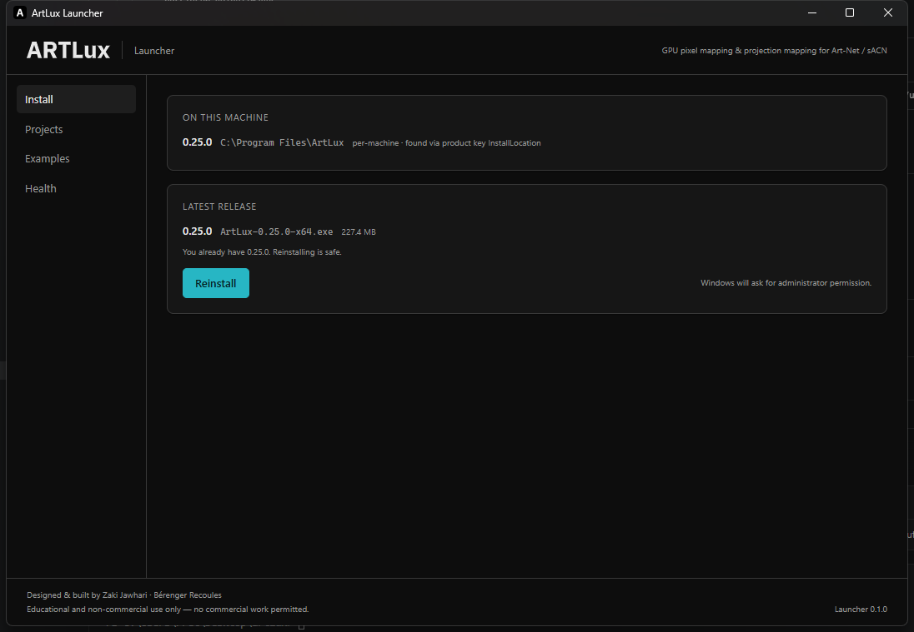
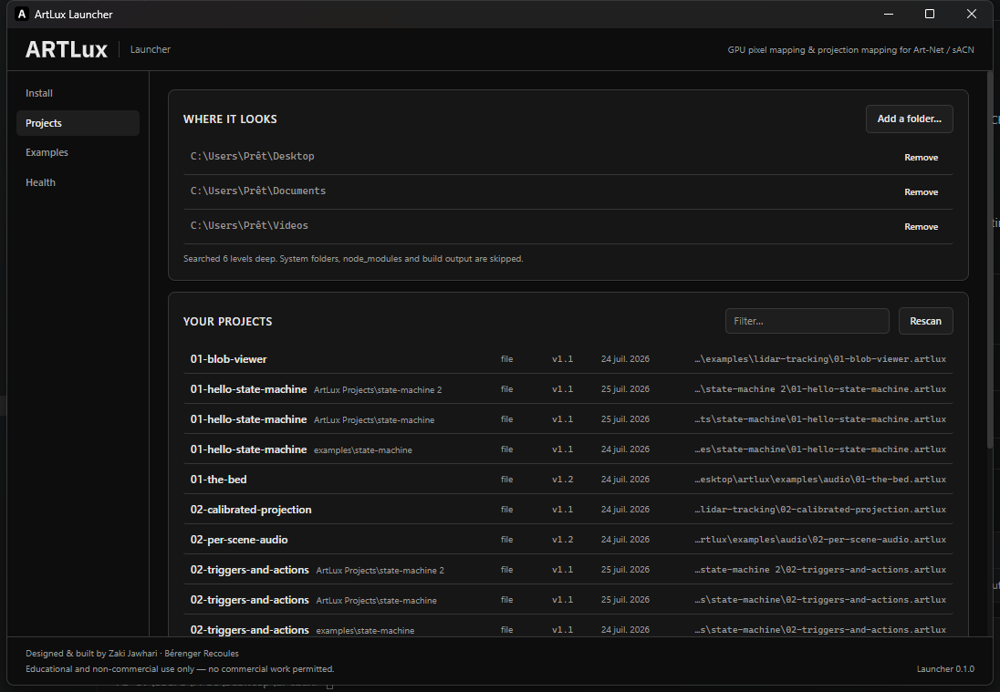
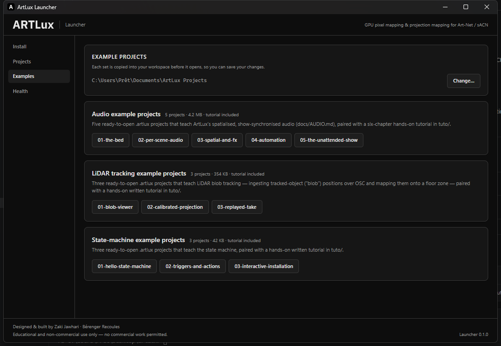
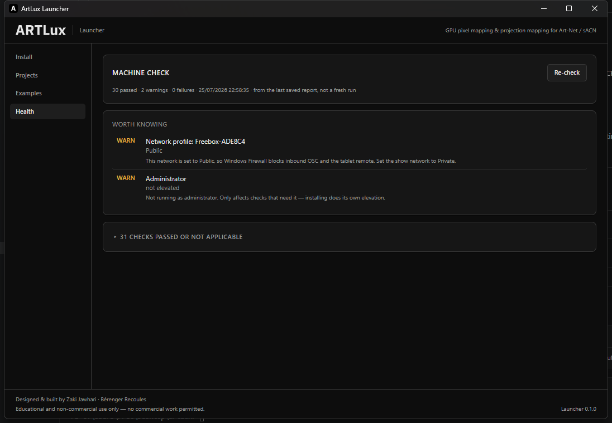

# The ArtLux Launcher

**`ArtLuxLauncher.exe` is the thing you download.** It installs ArtLux and everything ArtLux needs,
checks that the machine can actually run a show, finds your projects, and opens them. It is a small
separate Windows application — about 1.3 MB — that lives beside the app rather than inside it.

Source: [`launcher/`](../launcher/) · Releases: tagged **`launcher-v*`** ([latest](https://github.com/urbandronedesign/artlux/releases))

---

## Why it exists

Two problems, one surface.

**Installing was a procedure, not a download.** [INSTALL.md](INSTALL.md) is pages long: find and
remove the old per-user install that Windows will not replace, delete orphan firewall rules, accept
the UAC prompt (declining it silently produces an install with no redistributables and no firewall
rules — the failure that document exists to prevent), copy `preflight.ps1` onto the venue PC, run it
under `-ExecutionPolicy Bypass`, then read a FAIL/WARN table and know which lines are expected and
which are blocking.

**Opening a project was worse than it needed to be.** ArtLux cold-boots into an empty untitled
document. There was no picker, only `File ▸ Open…` and a ten-entry recents submenu whose dead paths
were never pruned. And the eleven example projects ship read-only inside `Program Files`, so an
operator's first Save into one failed.

### Why a separate program and not a window inside ArtLux

Because it has to work **before ArtLux exists** and **when ArtLux is broken**. Only an external
program can check a machine, install prerequisites, and diagnose a *failed* install. A welcome screen
inside the app can only ever report on a machine where the app already launched — which was never the
problem.

An in-app project picker is still worth having, and the two are complementary. This document covers
the external launcher.

**It is a front-end to the existing NSIS installer, never a replacement.** NDI runtime, VC++ redist,
firewall rules and the post-install preflight all stay in
[`build/installer.nsh`](../build/installer.nsh), so there is one source of truth and ArtLux's own
`electron-updater` keeps working unchanged.

---

## Getting it, and the warning you will see

Download `ArtLuxLauncher_<version>_x64-setup.exe` from the
[releases page](https://github.com/urbandronedesign/artlux/releases) and run it. It installs
**per-user**, so it needs no administrator rights for itself — it asks for elevation only when
installing ArtLux, which is a moment that makes sense.

> **Windows SmartScreen will warn on first run.** ArtLux and its launcher are unsigned, by decision
> (see [Licence and signing](#licence-and-signing)). Click **More info → Run anyway**. If there is no
> "More info" link, Windows kept the file's mark-of-the-web — right-click → Properties → **Unblock**,
> or `Unblock-File -Path .\ArtLuxLauncher_<version>_x64-setup.exe`. Full detail:
> [INSTALL.md → Windows SmartScreen](INSTALL.md#windows-smartscreen--the-warning-you-will-see-first).
>
> **Defender may also quarantine it outright**, as `Trojan:Win32/Bearfoos.A!ml` or similar. The
> `!ml` suffix means a machine-learning guess, not a signature match, and the launcher fits the
> pattern it guesses on — it downloads an installer, runs it silently and elevates. Verify before
> you act:
> [INSTALL.md → Antivirus](INSTALL.md#antivirus--when-defender-calls-the-installer-a-trojan).

Requires Windows 10/11 x64 and the WebView2 runtime, which ships with Windows 11 and is fetched
automatically on older builds.

---

## The four tabs

### Install



Shows every ArtLux on the machine and what is published, then does the whole install in one click.

- **Detection names its source.** "found via product key InstallLocation" is a registry fact; a path
  fallback is labelled as a guess, because those are different things and only one of them is
  trustworthy.
- **The double-install warning, with a fix.** Releases before 2026-07-22 installed per-user; the
  installer is now per-machine, and Windows treats them as different products, so it will *never*
  replace one with the other. Two installs, two Start Menu entries, and which version you get depends
  on which shortcut you click. Nothing inside the app can see this state and Windows will not resolve
  it, so the launcher names it **and offers to remove the old one** — using the uninstall command
  Windows itself recorded, then confirming by re-reading the registry rather than trusting the
  uninstaller's exit code.
- **The download is verified before it is run.** The checksum comes from `latest.yml`, the same
  metadata ArtLux's own updater trusts. A mismatch is refused outright and the file is deleted — with
  no code signature, this is the only integrity guarantee the project has.
- **It will not install over a running ArtLux**, and it will not claim success it did not observe:
  after the installer exits, the registry is re-read to confirm the install is really there.

Declining the administrator prompt gets its own message, because a declined UAC installs *nothing*
while looking like an ordinary failure.

### Projects



Everything on the machine that ArtLux can open, with one click to open it.

Searches Desktop, Documents and Videos by default — resolved through the shell, so a Documents folder
redirected to OneDrive is still found — six levels deep, skipping system folders, `node_modules` and
build output. A directory containing `project.artlux` is a **portable project**: it is listed once,
under the folder's name, and not descended into.

**Open projects in — Normal, or Calibration.** A segmented control above the list decides which
ArtLux a project opens in, and it applies to the Examples tab too.

| Mode | What opens |
|---|---|
| **Normal** | The editor as it ships. Projector outputs use the cheap warp path. |
| **Calibration** | The editor *plus* the alignment workbench — the calibration wizards, the camera, and the live venue render you check a solve against. The **Calib** entry appears in the left rail. |

The choice is **remembered**, because the machine that needs the workbench needs it every time
somebody sits down at it. It has no effect on **Create**: a project made a second ago has no
surfaces, no outputs and no venue model, so there would be nothing to align.

> **Why this is worth a control rather than a menu item inside ArtLux.** Calibration is a *launch
> profile*, not a preference: the plugin is activated once, when a window loads, in the editor and in
> every projector window it spawns — so **File ▸ Open Calibration Workbench…** inside the app has to
> save and restart it. Choosing out here means a machine that is going to be aligned comes up aligned,
> in one launch instead of a launch and a restart.

Two ways a mode can *silently* not happen, both refused or named rather than left to be found at the
venue:

- **ArtLux is already running.** The single-instance lock hands the incoming argv to the live process,
  which routes `--project=` and discards the rest — so the project really does open, in whatever mode
  that copy was launched in. The launcher says so instead of reporting a mode it did not deliver.
- **The installed ArtLux is older than 0.25.1.** `--calibrate` arrived with that release, and an older
  build drops an unknown flag in silence and opens the ordinary editor. That launch is refused with
  the version named, rather than spawned and reported as success.

**New projects start here too.** Type a name beside **Create** and the launcher makes the folder in
your workspace, then asks ArtLux to write the project into it.

> The launcher creates the FOLDER; it never writes `project.artlux`. What a new project *contains*
> is defined once, in the renderer's `resetToNewProject()` — a list whose own comment records it
> drifting three times while it merely existed twice inside the app. A fourth copy, in Rust, in a
> separate product, with nothing tying them together, would be strictly worse. So the launcher owns
> **where** a project goes and ArtLux owns **what** one is.
>
> ⚠ **This needs an ArtLux newer than 0.25.0.** `--new-project=` does not exist in 0.25.0, and an
> older build ignores an unknown flag entirely: it opens on an untitled document and writes nothing.
> The launcher therefore WAITS for the project file to appear rather than assuming, and says plainly
> that the installed version is too old — because spawning and reporting success would leave an empty
> folder and an app that looks fine.

**The folders are yours to change.** "Where it looks" lists them with **Add a folder…** and
**Remove** beside each. Removing all of them is a real, kept state — the launcher searches nowhere
and says so — which is different from never having configured it; **Reset** appears only once you
have curated the list and puts the OS folders back by *forgetting* your list rather than writing the
current defaults into it, so a Documents folder that moves later is still followed.

The scan is bounded (4000 projects, 20 seconds) and **says so when it stops early**, because a
silently truncated list reads as "you have no projects".

ArtLux's own recent files are merged in read-only, with dead paths pruned, so a project on a USB
stick outside every search folder is still one click away.

### Examples



The example projects ArtLux ships — audio, state machine, LiDAR tracking — each with the tutorial
that goes with it.

Picking one **copies the whole set into your workspace first**, then opens it. The shipped copies
live under `Program Files`, where saving fails; copying makes the obvious thing work. The whole set
comes across because a set shares one `assets/` folder, and one project without it is broken. If a
folder of that name already exists, the copy is numbered rather than merged into it.

Default workspace: `Documents\ArtLux Projects`, changeable with **Change…**. Whichever folder you
pick is added as a search folder if nothing already covers it — otherwise the projects you just
created would not appear under Projects, which reads as the launcher being broken.

### Health



Runs ArtLux's own [`preflight.ps1`](../scripts/preflight.ps1) — GPU, the runtimes ArtLux needs, the
network profile, firewall rules, the ports it binds — and sorts the result by what you should do
about it:

| Grouping | Meaning |
|---|---|
| **Fix before relying on this machine** | e.g. only a fallback GPU adapter. WebGPU compute *is* the pixel-mapping pipeline. |
| **Expected — can be repaired** | Missing NDI runtime or VC++ redist on a clean machine. **Repair** installs them. |
| **Worth knowing** | Public network profile (blocks inbound OSC and the tablet remote), multiple NICs up, a port already bound, no audio device. |

Checks the launcher has nothing curated to say about render **verbatim**, with the script's own
remedy — the triage map shapes wording, never what you are shown.

**Repair** appears only when something it can actually install has failed *and* winget is present, so
it is never a button that does nothing. It runs elevated and visible, because winget's own progress
is the only honest signal — and afterwards the check is re-run and diffed rather than trusting an
exit code nobody read. Anything still failing is named.

The launcher bundles its own copy of the check script, which is what lets it examine a machine
**before** ArtLux is installed. Once ArtLux is there, the installed copy is used so the check matches
the app version.

---

## How it works

```
ArtLuxLauncher.exe            Tauri: a Rust core with a WebView2 UI
│
├─ src-tauri/src/
│   ├─ install.rs    find every ArtLux install (registry, then labelled fallbacks)
│   ├─ releases.rs   GitHub releases → tag → latest.yml → version, asset, sha512
│   ├─ download.rs   streamed download, progress, cancel, sha512 verify
│   ├─ runner.rs     elevate the installer, and spawn ArtLux --project= [--calibrate]
│   ├─ projects.rs   library roots, the disk walk, ArtLux's recents
│   ├─ examples.rs   derive the sets, copy one to the workspace
│   ├─ preflight.rs  run the machine check, parse it honestly
│   ├─ lib.rs        ← all of the above, as a library
│   └─ main.rs       the Tauri shell: thin commands over the library
│
└─ src/              React + plain CSS over ArtLux's tokens
```

**The core is a library, and `main.rs` is only transport.** A bootstrapper's interesting behaviour is
registry detection, release resolution and checksum verification — none of which should be reachable
only by clicking a button in a WebView. [`src/bin/selftest.rs`](../launcher/src-tauri/src/bin/selftest.rs)
runs the same code against the real machine and the live release feed with no GUI.

**The web layer holds no privilege.** Every filesystem, registry, network and process operation is a
`#[tauri::command]` in Rust; the UI is granted no filesystem or shell capability at all. It cannot
name a path to execute — it can only hand back a path the Rust produced *and verified*. That matters
because this program runs a downloaded executable with Administrator rights.

**Styling is [docs/DESIGN-SYSTEM.md](DESIGN-SYSTEM.md), and the tokens are GENERATED, not copied.**
`launcher/scripts/sync-tokens.cjs` regenerates `launcher/src/tokens.css` from
`src/renderer/styles/tokens.css` on every build, exactly as the machine check is regenerated — a
separate product cannot import from the app's renderer, and a hand-written copy is a fork with no
mechanism to notice it has drifted. It drifted immediately when it was one: wrong `--accent-hover`
and `--accent-press`, an opaque `--accent-dim` instead of a 14% tint, and half the tokens renamed
(`--fg-1` for `--text-1`, `--radius-md` for `--r-md`). None of that shows in a screenshot; it just
makes the launcher quietly a different product.

The app expresses the system through Tailwind utilities. The launcher has no Tailwind — that would
mean the app's PostCSS config and its dependency tree — so `src/styles.css` restates the same
decisions as classes over the same tokens: the named type scale, the panel-header recipe, the
`:where()` hover/press film (5% / 12% white inset, *not* a brightness filter, which washes out a
tinted control), the focus ring, and the disabled floor.

---

## The contracts it depends on

Everything below is something the launcher relies on **from outside its own tree**. Changing any of
it breaks a shipped product that this repository does not build. Treat each as an interface.

### 1. The CLI

```
ArtLux.exe --project=<absolute path to a .artlux file>      # open an existing project
ArtLux.exe --new-project=<absolute path to a folder>        # lay it out and write a clean project
ArtLux.exe --project=<…> --calibrate                        # …in the calibration workbench
```

The **only** contract for "open this project": there is no file association and no protocol handler.
Parsed in [`src/main/index.ts`](../src/main/index.ts), consumed by an editor-mode boot effect in
[`src/renderer/App.tsx`](../src/renderer/App.tsx).

- `--project=` **outranks** the editor's own reopen of `prefs.lastProjectPath`. Both are mount
  effects that await, so without that rule they race and the document is whichever resolved last. The
  precedence lives in two places and only works as a pair.
- A **second** launch carrying `--project=` retargets the **running** instance via `second-instance`.
  The second process **exits 0 regardless** — the single-instance lock swallows it — so an exit code
  proves nothing. Probe for a running `ArtLux.exe` before spawning.

- `--new-project=` is **newer than 0.25.0**. An ArtLux without it ignores the flag silently, so a
  caller must watch for `project.artlux` to appear rather than trust the spawn.

- `--calibrate` is **0.25.1 or newer** — the release that made calibration a launch profile
  ([`src/main/runProfile.ts`](../src/main/runProfile.ts)). It is a *modifier*, not a mode of its own:
  pair it with `--project=`. Three things make it a contract rather than a flag:
  - **An older ArtLux drops it in silence** and opens the ordinary editor, which is indistinguishable
    from having worked. There is no artifact to watch for the way `--new-project=` has one, so this
    one is a **version gate** — and it does not have to guess which release carried the flag, because
    `git tag --contains` answers that once and the answer is recorded in `runner.rs`.
  - **`second-instance` routes `--project=` and nothing else.** A mode handed to a running copy is
    dropped, so a caller must probe first and report which of the two happened.
  - **The show modes imply it.** `--broadcast` and `--headless` carry calibration always — a show's
    outputs *are* the calibrated ones — so `--calibrate` is only ever needed for an editor launch.

  Guarded end to end (argv → `calibrate=1` on the renderer query → the registration that puts the
  workbench on screen) by the same `verify-invariants.cjs` check as `--project=`, because all three
  flags are spelled literally in a product this repository does not build.

Guarded by the `--project= reaches the document in every run mode` check in
[`scripts/verify-invariants.cjs`](../scripts/verify-invariants.cjs) — which also asserts that both
entry points write the clean document through the *same* helper, so neither can grow its own copy of
what a new project contains.

### 2. Locating an install

electron-builder's NSIS writes **two** keys under a product GUID that is a UUIDv5 of the appId, and
therefore stable across versions:

```
HKLM\SOFTWARE\<GUID>                    InstallLocation = C:\Program Files\ArtLux   ← the real path
HKLM\SOFTWARE\Microsoft\Windows\CurrentVersion\Uninstall\<GUID>
    DisplayName / DisplayVersion / DisplayIcon / QuietUninstallString
    InstallLocation                     (EMPTY)   ← the obvious lookup returns nothing
```

> ⚠ **`InstallLocation` on the Uninstall key is empty on every install observed.** Resolution order:
> product key → `DisplayIcon` (strip the `,0`, take the directory) → `%ProgramFiles%\ArtLux` → legacy
> `%LOCALAPPDATA%\Programs\artlux`. Path guesses come last and are **labelled** as guesses: reaching
> them means no registry entry matched, which is a different fact from "installed here".

`Find-ArtLuxInstall` in [`scripts/preflight.ps1`](../scripts/preflight.ps1) had exactly this bug and
survived only on its path fallback.

### 3. The release feed

Public repo, so unauthenticated access works — 60 requests/hour/IP, and a rate-limit response is a
real state to name rather than spin on.

- `GET /repos/urbandronedesign/artlux/releases?per_page=100&page=N` → filtered by **tag shape**,
  newest first, **walked page by page** (up to 5 pages) until a tag matches.
- `…/releases/download/<tag>/latest.yml` → `version`, `path`, `sha512`. The same metadata
  `electron-updater` consumes, so it is the only correct source for the hash.
- Windows asset name: `ArtLux-<version>-x64.exe` (arch is `x64`, not `x86_64`) — read from
  `latest.yml`'s `path`, never by scanning the release's asset list.

> ⚠ **The walk is load-bearing, because the two products share one list.** The request was a single
> un-paginated page of 30 until 2026-09-06. App releases land roughly ten times as often as launcher
> ones, so the newest `launcher-v*` sinks steadily down the list — and the first time it passed the
> 30th row, `resolve_launcher_latest` would have started answering *"no published launcher release
> was found"* on every installed launcher at once. Nothing local changes, no build fails, and CI
> cannot see it: the break is remote, and it lands on the product whose whole job is installing
> things. It had twelve app releases of headroom when it was found. `cargo run --example selftest`
> now prints the depth of each product in the feed so the number is watchable.

> ⚠ **`sha512` is base64, not hex.** Comparing a hex digest fails every download and reads as a
> network problem.

### 4. Running the installer

`nsis.oneClick` is unset (defaults **true**) and `perMachine: true`, so the installer's manifest
requests elevation. Therefore `/S` is **silent, not unattended** — Windows still shows UAC.

> ⚠ **`CreateProcess` never raises UAC.** `std::process::Command` handed an elevation-manifested
> executable fails with `ERROR_ELEVATION_REQUIRED (740)` and no prompt appears at all. Elevation is a
> *shell* behaviour: `ShellExecuteExW` with the `runas` verb, plus `SEE_MASK_NOCLOSEPROCESS` to get a
> handle to wait on. Declining the prompt returns `ERROR_CANCELLED (1223)` and installs **nothing**.

Never claim success from an exit code: re-read the registry.

### 5. Resources inside an install

```
<InstallDir>\ArtLux.exe
<InstallDir>\resources\scripts\preflight.ps1     ← also bundled by the launcher, for pre-install use
<InstallDir>\resources\scripts\lidar-emitter.cjs
<InstallDir>\resources\examples\<set>\*.artlux   ← the gallery source
<InstallDir>\resources\docs\*.md
```

`preflight.ps1` is fully self-contained (no sibling files; an absent repo just makes its `dev.*`
checks SKIP), which is what makes shipping a second copy viable.
`-Mode runtime -Json -OutFile <path>` emits
`{ generatedAt, host, mode, summary{pass,warn,fail,skip}, results[{group,id,name,status,detail,remedy}] }`.

> ⚠ Exit **1** means "some check FAILed", not "the run failed"; **2** means not-Windows. Releases up
> to 0.25.0 print a banner *before* the JSON even under `-Json`, so parse from the first `{`.
> PowerShell 5.1's `Out-File -Encoding utf8` writes a **BOM** — strip it, or the installer's own
> cached report never loads.

### 6. Prefs — read-only from outside

`%APPDATA%\artlux\artlux-prefs.json` carries `recentFiles` and `lastProjectPath`. **Never write it.**
It belongs to a running ArtLux and is rewritten wholesale on every save, and a malformed write (a BOM
will do it) makes the app silently reset every preference it holds — layout, shortcuts, UI scale,
templates.

---

## Building and testing

```bash
cd launcher
npm install          # its own tree — NOT a root workspace member, so root `npm ci` stays reproducible
npm start            # tauri dev (Vite on :5173 + the Tauri window)
npm run package      # → src-tauri/target/release/bundle/nsis/ArtLuxLauncher_<v>_x64-setup.exe

cd src-tauri
cargo run --example selftest              # detection, release feed, checksum refusal, scan, examples, health
cargo run --example selftest -- --download  # + the real 238 MB download, verified
cargo run --example selftest -- --install   # + a real elevated install (prompts for admin)
cargo run --example selftest -- --open      # + open a project, cold and with ArtLux already running
```

**Run the self-test after touching `install.rs` or `releases.rs`.** It fails if detection ever
resolves by *path guess*, which is how the registry gotcha would silently come back.

> ⚠ **The self-test is a cargo EXAMPLE, never a `[[bin]]`.** As a second binary in the crate it became
> a bundle candidate and `tauri build` shipped *it* as the launcher: launcher-v0.1.0's installer
> deployed the console self-test under the launcher's name, with a Start Menu shortcut that ran a
> report and opened no window. Setting `mainBinaryName` made it worse — it renamed the wrong binary
> rather than selecting the right one, overwriting the real launcher in `target/release` too.
> `scripts/verify-bundle.cjs` now asserts the built exe is the GUI, and runs in CI and in
> `npm run package`; adding another `[[bin]]` here would reopen the hole.

Four configuration choices that look like typos and are not:

- **`productName` is `ArtLuxLauncher`, space-free.** Tauri names the bundle
  `{productName}_{version}_{arch}-setup.exe` with no template to override it, and a space in a release
  artifact filename has already broken this project's publish pipeline once
  ([DEVELOPMENT.md → Release](DEVELOPMENT.md)). The window title reads "ArtLux Launcher" via
  `app.windows[].title`.
- **`installMode: currentUser`** — no UAC to install the launcher itself.
- **`css: { postcss: { plugins: [] } }` in `vite.config.ts`.** Vite searches *upward* for a PostCSS
  config and finds the **app's**, which needs `tailwindcss` from the root `node_modules`. That
  resolves on a machine where the app has been built and fails in CI, where only `launcher/` is
  installed. The launcher uses plain CSS and wants no PostCSS.
- **The root `tsconfig.json` excludes `launcher`** — it has no `include`, so it would otherwise
  typecheck Tauri's generated codegen assets and fail.

`tauri.conf.json` is schema-validated and rejects unknown keys, so it cannot carry comments — notes
about it live here.

The bundled `preflight.ps1` is **regenerated from the app's copy on every build**
([`scripts/sync-preflight.cjs`](../launcher/scripts/sync-preflight.cjs)), not committed, so it cannot
silently fork.

---

## Releasing

CI: [`.github/workflows/launcher.yml`](../.github/workflows/launcher.yml), triggered by a
**`launcher-v*`** tag. Separate from `build.yml` so an app release never rebuilds the launcher and
vice versa; the two tag patterns cannot match each other.

```bash
# Bump `version` in FIVE files, then let the guard confirm it:
#   launcher/src-tauri/tauri.conf.json   the BUNDLE version: installer filename + PE version
#   launcher/src-tauri/Cargo.toml        CARGO_PKG_VERSION -> own_version()
#   launcher/src-tauri/Cargo.lock        the artlux-launcher entry
#   launcher/package.json                the `version:` CI writes into launcher-latest.yml
#   launcher/package-lock.json           twice: the root, and packages.""
cd launcher && npm run verify:version      # refuses to let them disagree

git tag -a launcher-v0.1.3 -m "…" && git push origin launcher-v0.1.3
```

**Each release also force-moves a rolling `launcher-latest` tag** carrying one fixed-name installer,
so the download link in the README never has to be edited:

```
…/releases/download/launcher-latest/ArtLuxLauncher-Setup-x64.exe
```

The app gets an equivalent for free — GitHub's `/releases/latest/download/<name>` — but the launcher
cannot use that endpoint, because launcher releases are pre-releases on purpose and `latest` excludes
exactly those. The tag name was chosen against the resolver, not for looks: `launcher-latest` does
not start with `launcher-v` (so self-update skips it), is not `v<digit>` (so `is_app_tag` rejects it
and it can never be served as ArtLux), is published as a pre-release (so `/releases/latest` still
resolves the app), and matches neither workflow's tag trigger (so moving it cannot loop into a
build). It deliberately carries **no `launcher-latest.yml`**: that file names the *versioned*
installer in its `path`, which does not exist under this tag — self-update reads it from the
`launcher-v*` tag, where it is true.

> **This list was wrong until 0.1.3, and it shipped a mislabelled release.** It said *four* files
> and credited `package.json` with the bundle filename — but Tauri prefers the `version` in
> `tauri.conf.json` and only falls back when that field is absent. It was not absent, it was stale,
> so the whole `launcher-v0.1.2` release carries an asset named
> **`ArtLuxLauncher_0.1.1_x64-setup.exe`**, an installer whose product version is 0.1.1, and a
> binary that reports 0.1.2 when you ask it. Nothing failed. It was the second miss of the same
> shape: `package-lock.json` sat at 0.1.0 through the whole 0.1.1 release, equally silently.
>
> So it is no longer written down and trusted — `scripts/verify-version.cjs` asserts all five agree,
> runs in `npm run package` and in CI **before** the build, and prints which file is the odd one
> out. Each site has a different consumer, which is why they drift: a stale `package.json` offers an
> update that installs the same build and never clears; a stale `tauri.conf.json` leaves NSIS
> thinking a new install is the version already there.

> ⚠ **Launcher releases are published as PRE-RELEASES, and that is load-bearing.** GitHub's
> `/releases/latest` returns whichever release went out most recently, whatever it is — and **ArtLux's
> own electron-updater keys off that endpoint**, then fetches `latest.yml` from the tag it names. A
> launcher release published normally would make every installed ArtLux look for app metadata on a
> launcher tag and fail its update check, in the field, silently. Pre-releases are excluded from
> `latest`, which is exactly the property needed.
>
> The launcher does not rely on that alone: it lists releases and filters by **tag shape**, never
> trusting the ordering. Both defences, because either one alone is a single point of failure for
> something that breaks remotely.

CI writes **`launcher-latest.yml`** beside the installer, in the same shape electron-builder uses for
the app. One metadata format in the codebase, and the launcher's self-update reuses the
verified-download path it already uses for ArtLux.

**Self-update is not Tauri's updater plugin**, deliberately. The plugin would work and would mean a
signing keypair with its private half in CI secrets and its public half baked into the binary — real
infrastructure to stand up and keep correct, for an outcome that is otherwise identical. The
`__TAURI_BUNDLE_TYPE variable not found` warning in the build output belongs to that plugin and is
inert while it is unused.

---

## Troubleshooting

| What you see | What it means |
|---|---|
| SmartScreen blocks it, with no "More info" | Windows kept the mark-of-the-web. Properties → **Unblock**, or `Unblock-File`. |
| Defender quarantines it as `Trojan:Win32/…!ml` | A machine-learning guess, not a signature. Almost always a false positive here — but [verify the checksum before excluding anything](INSTALL.md#antivirus--when-defender-calls-the-installer-a-trojan). |
| "the download does not match the checksum…" | The file is not what GitHub published. Retry; if it persists, download manually and compare against `latest.yml`. **It will not be run.** |
| "Installation did not happen: the … prompt was declined" | Exactly that — nothing was installed. Run again and choose Yes. |
| "ArtLux is running. Close it first" | An installer cannot replace files in use. |
| "Two installs are present" | The legacy per-user install alongside the per-machine one. Remove the per-user one; Windows will not do it for you. |
| "ArtLux was already running — … a launch mode cannot be changed in a copy that is already up" | Exactly that: the project opened, in the mode the running copy started in. Close ArtLux and open it again, or switch inside the app with **File ▸ Open Calibration Workbench…**. |
| "This ArtLux (…) cannot be launched into the calibration workbench" | The install predates 0.25.1, which is where `--calibrate` arrived. Update from the Install tab. |
| Projects tab is empty | Nothing was found in the search folders. Check the "Where it looked" list. |
| The scan says it stopped early | It hit the 4000-project or 20-second limit. Narrow the search folders. |
| Examples tab says ArtLux is not installed | The examples ship inside the app; install it first. |
| "GitHub is rate-limiting this machine" | 60 requests/hour for anonymous access. Wait, or install manually. |
| Health tab absent | No check script could be found — a broken build. |

---

## Licence and signing

LICENSE §3 requires the authorship credit and the non-commercial notice to survive in a build. The
launcher is a build, and it is the first screen a venue sees, so it renders `CREDIT_LABEL`,
`AUTHORS_LINE` and `LICENSE_HEADLINE`. Those strings are copied from
[`shared/credits.ts`](../shared/credits.ts) into `launcher/src/brand.tsx` — change them together. The
wordmark comes from `build/wordmark.svg`, whose generator header marks it as the asset for external
use.

**Both products ship unsigned, by decision.** `build.yml` sets `CSC_IDENTITY_AUTO_DISCOVERY: 'false'`,
there is no Authenticode step, and none is planned: a certificate is a recurring cost and an annual
renewal for a project that takes no money. Two consequences worth holding on to:

- **The sha512 comparison is the only integrity guarantee this project has.** `download.rs` refusing a
  mismatched file is not belt-and-braces — it is the entire mechanism, which is why that refusal
  deletes the file and hard-errors rather than warning.
- **The launcher is the safer install path**, and can be recommended as such: it verifies every
  download automatically, where a human downloading the `.exe` by hand has to remember to.

---

## Status

| Stage | What | State |
|---|---|---|
| 0 | ArtLux-side prerequisites (`--project=` in the editor, `second-instance` argv, preflight fixes) | **done** |
| 1 | Install: detect · resolve · verified download · elevated run | **done** |
| 2 | Projects: library roots, cancellable scan, recents merge, open via `--project=` | **done** |
| 3 | Examples: derived sets, whole-set copy to a writable workspace, then open | **done** |
| 4 | Health: run `preflight.ps1`, triage as data, repair via `-Fix` | **done** |
| 5 | CI on `launcher-v*`, self-update | **done** |
| 6 | Launch mode: open a project in the editor or the **calibration workbench**, with the running-instance and version cases named rather than silently dropped | **done** (v0.1.2) |

Not built, and worth considering later: **thumbnails for projects**, which would mean rendering a
project through the WebGPU pipeline and is therefore a real feature rather than a detail; and a
**cancel** for the download, which exists in the core (`download::request_cancel`) and is wired to a
button only while a download is running.

**Broadcast is deliberately not a launch mode here.** `--broadcast` is one flag away and the plumbing
already generalises to it, but a show mode is a different promise: it has no editor window, quits
when the last output closes, and is what the watchdog relaunches into. Starting one from a
project-picker — on a machine an operator may be about to walk away from — is a decision worth its
own deliberate surface, not a third segment beside *Normal*. Add it when someone asks for it and
knows why.

**Not exercised end to end:** removing the legacy per-user install. Its guard paths are covered by
the self-test (no recorded command, missing uninstaller), but the happy path would delete a real
install and no machine here carries a legacy one to practise on. Worth watching the first time it is
used in anger.
