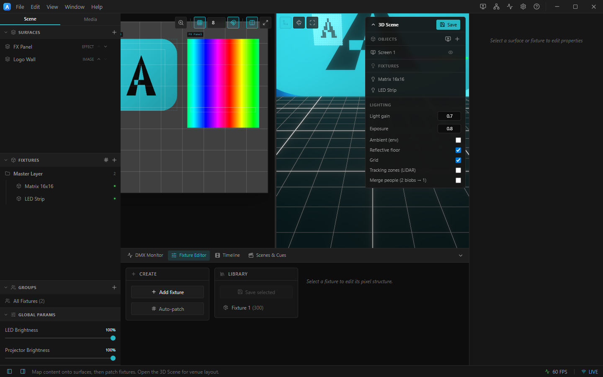
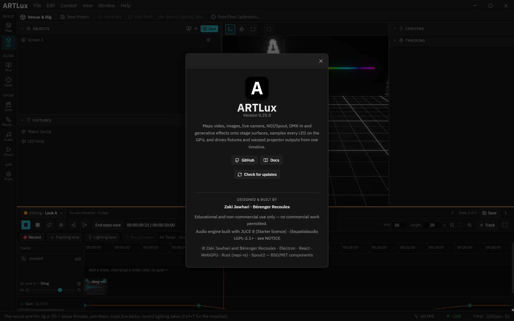

# 1. Interface tour

This page names every part of the editor so the rest of the guide can refer to them. If you only
read one page first, read this one.

> ⚠ **The screenshots on this page and throughout this guide predate the workspace rewrite** and
> show the old fixed shell (a Scene/Media tab column, a Stage/3D split, a four-tab dock). The *text*
> below describes the app as it is now. Re-capture with `node scripts/capture-docs.cjs`.

*The whole editor at a glance.*

---

## The one idea: workbenches, and nothing is nailed down

The editor is not one layout. It is **nine workbenches**, one active at a time, chosen from the
**rail down the far left**. Each declares the whole screen around its main view: which lists appear,
which parameters, which panels in the dock, and which actions sit on the action bar.

**And the arrangement each one ships with is a starting point, not a fixture.** Every panel can be
dragged into another group, split off into its own pane, closed, or added where it does not normally
appear — per workbench, remembered, surviving a restart. See [Making it yours](#making-it-yours).

So when this guide says "the browser column" or "the dock", it means *where a thing ships*, so you
can find it the first time. After that, it is wherever you put it.

| Cluster | Workbenches |
|---|---|
| **BUILD** | **Map** — surfaces, content, fixtures, patch · **3D** (Venue & Rig) — the venue scene, the lighting rig, tracking |
| **ALIGN** | **Proj** — projector outputs · **Calib** — projector calibration |
| **SHOW** | **Cues** — scenes & the cue grid · **Machine** — the show graph · **Audio** · **Show** — running it |
| **APP** | **Prefs** |

Switch with the rail, **Ctrl+1..9**, the **Context** menu, or **Ctrl+K** — the command palette, which
searches every workbench *and* every action any of them offers, and switches for you before running
one.

---

## Title bar (top)

A single dark strip carrying everything that frames the app:

- **The ArtLux mark** on the far left.
- **File / Edit / Context / View / Window / Help** menus — app‑styled dropdowns (the native menu is
  also registered, so every keyboard accelerator keeps working).
- A draggable empty middle — drag it to move the window, double‑click to maximize.
- **Action icons** (right side): **3D Scene**, **Outputs**, **Routing**, **DMX Monitor**,
  **Preferences**, and **Help (F1)**. Hover any icon for a tooltip.
- The window **minimize / maximize / close** controls.

> Video/timeline **Play/Pause** does **not** live here — it's on **Space**.

The menus, in brief:

| Menu | Highlights |
|------|-----------|
| **File** | New / Open / Open Project Folder, Save / Save As, Collect Assets, Export/Import Rig, Routing, Preferences, **Launch in Broadcast Mode**, Quit |
| **Edit** | Undo / Redo, Cut / Copy / Paste, Select All |
| **Context** | jump to any of the nine workbenches |
| **View** | Reload, Developer Tools, **Timeline** (the drawer), **OSC Monitor**, zoom, full screen |
| **Window** | Minimize, Close |
| **Help** | Help… (F1), Check for Updates, Documentation, GitHub, **About ArtLux** |

---

## Action bar

Under the title bar: the name of the active workbench and the actions that belong to it — *Add
Surface*, *Auto-patch*, *Routing* and *Collect Assets* in **Map**; *Store Key*, *Save Pose* and
*Record Lighting Take* in **3D**. Everything here is also in the **Ctrl+K** palette.

---

## Browser column (left)

The lists the active workbench works from — Surfaces, Fixtures, Groups and Global Params in **Map**;
Objects and Fixtures in **3D**; the media library in **Audio**. Add with **+**, double‑click to
rename, hover a row for delete/reorder actions.

---

## Viewport (centre)

Whatever the workbench is *for*: the 2D Stage, the 3D scene, the outputs table, the cue grid, the
show graph, Preferences. On the Stage, **surfaces are cyan** and **fixtures are red**; its top-right
toolbar has **zoom**, a **grid** toggle (with grid size), a **snap (magnet)** toggle, a **split‑view**
toggle, and **reset view**.

**Light fixtures — moving heads, washes, beams — are never drawn on the 2D Stage.** They are placed
and aimed in the **3D** workbench. See [3D scene](09-3d-scene.md).

---

## Parameters column (right)

Properties of whatever is selected, and **a surface and a fixture can both contribute sections at
once**. Sections are filtered by what *kind* of thing is selected, so an LED strip and a moving head
never see each other's controls: no colour order or serpentine toggle on a head, no pan/tilt on a
strip.

---

## Dock (under the viewport)

Tabbed panels: **Library** (DMX profiles + your fixture templates), **Wiring & Ledmap**, **Media
Library**, **Program** (the full-bleed program monitor), **Routing**, **DMX Monitor**,
**Performance**, plus **Output Preview** in Proj/Show and whatever the enabled plugins add (OSC
Monitor, Trigger Zones, Schedule, Playlist, Metrics…). Which ones a workbench *ships* with is its
choice; you can add any of them anywhere.

Drag the group's edge to resize; click the chevron to collapse.

---

## Timeline — a drawer, not a workbench

The timeline spans the **full width** of the window along the bottom, and it is available *inside*
eight of the nine workbenches (all but Calib and Prefs). Pull it up with **Ctrl+T**, **View ▸
Timeline**, or by clicking the collapsed strip; each workbench remembers whether you left it open.

That is deliberate: the timeline is a tool you want *while* working in a view — cutting against the
2D stage, recording a lighting take against the 3D rig, authoring a scene's timeline from the cue
grid — not a place you travel to. See [Timeline](06-timeline.md).

---

## Making it yours

- **Drag a panel by its tab** onto another group to join it, or onto an **edge** to split the space.
- **Right‑click a tab** for the same moves without a drag, plus **Close**.
- **+** on a tab strip adds any panel, including ones the workbench does not normally show, and
  carries **Reset this workbench** for when you want the shipped arrangement back.
- **Drag the dividers** to resize; **the chevron** collapses a group.

It is all per workbench, saved with your preferences, and survives a restart. If you would rather
have the fixed layout back, turn off **Preferences ▸ Appearance ▸ Dockable workspace**.

> None of this touches the show. The rendering engine does not live in the interface: output keeps
> running while you rearrange, and it keeps running even if a panel crashes.

---

## Status bar (bottom)

Panel toggles at each end, a one‑line contextual hint for the active workbench in the middle, and
live **FPS** + a **LIVE** output indicator on the right.

---

## Help

Open it with **F1**, a tooltip's **? Learn more** link, or **Help ▸ Help…**. One searchable modal
over two tiers of content: the coarse **topic guides** (with an **EN / FR** toggle that is
remembered between sessions) and a **per-function entry** for every control that carries a tooltip.
Type to search both at once; **Esc** closes. Contextual help for whatever you hover stays live in
the status bar.

---

## About & updates

**Help ▸ About ArtLux** shows the version, links to GitHub and the docs, and a **Check for updates**
button (Windows/Linux auto‑update; macOS prompts you to download).

*About ArtLux — version, links, and update check.*

➡ Next: [Surfaces & content](02-surfaces-and-content.md)
