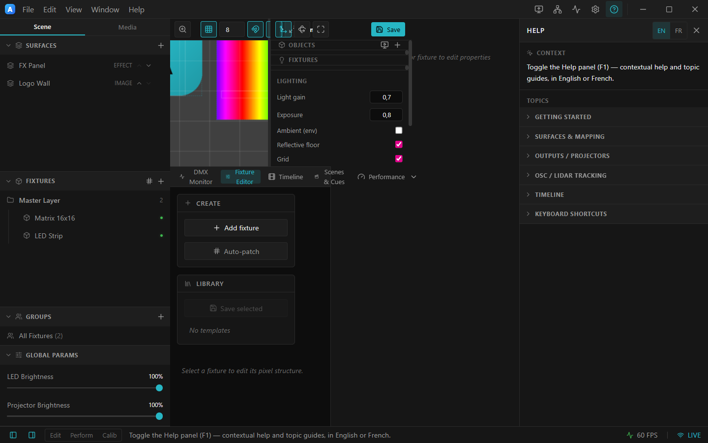

# 1. Interface tour

This page names every part of the editor so the rest of the guide can refer to them. If you only
read one page first, read this one.

*The whole editor at a glance.*

---

## Title bar (top)

A single dark strip carrying everything that frames the app:

- **The ArtLux mark** on the far left.
- **File / Edit / View / Window / Help** menus — app‑styled dropdowns (the native menu is also
  registered, so every keyboard accelerator keeps working).
- A draggable empty middle — drag it to move the window, double‑click to maximize.
- **Action icons** (right side): **Outputs**, **Routing**, **DMX Monitor**, **Preferences**, and
  **Help (F1)**. Hover any icon for a tooltip.
- The window **minimize / maximize / close** controls.

> Video/timeline **Play/Pause** does **not** live here — it's in the Timeline dock and on **Space**.

The menus, in brief:

| Menu | Highlights |
|------|-----------|
| **File** | New / Open / Open Project Folder, Save / Save As, Collect Assets, Export/Import Rig, Routing, Preferences, **Launch in Broadcast Mode**, Quit |
| **Edit** | Undo / Redo, Cut / Copy / Paste, Select All |
| **View** | Reload, Developer Tools, **OSC Monitor**, zoom, full screen |
| **Window** | Minimize, Close |
| **Help** | Help Panel (F1), Check for Updates, Documentation, GitHub, **About ArtLux** |

---

## Left panel — Scene & Media

Two tabs at the top of the left column:

- **Scene** (shown above) — the **Surfaces** list and the **Fixtures** list (grouped under layers),
  plus **Groups** and **Global Params** (LED Brightness, Projector Brightness) at the bottom. Add
  items with **+**, double‑click to rename, hover a row for delete/reorder actions.
- **Media** — the project's [media library](11-projects-media-broadcast.md): import, preview, and
  drag video / images / models / takes onto the Stage or Timeline.

Hide the whole panel with the toggle at the **left end of the status bar**.

---

## Stage (center) and 3D Scene (split pane)

- The **Stage** is the 2D canvas where you place and arrange surfaces and fixtures. Its top‑right
  toolbar has **zoom**, a **grid** toggle (with grid size), a **snap (magnet)** toggle, a
  **split‑view** toggle, and **reset view**.
- The **3D Scene** shares the center as a split pane (drag the divider). It previews your fixtures in
  real‑world space, lit by live output colors. See [3D scene](09-3d-scene.md).

---

## Inspector (right panel)

Context‑sensitive properties for whatever is selected — a surface's **Content** and **Transform**, or
a fixture's **Mapping / Effect / 2D‑Output / Routing / 3D‑Layout**. When nothing is selected it reads
*"Select a surface or fixture to edit properties."* Hide it with the toggle at the **right end of the
status bar**.

---

## Bottom dock

Tabbed panels along the bottom — **DMX Monitor**, **Fixture Editor**, **Timeline**, **Scenes &
Cues**. Drag the dock's top edge to resize; click the chevron to collapse. Each tab is documented on
its own page.

---

## Status bar (bottom)

Panel toggles at each end, a one‑line contextual hint in the middle, and live **FPS** + a **LIVE**
output indicator on the right.

---

## Help panel

Open it with **F1**, the **?** icon in the title bar, or **Help ▸ Help Panel**. It shows contextual
help for whatever control you hover, plus browsable topic guides — and an **EN / FR** toggle that is
remembered between sessions. Drag its left edge to resize.

*The Help panel: contextual help on top, topic guides below, EN/FR toggle top‑right.*

---

## About & updates

**Help ▸ About ArtLux** shows the version, links to GitHub and the docs, and a **Check for updates**
button (Windows/Linux auto‑update; macOS prompts you to download).

*About ArtLux — version, links, and update check.*

➡ Next: [Surfaces & content](02-surfaces-and-content.md)
