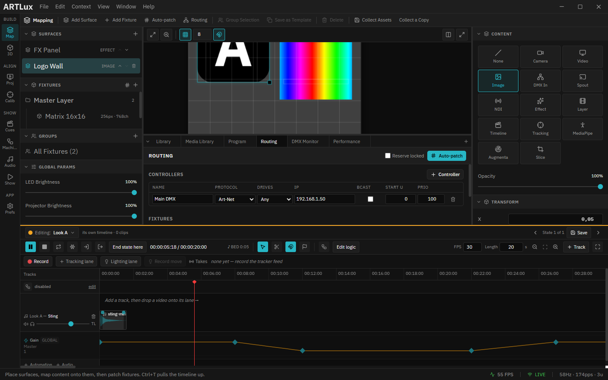

# 2. Surfaces & content

A **surface** is a rectangle on the Stage that carries **one** content source. Fixtures sample
surfaces, so surfaces are where the picture comes from. This page covers creating and arranging
surfaces, and every content source you can put on one.

*"Logo Wall" selected: the Inspector shows the Content grid (top) and Transform (bottom). On the Stage, the selected surface shows move/resize/rotate handles.*

---

## Create & arrange a surface

**Create:** left panel ▸ *Surfaces* ▸ **+**. New surfaces appear centered at half size (shown in
**cyan**). Coordinates are normalized 0–1 to the stage, so a layout scales cleanly.

**The Stage is an open workspace.** Place surfaces anywhere — there is no edge. A surface keeps its
content, its LED output and its projector output wherever it sits, and the grid tiles the whole
workspace so snapping works everywhere. Use **Fit** (stage top-left) to frame everything you've
placed, however spread out. The only exception is **reduced rendering mode** (when the app falls
back to WebGL): a dashed *Document · UV 0–1* frame then appears, and a surface outside it shows an
amber *black on LEDs* chip — its picture is still visible, but LEDs linked to it read black until
it is moved back inside the frame.

On the Stage:

| Action | How |
|--------|-----|
| **Move** | Drag the surface body |
| **Resize** | Drag the bottom‑right corner handle (keeps aspect) |
| **Rotate** | Drag the rotation handle above the surface |
| **Snap** | Turn on the **magnet** (stage top‑right) to snap to the grid and to other items' edges/centers |
| **Precise values** | Use the Inspector's **Transform** card — X, Y, Width, Height, Rotation |

**Stacking order:** surfaces have a z‑order. In the *Surfaces* list the top row is front‑most; use the
**▲ / ▼** row buttons to bring a surface forward or send it back (e.g. put a Tracking surface over a
video). A fixture linked to a specific surface always samples **that** surface even if others overlap.

**Opacity:** the Inspector's *Opacity* slider sets composite alpha (0–100 %) — fadeable for crossfades.

---

## Content sources

Select a surface, then pick a type in the Inspector's **Content** grid:

| Source | What you provide | Notes |
|--------|------------------|-------|
| **None** | — | Black surface (linked fixtures go dark). |
| **Video** | A video file (`.mp4`, `.webm`, `.mov`, `.mkv`) | Driven by the timeline transport / **Space**. HAP‑encoded `.mov` is GPU‑decoded for smooth high‑res playback. |
| **Image** | An image file | Static (Play/Pause does nothing). |
| **Camera** | A **Device** (which webcam), plus **Size** / **Rate** | The OS asks for camera permission the first time. Leave the device on *Default camera* if the machine has only one — otherwise pick yours, and see the note below. **Camera controls** (exposure, white balance, brightness, zoom…) appear if the camera has them. |
| **DMX In** | — | Shows incoming Art‑Net/sACN as content (input port set in Preferences). |
| **Spout** | A Spout sender name (Windows) | Live GPU feed from Resolume/TouchDesigner etc. **Refresh** rescans; blank = active sender. *Requires a Spout sender running **on the same GPU as ArtLux** — see the note below.* |
| **NDI** | An NDI source name | Network video. Requires the free **NDI Runtime/Tools**; if missing, the panel shows an install link. **Refresh** rescans; blank = first source. |
| **Layer** | A timeline track | The surface shows whatever clip is under the playhead on that track. |
| **Timeline** | — (the whole Program) | The full composited timeline (all contributing layers, z‑ordered). |
| **Effect** | An effect + palette | A built‑in generative effect (solid, rainbow, wave, fire…) with **Speed** and **Intensity**. No media file needed. |
| **Tracking** | A tracking **Source** (`SOL` / `MUR` / `SOL_MUR`) | Live **LiDAR blob** positions as content — for interactive floors/walls. Needs OSC enabled (Preferences ▸ OSC/Tracking). |

The top‑bar/timeline **Play/Pause** is the global transport for video, camera and the timeline (only
enabled when something is playable). Live sources (camera, Spout, NDI, DMX‑in) are real‑time.

> **Spout and two graphics cards.** Spout hands ArtLux the sender's texture **on the GPU** — nothing is
> copied or resized, so you get the sender's full resolution with no setting to tune. The catch is that
> a texture shared on one graphics card cannot be read by an app running on another, and on a machine
> with two GPUs (an integrated chip plus a discrete card) Windows may put ArtLux on one and your sender
> on the other.
>
> If that happens ArtLux **tells you** — *"Spout not compatible"* appears under the sender picker,
> naming the reason — and shows nothing, rather than quietly giving you a softer, slower picture. Fix it
> in **Windows Settings ▸ System ▸ Display ▸ Graphics** by setting *both* ArtLux and the sender app to
> the same GPU. If you can't, use **NDI** instead: it costs a compression pass but has no such limit.
> Full detail in the [Spout reference](../SPOUT.md).

> **The camera surface is empty and the camera works everywhere else.** Almost always the wrong
> *device*. **Default camera** means whatever Windows offers first, and a machine with **NDI Tools**,
> **OBS** or a webcam-utility installed has a **virtual camera** in that list — it opens successfully
> and then sends no picture. Set **Content ▸ Device** to your real webcam by name.
>
> Each surface picks its own device, so you can map two cameras onto two surfaces at once, and the
> choice is saved with the project. Two things to expect: device **names** stay generic (*Camera 1,
> Camera 2*) until a camera has opened successfully once — that's the operating system withholding
> them until permission has been used — and the ids are **per machine**, so a project opened on
> another computer falls back to the default camera and says so under the picker. Re-pick there.
>
> Under the picker ArtLux states what the chosen camera is doing — *Live*, *Opening…*, or the reason
> it can't: **permission denied**, **in use by another program** (close Teams/Zoom/OBS, then
> **Retry**), or **not connected**.

> **Size, rate and the camera's own controls.** **Size** and **Rate** list only what this camera can
> reach, and they are a **request, not a command**: a camera that can't do what you asked gives its
> nearest mode rather than failing, so read the **Actual** line underneath — ask 1080p60 of a camera
> that only does 1080p30 and you get 30, and nothing else would tell you. Leave both on *Camera
> default* unless you need something specific; a bigger capture is uploaded to the GPU every frame,
> for detail LED fixtures usually can't resolve. Raise it when the surface also feeds a projector.
>
> **Camera controls** (in the fold under the format) are **whatever this camera advertises** — a
> plain webcam offers brightness and contrast, a better one exposure and white balance, a PTZ head
> pan/tilt/zoom. Nothing is listed that the device doesn't have. Two are worth setting for any real
> show: put **Exposure** and **White balance** on *manual*, because on auto they hunt and drift as
> the stage light changes and the surface breathes with them. Sliders take effect as you drag.
> **Reset to camera defaults** hands every control back to the camera (it re-opens the device, so
> the picture blinks once).
>
> If two surfaces use the **same** camera they share one capture — one camera, one exposure. They get
> the largest size and rate either asked for, and the controls of whichever surface was created last.
> Two *different* cameras on two surfaces is fine and costs two captures.

> **Tip:** for **Video** and **Image** you don't have to browse each time — import once into the
> **Media** library and **drag a tile onto the surface** (or select the surface and click **Use**).
> See [Projects, media & broadcast](11-projects-media-broadcast.md).

---

### Tracking content (LiDAR blobs you can project)

Shows a glowing marker per tracked person. Because it's a normal surface, you can route it to a
projector and map it onto the real floor/wall at 1:1. Inspector options include **Source**
(`SOL`/`MUR`/`SOL_MUR`), **Blob size**, **Show IDs**, **Flip H/V**, **Rotate**, **Calibrate** (overlay
a zone border + grid + U/V arrows), and a **Background** timeline layer drawn under the blobs.

**Calibrate a projection (1:1):** point a projector at the tracking surface (see
[Projector outputs](08-projector-outputs.md)), tick **Calibrate**, use **Outputs ▸ Align** to drag the
projected border onto the real edges, then have someone stand at a known spot and toggle
**Flip/Rotate** until their marker lands on them. Turn **Calibrate** off for the show.

➡ Next: [Fixtures](03-fixtures.md)
