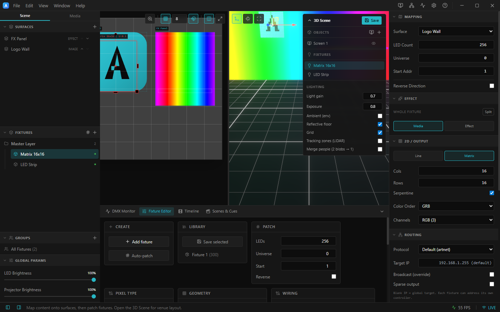
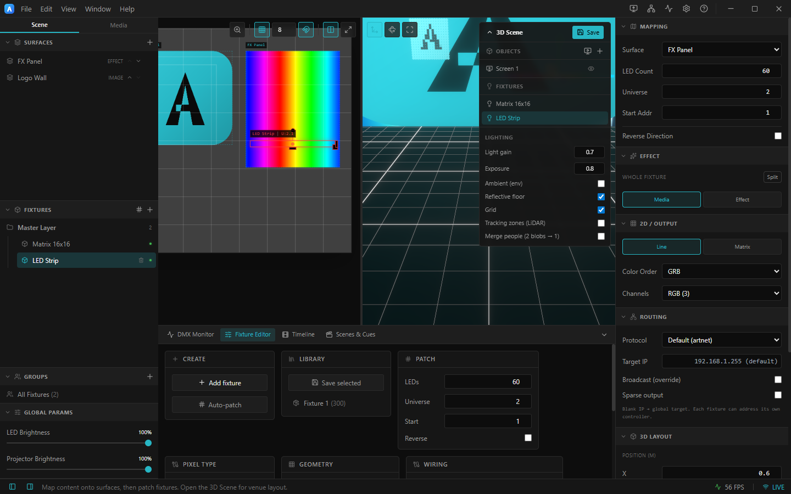

# 3. Fixtures

A **fixture** describes one LED product: how many LEDs, how they're wired, and how many channels each
uses. You build and edit the *structure* in the **Fixture Editor** dock tab, and tune *placement,
mapping and 3D layout* in the right **Inspector**.

*The Fixture Editor dock: Create, Library (templates), Patch, and the Pixel Type / Geometry / Wiring cards. A 16×16 serpentine matrix is selected; the Inspector mirrors its geometry on the right.*

---

## Create a fixture

**Fixture Editor ▸ Add fixture** (defaults: 30 LEDs, a Line shape, RGB order, auto‑patched). It
appears on the Stage and auto‑links to the first surface. You can also drop one from a **template**
(see *Library* below).

---

## Geometry (shape)

In the Inspector's **2D / Output** card (and the Fixture Editor's *Geometry* card):

- **Line** — a single run of LEDs (a strip).
- **Matrix** — a 2D panel: set **Cols** and **Rows**, and toggle **Serpentine** if the rows are wired
  in a zig‑zag (row 0 left→right, row 1 right→left…). The **Wiring** card previews the physical LED
  order so you can confirm it matches the panel.

---

## Pixel type

- **Color Order** — the physical channel order of each LED (RGB, GRB, BGR…). WS2812B strips are
  usually **GRB**. *If colors look swapped, this is the setting to change.*
- **Channels** — **RGB (3)** or **RGBW (4)**.
- **White** (RGBW only) — *Subtract min* derives white from the common minimum of R/G/B (brighter,
  keeps hue); *None* leaves white off.
- **Reverse** — flips the whole fixture's pixel order (pixel 0 ↔ last) for backward wiring.

---

## Map it to a surface

With the fixture selected, set the Inspector's **Mapping ▸ Surface** (visible at the top of the
inspector). `— none (off) —` means the fixture samples nothing. The **LED Count**, **Universe** and
**Start Addr** for the fixture are shown here too.

*"LED Strip" selected: Mapping (Surface / LED Count / Universe / Start Addr), Effect, 2D/Output, Routing and 3D Layout cards stack down the Inspector.*

---

## Place it on the Stage

Drag to move; drag the corner/edge handles to resize (corner = both axes, side handles = one axis);
drag the top handle to rotate. Hold **Ctrl/Cmd** or **Shift** while clicking to multi‑select; with
snapping on, rotation snaps to 45° steps.

---

## Templates (reusable fixture types)

Configure a fixture, select it, and in the Fixture Editor's **Library** card click **Save selected**.
It stores the *structure only* (LED count, shape, matrix size, serpentine, color order, channels) —
not its position or address. Click a template later to drop a new fixture of that type; delete
templates from the same card.

---

## Ledmap (irregular wiring)

A **ledmap** remaps physical pixels onto the fixture's geometry — "the *Nth* pixel in the data stream
lights *which* position?" Most rigs don't need one: **Reverse** handles backward strips and
**Serpentine** handles zig‑zag panels. Reach for a ledmap only for irregular or hand‑wired layouts.

In the Fixture Editor's **Ledmap** card:

- **Load** — import a `.json` map. ArtLux accepts a bare array `[0,1,2,…]` or a WLED‑style
  `{ "map": [...] }`, so you can drop in a WLED `ledmap.json` directly.
- **Export** — save the current map (or an identity template to edit by hand).
- **Clear** — back to natural order.
- **Generate serpentine** (matrix only) — bake the zig‑zag into a ledmap and switch Serpentine off so
  it isn't applied twice.

The map length should equal the LED count; out‑of‑range entries fall back to natural order. Transforms
apply in the order **Reverse → ledmap → Serpentine**. See [LEDMAP.md](../LEDMAP.md).

➡ Next: [Patching & routing](04-patching-and-routing.md)
