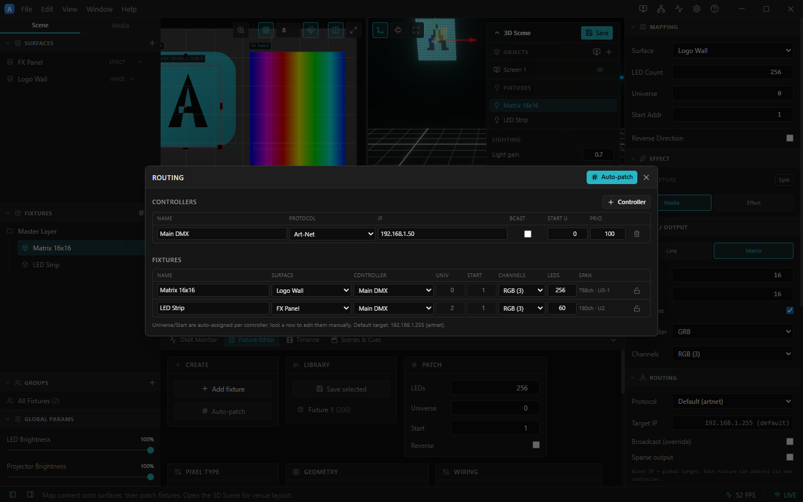

# 4. Patching & routing (DMX addressing)

Every LED needs a DMX **universe** and **start channel**, and ArtLux needs to know **which device** to
send each fixture to. ArtLux can assign addresses for you, or you can patch by hand.

*The Routing panel: Controllers on top, the per‑fixture patch grid below. Note the computed **Span** column (total channels · universe range) and the per‑row lock.*

---

## Auto‑patch (the quick path)

Click **Auto‑patch** (in the Fixture Editor's *Create*/*Patch* area, or the Routing header). It packs
fixtures back‑to‑back — each consumes `LEDs × channels` — wrapping to the next universe at the
512‑channel boundary, per controller. Fixtures you've **locked** keep their manual addresses and are
skipped.

In the demo above: the 256‑LED matrix (RGB, 768 ch) fills universes **0–1**; the 60‑LED strip (180 ch)
starts at universe **2**.

---

## The Routing panel (the full patch sheet)

Open it from the title‑bar **Routing** icon or **File ▸ Routing…**.

**Controllers** — one row per physical output device:

| Column | Meaning |
|--------|---------|
| **Name** | Your label for the device |
| **Protocol** | Art‑Net or sACN |
| **IP** | The device's address |
| **BCAST** | Art‑Net broadcast / sACN multicast |
| **Start U** | First universe this controller fills |
| **Prio** | sACN priority |

With **no** controllers, fixtures use the global target from Preferences. Add one with **+ Controller**;
delete with the trash icon.

**Fixtures** — the patch grid: *Name*, *Surface*, *Controller*, *Univ*, *Start*, *Channels*, *LEDs*,
and a computed **Span** (total channels · universe range). The **lock** icon toggles a fixture between
**auto** (universe/start computed) and **manual** (you set them).

---

## Per‑fixture overrides

The Inspector's **Routing** card (visible when a fixture is selected) lets a single fixture override
the global behaviour:

- **Protocol** — Art‑Net / sACN / *Default*.
- **Target IP** — override the controller/global IP. *Blank = global target.*
- **Broadcast (override)** — Art‑Net broadcast / sACN multicast.
- **Sparse output** — don't resend a universe whose data hasn't changed since the last frame.
- **sACN priority**.

---

## Global output (Preferences ▸ DMX Output)

The defaults every fixture falls back to: protocol, output on/off, target IP, port, broadcast, and
**Discover devices** (scan for Art‑Net nodes). Engine settings (FPS, keep‑alive, ArtSync, Gamma) live
just below. See [Preferences & monitoring](11-preferences-monitoring.md).

> **Sanity check:** if nothing lights up, confirm the chain — surface has content, a fixture is over it
> and **Mapping ▸ Surface** is set, the fixture is patched (Auto‑patch), and DMX output is enabled with
> the right IP/protocol. Verify packets in the [DMX Monitor](11-preferences-monitoring.md#dmx-monitor).

➡ Next: [Color, effects, groups & scenes](05-color-effects-groups-scenes.md)
