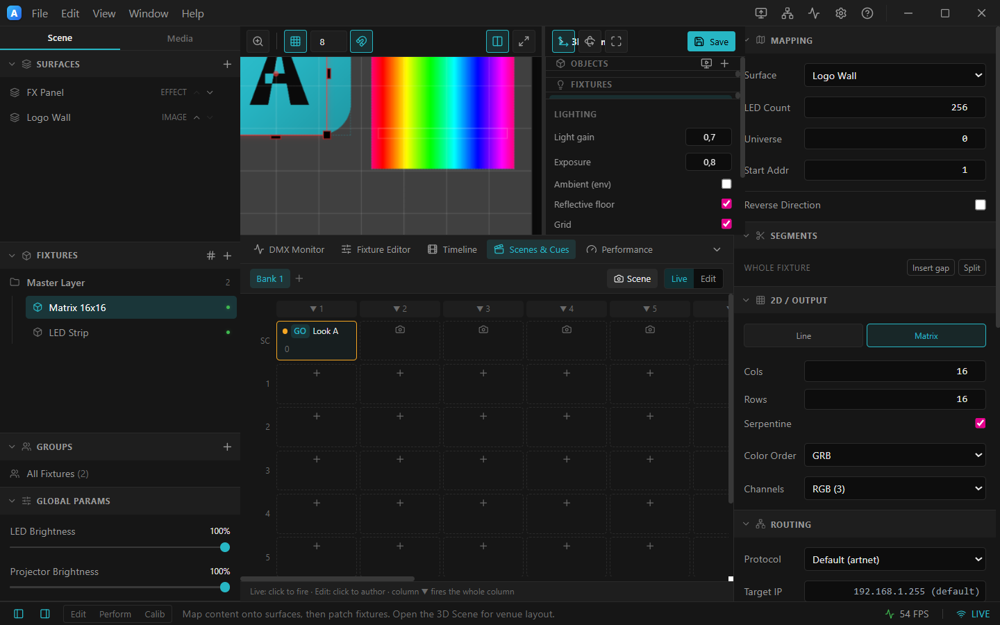

# 5. Color, effects, groups, scenes & cues

This page covers the "look" layer: correcting color, running generative effects, and saving/recalling
states with groups, scenes and the cue grid.

---

## Color & output quality

- **Color order** (per fixture, Inspector ▸ *2D/Output*) — fixes swapped R/G/B (e.g. GRB for WS2812B).
- **RGBW white mode** (per fixture) — *Subtract min* vs *None* (see [Fixtures](03-fixtures.md)).
- **LED Brightness** (left panel ▸ *Global Params*) — master scale for every fixture, 0–100 %.
- **Projector Brightness** (left panel ▸ *Global Params*) — master scale for projected content,
  independent of LED brightness.
- **Output gamma** (Preferences ▸ *Engine*) — global non‑linear brightness correction (1.0–3.0).
- **Per‑projector gamma & soft‑edge** — set independently per output (see
  [Projector outputs](08-projector-outputs.md)).

---

## Effects

Instead of media, a **surface** (Content ▸ *Effect*) or a **fixture** (Inspector ▸ *Effect* card) can
run a built‑in generative effect with a color **palette**, **Speed** and **Intensity**. The Inspector's
**Effect** card has a **Media | Effect** toggle (use the fixture's sampled media, or a generated
effect) and a **Split** button so multi‑segment fixtures can run a different effect per segment.

In the demo, the "FX Panel" surface runs a rainbow effect — you can see it sampled by the LED strip in
the [DMX Monitor](12-preferences-monitoring.md#dmx-monitor).

---

## Groups

The left panel's **Groups** section holds named selection sets.

- **+** makes a group from the current selection.
- Click a group to **reselect** it.
- Row actions let you **add the selection**, **copy one fixture's look** (effect/palette/speed/
  intensity/segments) to the whole group, or **delete** the group.

Groups don't copy position or patch — they're just reusable selections + a look‑copy helper.

---

## Scenes & cues

Open the **Scenes & Cues** dock tab.

*A cue bank: the "Look A" scene sits in the cue grid. Toggle **Scene / Live / Edit**; click a cell to fire it, or fire a whole column with the ▼ header.*

- A **scene** is a snapshot of the current look — capture all fixture colors + master brightness under
  a name (the **camera** button). Click a scene to recall it instantly. Scenes capture the *static
  look*, not effects, media or patch.
- A **cue bank** is a grid (rows × columns) of cue cells. Row 0 references your scenes; lower rows hold
  granular cues. **Live**: click a cell to fire it. **Edit**: click to author. A **column ▼** header
  fires the whole column at once — handy for stacking looks.

➡ Next: [Timeline](06-timeline.md)
