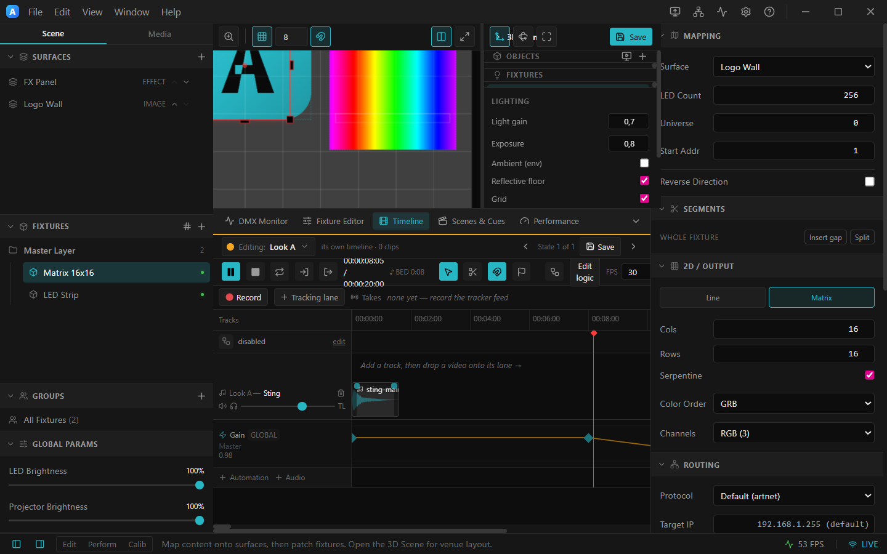

# 6. Timeline & state machine

The **Timeline** dock tab is a DaVinci‑style editor for sequencing video on tracks (layers). Point a
surface's content at a **Layer** (one track) or **Timeline** (the whole composited Program) to show it.
Press **F** to maximize the timeline full‑screen; drag the dock's top edge to resize.

*The Timeline: transport + tools toolbar, the Takes strip, the state‑machine row, then tracks with clips, a ruler and the playhead. A marker (flag) sits at ~4 s.*

---

## Editing clips

- **Drop** a video (or a Media tile) onto a track to make a clip. Place several clips on one track to
  build a sequence — the playhead plays whichever clip it's over, and outputs **black** over gaps.
- **Select tool (V)** — drag a clip to move it; drag its edges to trim.
- **Blade tool (B)** — click to split a clip; **C** splits at the playhead.
- **Snapping (S/N)** — aligns drags to clip edges, the playhead, markers and the in/out range.
- **Markers (M)** — add at the playhead; click to seek, Alt/right‑click to delete, double‑click to
  note. **I / O** set the in/out region.
- **Tracks** — mute / solo / lock / show‑hide, recolor, reorder (drag the grip), and resize height from
  the track header.

**Length & looping:** the **Length** field (toolbar) is the end of the timeline — playback stops and
holds on the last frame when it gets there. Looping is off by default; toggle **Loop** (**Shift+L**) to
repeat the **in/out** region, or the whole timeline if no region is set. **Stop**, **Set In**/**Set
Out** buttons and draggable ruler handles set the region without needing the **I**/**O** keys.

**Navigation:** **wheel** zooms toward the cursor, **Shift+wheel** scrolls horizontally, **middle‑drag**
pans in any direction. **Home / End** seek start / content end.

---

## Tracking takes (record & replay LiDAR without the tracker)

The **Takes** strip under the toolbar records the live LiDAR blob feed into reusable *takes*, so you can
rehearse and run an interactive show with **no tracker connected**.

- **Record** — press **● Record** to capture the live feed (independent of Play/Pause), **■** to stop.
  A take chip appears and a green **Tracking** lane is created.
- **Place** — drag a take onto the tracking lane (or from the **Media** library). It shows a
  blob‑density sparkline; move/trim it like any clip.
- **Replay** — with the tracker disconnected, **Play** or scrub: the recorded blobs drive the 3D Scene
  and any *Tracking* projector outputs. While a take plays it takes over from any live feed; past the
  clip the blobs clear and the live tracker resumes.

See [TRACKING_TAKES.md](../TRACKING_TAKES.md).

---

## State machine (automatic control layer)

The lane above the tracks is an always‑present logic layer (the **Edit logic** button opens its
editor). It's **disabled by default**. When enabled it can drive the transport automatically:

- Build a graph of **states** — each can *play / pause / stop / seek / set loop / jump to a marker* on
  entry.
- Connect them with **transitions** that fire **manually** (buttons on the state lane) or
  automatically **after a delay**, **at a time**, **on a marker**, **when a clip ends**, or **when the
  timeline ends** (the trigger to reach for when the whole show should advance unattended).

Turn it off any time to return to fully manual control. The Play/Pause button always reflects the real
state, whether you or the machine changed it. See [TIMELINE.md](../TIMELINE.md).

➡ Next: [Audio](07-audio.md)
