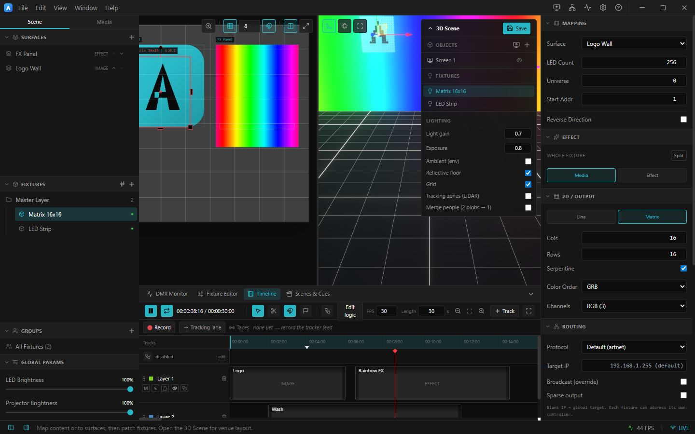

# 6. Timeline & state machine

The **Timeline** dock tab is a DaVinci‑style editor for sequencing video on tracks (layers). Point a
surface's content at a **Layer** (one track) or **Timeline** (the whole composited Program) to show it.
Press **F** to maximize the timeline full‑screen; drag the dock's top edge to resize.

*The Timeline: transport + tools toolbar, the state‑machine row, then tracks with clips, a ruler and the playhead. A marker (flag) sits at ~4 s.*

---

## Editing clips

- **Drop** a video (or a Media tile) onto a track to make a clip. Place several clips on one track to
  build a sequence — the playhead plays whichever clip it's over, and outputs **black** over gaps.
- **Select tool (V)** — drag a clip to move it; drag its edges to trim.
- **Fade in / out** — drag the small square in either **top corner** of a clip inwards. The clip's
  picture fades up from black, or down to it, over that length. It is the same handle, the same
  gesture and the same shading as a fade on an audio clip, because it is the same idea. Fades do not
  snap: they are an envelope, not a time edit. Trimming a clip shorter clamps its fades with it.
- **Blade tool (B)** — click to split a clip; **C** splits at the playhead.
- **Snapping (S/N)** — aligns drags to clip edges, the playhead, markers and the in/out range.
- **Markers (M)** — add at the playhead; click to seek, Alt/right‑click to delete, double‑click to
  note. **I / O** set the in/out region.
- **Tracks** — mute / solo / lock / show‑hide, recolor, reorder (drag the grip at the left of the track
  name), and resize height from the track header. The **top** track is front‑most in the composite;
  **+ Track** adds a new one on top.

**Length & looping:** the **Length** field (toolbar) is the end of the timeline — playback stops and
holds on the last frame when it gets there. Looping is off by default; toggle **Loop** (**Shift+L**) to
repeat the **in/out** region, or the whole timeline if no region is set. **Stop**, **Set In**/**Set
Out** buttons and draggable ruler handles set the region without needing the **I**/**O** keys.

**Navigation:** **wheel** zooms toward the cursor, **Shift+wheel** scrolls horizontally, **middle‑drag**
pans in any direction. **Home / End** seek start / content end.

**Over the track names, the wheel scrolls the list instead.** The gutter is a list — track headers, lane
names, their buttons — and in a show with more tracks than fit, reading down it is the whole reason to put
a cursor there. Plain wheel scrolls it vertically, **Shift+wheel** horizontally, with your platform's usual
momentum. Zooming still works everywhere to the right of the gutter.

---

## Takes on a lane (replay LiDAR and lighting without the source)

A **take** is a recording — of the live LiDAR blob feed, or of you busking a set of moving heads. You
**record** takes from the **Lighting Takes** and **Tracking Takes** dock panels, not from here: capture
has nothing to do with the playhead, so it does not live in the timeline. See
[Tracking](13-tracking.md#record--replay-takes-author-with-no-tracker) and
[Moving lights](16-moving-lights.md).

What the timeline owns is **placing** one:

- **Place** — drag a take out of its Takes panel (or from the **Media** library) onto a **Tracking** or
  **Lighting** lane. A tracking take shows a blob‑density sparkline; move/trim it like any clip. A
  lighting take can also be picked in a lighting clip's *Source* instead of being dragged.
- **Replay** — with the tracker disconnected, **Play** or scrub: the recorded blobs drive the 3D Scene
  and any *Tracking* projector outputs. While a take plays it takes over from any live feed; past the
  clip the blobs clear and the live tracker resumes.

Stopping a recording creates the matching lane for you if there is none.

See [TRACKING_TAKES.md](../TRACKING_TAKES.md).

---

## OSC tracks (send a curve to other devices)

An **OSC track** is a lane whose value leaves ArtLux as an **OSC message**. Use it to drive an Arduino
with an Ethernet shield, another computer or a console from the same timeline as the show. Click
**+ OSC** under the lanes, then set three things in the track's settings (the sliders button in its
gutter):

- **Address**: what the receiver listens for, e.g. `/led`.
- **Type**: `bool` (on/off, on at 0.5 and above), `int` (a whole number, e.g. 0–255) or `float`.
- **Destinations**: one or more `IP:port`. **Every destination gets every message**: list several
  boards to drive them together, or give each board its own track. An address ending in `.255` reaches
  every device on that network.

The curve is drawn and edited like any automation lane. It starts with **hold** keys, which is what an
on/off cue is. The track sends **when its value changes**, during playback and while you scrub, with at
most **Max rate** messages per second (default 30). **Re-send every** repeats the current value so a
board that rebooted catches up. The lane shows how many messages it has **sent**, and the paper-plane
button sends the current value again.

The settings also have **Test** buttons, which send a value right now even if the track is off. Under
each destination they show what happened when ArtLux tried to send there: a count, or an error such as
`EHOSTUNREACH`, which means no network card on this PC is on that board's address range.

A new track points at `127.0.0.1:10000`, which is ArtLux itself, so with OSC receive on you can watch it
in **View ▸ OSC Monitor** before any hardware exists. Switching a track off stops it sending, and the
device keeps the last value it got. Setup, wiring and a debugging checklist are in the
[OSC → Arduino tutorial](../../examples/osc-arduino/tuto/README.md). The reference is
[OSC.md](../OSC.md#sending-osc-from-the-timeline-osc-tracks).

---

## State machine (automatic control layer)

The lane above the tracks is an always‑present logic layer (the **Edit logic** button opens its
editor). It's **disabled by default**. When enabled it can drive the transport automatically:

- Build a graph of **states** — each can *play / pause / stop / seek / set loop / jump to a marker* on
  entry.
- Connect them with **transitions** that fire **manually** (buttons on the state lane) or
  automatically **after a delay**, **at a time**, **on a marker**, **when a clip ends**, or **when the
  timeline ends** (the trigger to reach for when the whole show should advance unattended).

Turn it off any time to return to fully manual control. The Play/Pause button always reflects the real
state, whether you or the machine changed it. See [TIMELINE.md](../TIMELINE.md).

➡ Next: [Audio](07-audio.md)
