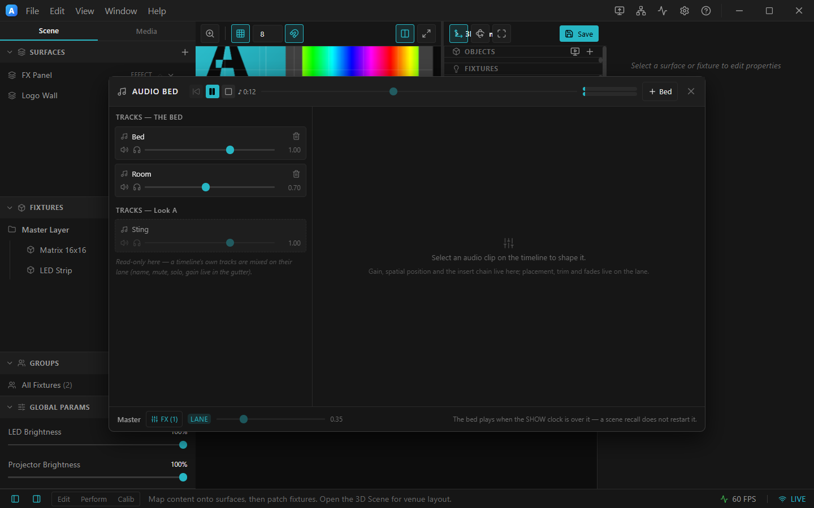

# 7. Audio

ArtLux plays **spatialised sound in step with the show**. A native engine (JUCE + ambisonics) puts every
source at a *point in the room* and decodes it to headphones (**binaural** HRTF) or a real **speaker array**.
It rides the **same transport** as the picture — so firing a cue restarts the visuals **without stuttering the
house music**.

The mixer is the **Audio Bed** panel: **View ▸ Audio Bed…**. Placement lives on the **timeline's** audio
lanes.

*The Audio Bed, with a scene bound. Read it top to bottom and the whole design is there: the **show clock** (`♪ 0:12`) in the header; **`TRACKS — THE BED`** (Bed, Room) above **`TRACKS — Look A`** — the two containers, side by side — with the scene's own track **read-only here**, because a timeline's tracks are mixed on their lane; the **clip inspector** on the right, empty until you select a clip on the timeline; and along the bottom the **master strip**, greyed out and wearing a **`LANE`** badge, its fader pinned at **0.35** because an automation lane owns the house level. Nothing in this picture is idle.*

---

## The one thing to understand first: two containers, two clocks

Almost every question about ArtLux audio — *"why did it restart?"*, *"why **didn't** it restart?"* — is
answered by asking **which container the sound is in**.

| | **The BED** | **A timeline's OWN audio** |
|---|---|---|
| Lives in | the **project** — one bed, always | the **timeline** — so **one per Scene** |
| Rides | the **SHOW clock** | the **playhead** |
| A Scene recall (a GO) | **does not touch it** | **restarts it** |
| Edit it on the timeline | only while **Global** is bound | whenever that timeline is bound |
| Use it for | house music, room tone, a long ambient bed — **the thing that must not stutter when you fire a cue** | the scene's **sting** — the thing that *should* fire again on every entry |

> **The question to ask, every time you add a sound:** *"When I fire this cue again, should this start over?"*
> **Yes** → the Scene's timeline. **No** → the bed. There is no flag to set — **put it in the right container
> and the behaviour is free.**

**You can see both clocks.** With a Scene bound, the timeline toolbar grows a **`♪ BED m:ss`** readout — the
**show** clock — while the ruler underneath shows that **scene's** playhead. They are *supposed* to disagree.

**The bed's lanes vanish from the timeline while a Scene is bound.** That is a signal, not a bug: the ruler
you are looking at belongs to the scene, and the bed does not obey it. Click the **Global** pill to get them
back. *You can hear the bed everywhere; you can only edit it on Global.*

---

## Tracks, clips & lanes

- **Add a bed track** — **`+ Bed`** in the Audio Bed header, or the **`+`** on the bed lanes' gutter. Same
  door.
- **Add a sound** — drag an audio file from the **Media** library onto a lane. Formats: **`wav`, `aiff`,
  `flac`, `ogg`** (MP3/AAC are not enabled).
- **Place / trim / blade / fade** — on the **lane**, exactly like a video clip. The corner handles are fades.
- **Name, mute, solo, gain** — the lane's **gutter**, *or* the Audio Bed. The same fields, two doors.
- **Solo is scoped per container** — soloing a *bed* track does not silence a Scene's own audio. They are two
  mixes on two clocks.

---

## Shaping a sound (the clip inspector)

**Select a clip on its lane** and it appears in the Audio Bed's inspector. That is the whole
arrangement/mixer split: you **place** on the lane, you **shape** here.

- **Gain** — the clip's level.
- **Spatial** — tick it, and a **top-down positioner pad** appears (left/right × front/back) plus a **height**
  slider. Drag the dot and the sound moves **around your head**. 🎧 *Binaural decoding is an HRTF — it only
  works over headphones.* On a real installation, switch to a **speaker layout** in Preferences.
- **FX** — an **insert chain** on the source: **reverb, filter, delay, compressor**.

> **The insert runs *before* the sound is placed** — so a reverb puts the source in a room, and then **the
> room moves with it**. That is what you want, and it is why the insert belongs to the clip.

---

## The master strip

The bottom of the Audio Bed: the **house level**, an **FX** chain, and the **L/R meters** in the header.

- The **clipping** badge is **latched** — it lights if *any* audio block clipped since the last poll, not just
  the one that happened to be sampled. **If it lit, it happened.**
- **Master FX is for protection** — a **compressor / limiter** to keep the rig safe.

> ### ⚠ A reverb on the master does nothing, and the UI will still let you add one.
> The master chain runs **after** the ambisonic decode, where the signal may be 8 channels wide — and JUCE's
> reverb is a **≤ 2-channel** processor. It would pass the signal dry, so the engine **drops it** rather than
> pretend. **Put reverb on the clip.** (You would not want it on the master anyway: it would smear the entire
> spatial field into one flat room *after* you had carefully placed everything in it.)

---

## Automation

Audio is automated by the **same curve engine** as everything else — an audio lane *is* a lane. Add one from
the **`+`** in the timeline's automation gutter.

You can automate the **master gain**, any **track** or **clip** gain, a source's **position** (`x`/`y`/`z` —
this is how you fly a sound around a room), and any **FX parameter**. You *cannot* automate the **Spatial
checkbox** or a **mute** — neither is a number.

**A lane rides the clock of the document it lives in.** A lane on the **Global** timeline rides the **show
clock**, so it keeps driving underneath every Scene. A lane on a **Scene's** timeline rides that scene's
playhead, and re-fires on every entry.

**The mixer shows what is *sounding*, not what the document says.** When something else owns a fader, it says
so:

| Badge | Means | The fader |
|---|---|---|
| **`LANE`** | an automation lane owns this parameter | **read-only** — a move would be overwritten on the next frame. Switch the lane off (the **⚡** in its gutter) to take it back. |
| **`FADE`** | a Scene or Cue recall faded it here — **and it persists** | **still live** — moving it is a real **takeover**. This is your recovery gesture. |

While a Scene is bound, the timeline still draws the **Global** lanes — dimmed and badged **`GLOBAL`** — so
you can *see* what is moving your master. If a scene lane owns the same parameter, the global one is **struck
through**: it is no longer applying.

---

## Three silences, and they are not the same

| Badge | Means | Fix |
|---|---|---|
| **`no audio engine`** (amber) | The app started **without its native audio engine**. Everything else — authoring, saving, DMX, projectors, OSC — works normally. There is simply nothing to make sound with. | Reinstall, or (from source) `npm run build:audio`. |
| **`no output device`** (red) | The engine is fine and the show is running, but **the audio interface has gone** — a bumped USB cable, a driver reload. | Reconnect it, then **Preferences ▸ Audio ▸ Reconnect**. Sound returns with no restart. ⚠ ArtLux does **not** re-open a device by itself. |
| **`show ended`** (amber) | **Not a fault — the show is over.** The global **Length** ran out with **Loop off**, so the show clock parked and the bed stopped. Everything else still says *playing*. | Raise the global **Length**, turn global **Loop** on, or **Stop → Play**. **An installation should essentially always loop.** |

---

## Preferences ▸ Audio

Choose the **output channels** (1/2/4/6/8) and the **spatial output mode**: **Binaural** (HRTF, for
headphones) or a **Speaker layout** (the mode for a real installation). The device may open with *fewer*
channels than you ask for — the panel tells you, and the master chain is built for what you actually got.

---

**Learn it by ear:** the [`examples/audio/`](../../examples/audio/README.md) set has **five openable projects**
and a **six-chapter tutorial**. Its demo bed **counts out loud**, one beep per second — so *"a cue does not
restart the music"* is something you **hear**, not something you take on trust. Full reference:
[AUDIO.md](../AUDIO.md).

➡ Next: [Projector outputs](08-projector-outputs.md)
