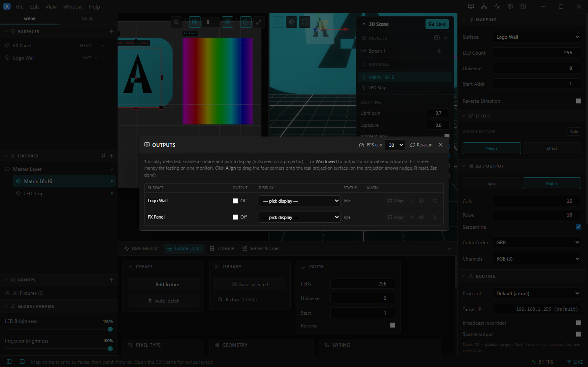
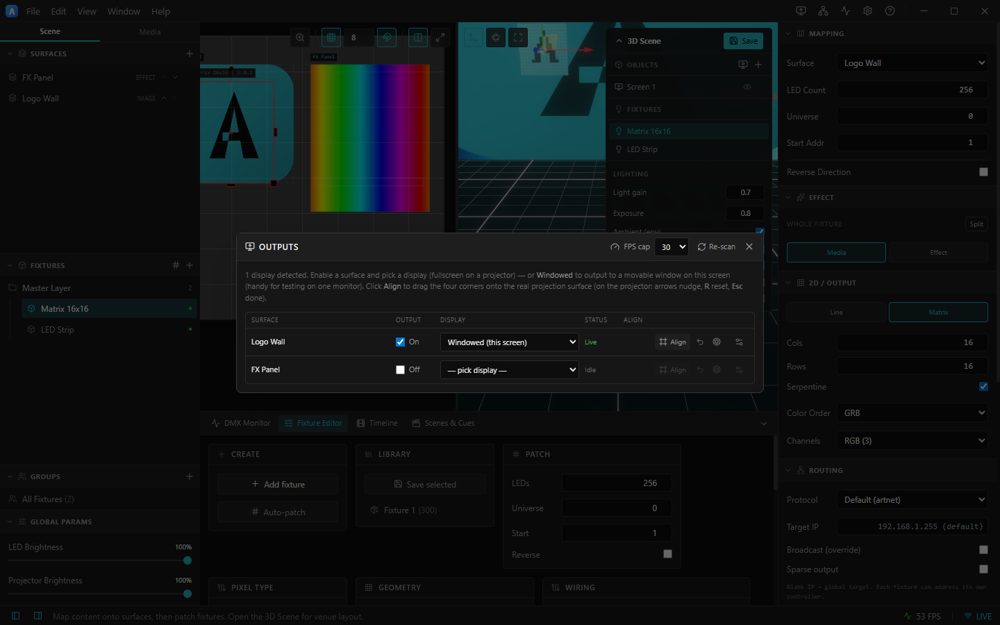

# 7. Projector outputs

Send any surface fullscreen to a physical display with geometry correction. Open the **Outputs** panel
from the title‑bar **Outputs** icon. Each surface gets a row.

*The Outputs panel: one row per surface, with On toggle, Display picker, Status, and Align. The header has a global FPS cap and Re‑scan.*

---

## Turn an output on

1. Pick a **Display** for the surface's row. A real projector appears here; **Windowed (this screen)**
   outputs to a movable window on your current monitor (handy for testing on one screen). Use
   **Re‑scan** if you plug/unplug displays.
2. Tick **On**. A frameless fullscreen window opens on that display and the status reads **Live**.

*"Logo Wall" output On, set to Windowed — status **Live**, and the **Align** button is now active.*

> The projector window itself is hardware‑accelerated and isn't shown here, but it mirrors the surface
> exactly. On a real rig you'd see the surface content filling the projector.

---

## Align (corner‑pin)

Click **Align**, then on the projector window drag the four corners onto your projection surface:

| Input | Action |
|-------|--------|
| Drag a corner handle | Move that corner |
| Arrow keys | Nudge the selected corner (**Shift** = ×10) |
| **R** | Reset to a clean rectangle |
| **Esc** | Finish aligning |

---

## Bézier warp (curved surfaces)

Expand a row (the **gear**) and tick **Bézier warp**, then **Align** to drag a 16‑point control mesh —
for cylinders, coves, domes and angled walls. **R** resets the mesh.

---

## Soft edge, gamma & color match

Per output (in the expanded row):

- **Soft edge** — feather each edge (L/R/T/B %) with a blend **gamma** for multi‑projector overlaps.
- **Output γ** — a per‑screen gamma.
- **Color / black match** — match brightness/black level across projectors.

---

## Other controls

- **Send as NDI** — publish the warped output as an NDI source for downstream tools.
- **FPS cap** (panel header — Off / 60 / 30 / 24) — throttle all outputs to save GPU on big rigs.
  Outputs otherwise render at native resolution with anti‑aliasing.

For a precise lens+pose solve (so the 3D scene maps onto the real surface), use the
[calibration wizard](09-calibration.md). Hardware acceleration (NVAPI scanout warp/blend) is used
automatically on supported NVIDIA pro GPUs — see [NVWARP.md](../NVWARP.md). More in
[OUTPUTS.md](../OUTPUTS.md).

➡ Next: [3D scene](08-3d-scene.md)
