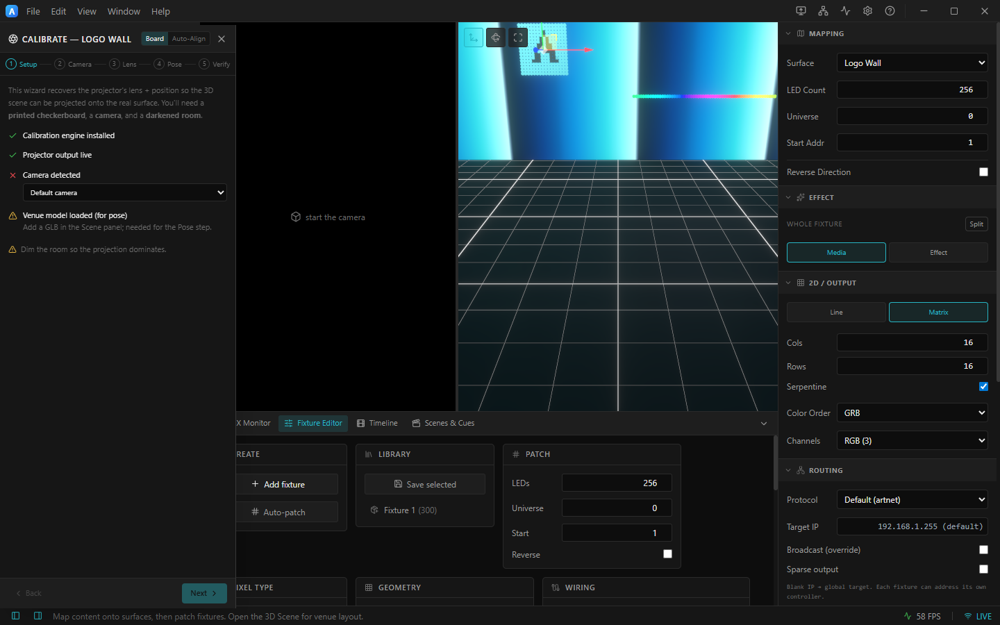

# 9. Projector calibration

Calibration recovers a projector's **lens + position** so the 3D scene can be projected onto the real
surface at 1:1. You launch it from the [Outputs panel](07-projector-outputs.md): enable an output, then
click the **Calibrate** (target) icon on that row.

> **Hardware required:** calibration needs a **camera**, a **projector**, and (ideally) a darkened
> room. The wizard UI below is the real panel; with no camera connected the *Camera detected* check
> shows a ✗ and the camera steps wait for a device.

*The calibration wizard for "Logo Wall": Board / Auto‑Align modes, the 5 steps (Setup ▸ Camera ▸ Lens ▸ Pose ▸ Verify), and a readiness checklist.*

---

## Two modes

- **Board** — structured‑light + a **printed checkerboard**. Most accurate; recovers full lens
  intrinsics and pose. A ready‑to‑print board is in [`docs/checkerboard-9x6-25mm.svg`](../checkerboard-9x6-25mm.svg).
- **Auto‑Align** — markerless: you nominate a few correspondences and it solves the pose. Faster setup,
  no print needed. See [AUTO-ALIGN.md](../AUTO-ALIGN.md).

---

## The Setup checklist

The first step confirms you're ready:

| Check | Meaning |
|-------|---------|
| ✅ **Calibration engine installed** | The native OpenCV addon is present. |
| ✅ **Projector output live** | The output you're calibrating is On. |
| ❔ **Camera detected** | Pick your camera in the dropdown; ✗ until one is connected. |
| ⚠ **Venue model loaded (for pose)** | Add a `.glb` in the 3D Scene — needed for the Pose step. |
| ⚠ **Dim the room** | So the projection dominates the camera image. |

---

## The 5 steps

1. **Setup** — the checklist above; pick the camera and **Start the camera**.
2. **Camera** — frame the projector so the camera sees the whole projection.
3. **Lens** — capture the checkerboard / patterns to solve the projector's lens intrinsics.
4. **Pose** — solve where the projector sits relative to the venue model (PnP).
5. **Verify** — overlay the solved projection on the camera feed to confirm the fit.

**Back / Next** move between steps. The result feeds the projector output so the 3D scene maps onto the
real surface.

ArtLux also imports/exports **MPCDI** for interchange with other warping tools, and can camera‑measure
projector **gamma**. Full details, the optimization passes (ArUco one‑click recal, masking, exposure,
colour/black match), and troubleshooting are in [CALIBRATION.md](../CALIBRATION.md) and
[CALIB-OPTIMIZATIONS.md](../CALIB-OPTIMIZATIONS.md).

➡ Next: [Projects, media & broadcast](10-projects-media-broadcast.md)
