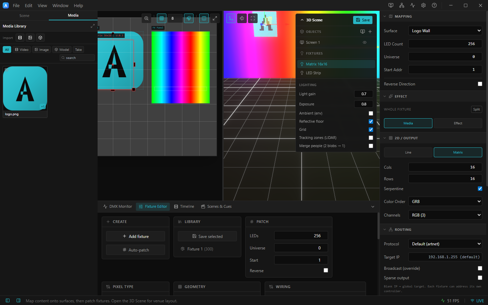
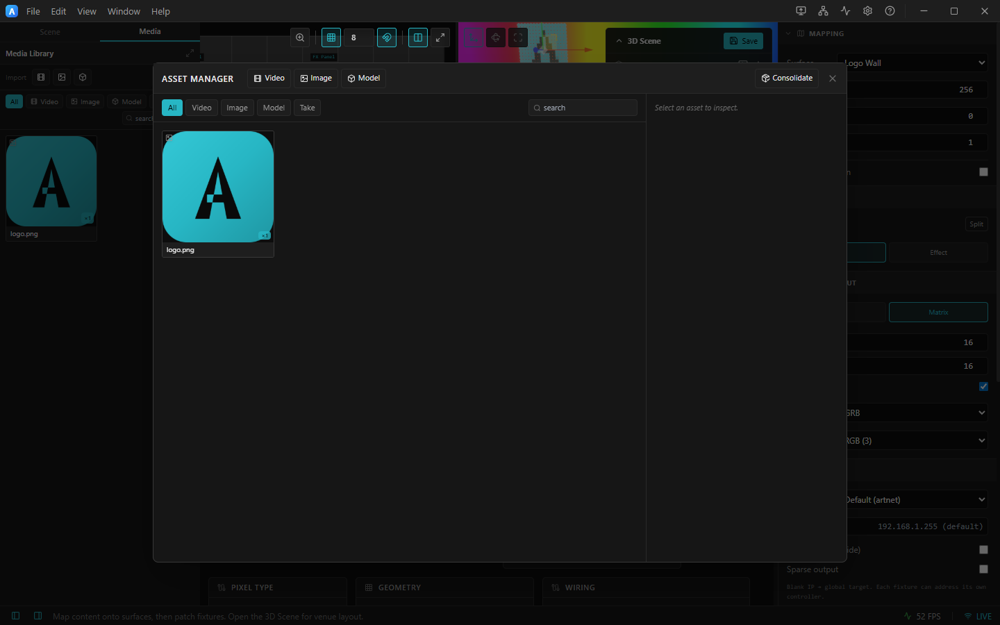

# 10. Projects, media library & broadcast mode

## Projects are folders

ArtLux projects store **everything** — surfaces, fixtures, controllers, settings, brightness, groups,
scenes, cue banks, the 3D scene, the timeline, the media library, and projector outputs.

- **New Project** (**Ctrl/Cmd+N**) prompts for a **location** and creates a project **folder** —
  `project.artlux` plus an `assets/{video,images,models,tracking}/` tree — and saves immediately, so
  imported and recorded media always has a home.
- **Open…** (**Ctrl/Cmd+O**) opens a `.artlux` file; **Open Project Folder…** (**Ctrl/Cmd+Shift+O**)
  opens a folder. **Open Recent** lists your last projects.
- **Save** (**Ctrl/Cmd+S**), **Save As…** (**Ctrl/Cmd+Shift+S**).

Asset paths inside the folder are stored **relative**, so you can zip or move the whole folder and it
stays self‑contained.

---

## Media library

The left panel's **Media** tab is the project's media hub — video, images, 3D models and recorded
tracking takes in one place.

*The Media library: Import buttons (Video / Image / Model), type filters and search, and a tile per asset with a thumbnail and a usage badge.*

- **Import** — the **Video / Image / Model** buttons copy the chosen files **into** the project's
  `assets/` folder (so the project stays portable). Recorded **takes** appear here automatically.
- **Browse** — filter by type, search by name. Each tile shows a thumbnail and a badge: **used N×**,
  **unused**, or **⚠ missing**.
- **Place** — **drag a tile** onto a Stage surface (sets its video/image content) or onto a Timeline
  lane (creates a clip). Or select a tile and click **Use** to assign it to the selected surface.

### Asset Manager

Click the **expand** icon (⤢, *Open full Asset Manager*) for the full manager.

*The Asset Manager: filter by Video / Image / Model / Take, search, inspect an asset, and **Consolidate** external media into the project folder.*

From here you can see an asset's **usage** (click a surface usage to jump to it), **Relink** a
moved/missing file (every reference updates), **Reveal in folder**, **Remove**, and **Consolidate**
(copy any still‑external media into the folder and relativize paths — the successor to *Collect
Assets*). See [ASSETS.md](../ASSETS.md).

---

## Broadcast (show) mode

**File ▸ Launch in Broadcast Mode** opens every enabled output fullscreen and streams Art‑Net/sACN with
**no editor UI** — the lean way to run a show. Quit it from the system‑tray icon or with
**Ctrl/Cmd+Shift+Q**.

For an even lighter footprint (compute + output only, no UI/3D), the app also has a `--headless` launch
mode used by automation.

---

## Updates

**Help ▸ Check for Updates…** — Windows/Linux auto‑update; macOS prompts you to download.

➡ Next: [Preferences & monitoring](11-preferences-monitoring.md)
