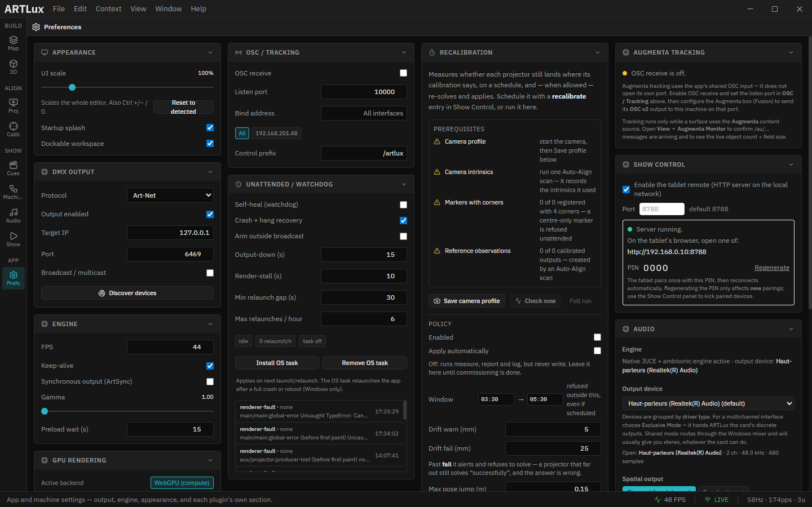
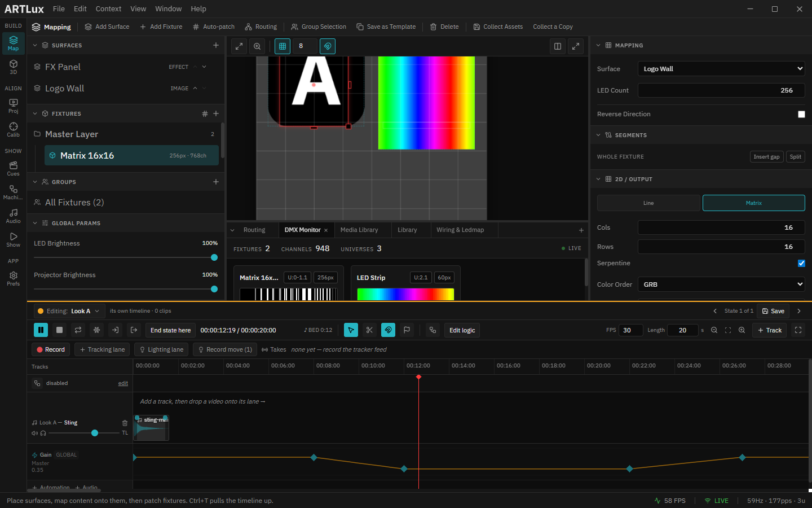
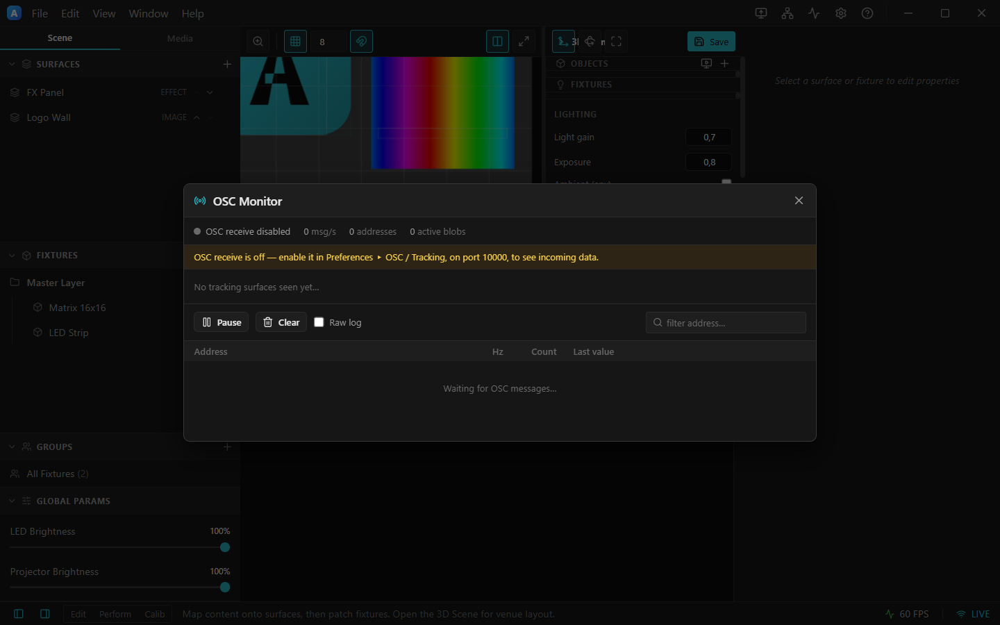

# 12. Preferences & monitoring

## Preferences

Open from the title‑bar **Preferences** icon, **File ▸ Preferences…**, or **Ctrl/Cmd+,**. It's a single
scrolling panel with collapsible sections.

*Preferences: DMX Output, Engine, and OSC / Tracking sections.*

**DMX Output** — the global output defaults:

- **Protocol** — Art‑Net or sACN.
- **Output enabled** — master on/off for network output.
- **Target IP** / **Port** — where packets go (Art‑Net default port 6454).
- **Broadcast / multicast**.
- **Discover devices** — scan the network for Art‑Net nodes.

**Engine** — the output loop:

- **FPS** — output frame rate (what goes on the wire).
- **Engine rate (fps)** — how often a new frame is *made*: composited, sampled for your fixtures and
  published. Default **30**.

  **Higher is not always smoother.** Each engine tick asks every video layer for the exact frame at the
  playhead, and asking faster than the decoder can supply does not produce more pictures — you get the
  nearest frame it happens to hold instead, and a run of those is what looks like the picture stopping
  and starting. On a 1080p60 HAP show looping every 14 seconds, running uncapped missed **19%** of
  frames — bunched into the moment after each loop — while 25 fps missed **0.27%** and every scene cut
  was clean.

  It is **not** the Art‑Net rate: the wire keeps running at **FPS** above, re-sending the last frame, so
  a slower engine never starves a node — only new pixel data arrives less often. Lower it if heavy video
  stutters; raise it on a fast machine. It is a property of *this computer*, not of the show, so it does
  not travel with a project.
- **Keep‑alive** — keep streaming unchanged universes.
- **Synchronous output (ArtSync)** — synchronized universe release.
- **Gamma** — global output gamma (1.0–3.0).

**OSC / Tracking** — external control + LiDAR:

- **OSC receive** — enable the listener.
- **Listen port** / **Bind addr…** — where to listen (pick a NIC or *All interfaces*).
- **Control prefix** — the OSC address namespace (e.g. `/artlux`).

See [OSC.md](../OSC.md) for the full address map.

**Audio** — the output device and the spatial rig (only when the native audio engine is built):

- **Output device** — a dropdown **grouped by driver type**. On Windows the same interface appears under
  *Windows Audio* (shared — routes through the Windows mixer, usually stereo) **and** *Windows Audio
  (Exclusive Mode)* — pick **Exclusive Mode** for a multichannel rig; it hands ArtLux the card's discrete
  outputs. **Sample rate** and **buffer size** pin the device; the *Open:* line reports what was **actually**
  opened (a stereo card asked for 8 channels reports 2 back). **Reconnect** re-opens the named device after
  a cable bump.
- **Spatial output** — *Binaural* (headphones, HRTF) or *Speaker layout* (a real array: quad, 5.1, 7.1,
  octagon, cube…).
- **Speaker check** *(speaker mode)* — **click** a speaker to hear a repeating blip from exactly that output, and
  set which device **channel** each speaker is wired to. This is how you commission a ring whose speakers
  aren't cabled 1:1 — see the walkthrough in [chapter 7 ▸ Commissioning a speaker rig](07-audio.md).
- **Meters** — a live per-channel level meter.

These settings are **per-machine** (they describe this computer's sound card), so they are stored in
Preferences, not in the project — opening a show never re-patches the venue's audio. See
[AUDIO.md ▸ Devices and speakers](../AUDIO.md) for the reference.

**GPU rendering** — what this machine's graphics hardware is doing, and what to give up when it can't
keep up. Like Audio, these are **per-machine** and never travel inside a project:

- **Active backend** — which pixel-mapping path is live. **WebGPU (compute)** is the real one. **WebGL
  (fallback)** is a reduced mode: it samples the whole composite rather than each surface's own pixels,
  so overlapping surfaces are approximated and effects are ignored. If you see it on a machine that is
  meant to run a show, the graphics driver is the thing to fix — see [chapter 17 ▸ Installing](17-installing.md).
- **Test WebGPU support** — probes the adapter and names it. Use it to tell "no WebGPU on this machine"
  apart from "WebGPU exists but something else went wrong".
- **Force WebGL fallback** — deliberately run the reduced path on a machine that has WebGPU, to see what
  an underpowered venue PC will show. Takes effect on the next reload (**Ctrl+R**); the Stage displays a
  banner the whole time it is active, so you cannot leave it on by accident.
- **3D render scale** — the resolution the 3D Scene viewport renders at, applied live. **This is the
  first thing to lower when the 3D view is slow**: cost scales with the square, so `0.5×` is a quarter
  of the pixels. It affects only the 3D preview — never the projector outputs, never what goes on the
  wire. See [chapter 9 ▸ Making this viewport cheap](09-3d-scene.md).
- **3D frame rate** — a ceiling on how often the 3D Scene viewport redraws, applied live. Try it when
  the render scale did not help: that means whole frames are expensive rather than pixels. **Capping the
  preview never slows the show** — mapping, LED sampling and Art-Net run in the frame engine at the
  engine FPS regardless — it only stops the preview taking GPU time from the output. Whether that buys
  anything depends on the machine; watch the **FPS** readout in the status bar and keep the setting only
  if it moves.
- **3D Scene on WebGPU** — **on by default.** Renders the 3D Scene viewport with WebGPU instead of the
  older WebGL path; measured here at **60 fps against 32**, with WebGL leaving the graphics processor
  saturated on a scene of two venue screens. Takes effect on the next reload (**Ctrl+R**). The viewport
  badges itself whenever it is *not* on WebGPU — turned off deliberately, or fallen back because this
  machine has no usable adapter. This is the *preview* only — unrelated to **Active backend** above,
  which is the pixel-mapping engine and has always been WebGPU.

---

## DMX Monitor

The **DMX Monitor** dock tab shows the **live, per‑fixture pixel output** — exactly what's going on the
wire.

*The DMX Monitor: totals (Fixtures / Channels / Universes) and a live color strip per fixture. The **LIVE** badge is lit while output runs.*

Use it to confirm output is flowing, channel counts are what you expect, and color order is right
(the strip should show the colors you intend). In the demo: 2 fixtures, 1264 channels, 3 universes.

---

## OSC Monitor

**View ▸ OSC Monitor…** (**Ctrl/Cmd+Shift+M**) opens a sniffer for the incoming OSC / LiDAR feed.

*The OSC Monitor: rate (msg/s), address count and active blob count, a per‑address table (Hz / Count / Last value), Pause / Clear / Raw log, and an address filter.*

If it reads *"OSC receive is off"*, enable it in **Preferences ▸ OSC / Tracking**. This is the first
place to look when tracking content or external control isn't responding.

---

## Health metrics (Prometheus & Grafana)

ArtLux can publish live health metrics — output FPS, packets/sec, active universes, CPU, memory — for a
dashboard, on this machine or another on the network. It's cheap on the show machine: ArtLux only
exposes a tiny text page at `http://127.0.0.1:9464/metrics`; **Prometheus** scrapes it and **Grafana**
draws the dashboard.

- **Disable / move it:** loopback‑only by default. `ARTLUX_METRICS=0` disables it;
  `ARTLUX_METRICS_HOST=0.0.0.0` lets another machine/Docker read it; `ARTLUX_METRICS_PORT` changes the
  port (default `9464`).
- **Dashboard:** open Grafana (default `http://localhost:3001`, `admin`/`admin`) and pick the **ArtLux**
  dashboard; `artlux_output_up` reads **LIVE** while output runs.

Full setup (Docker one‑liner, native path, ready‑made dashboard) is in [MONITORING.md](../MONITORING.md).

➡ Next: [Tracking (LiDAR · camera · Augmenta)](13-tracking.md)
