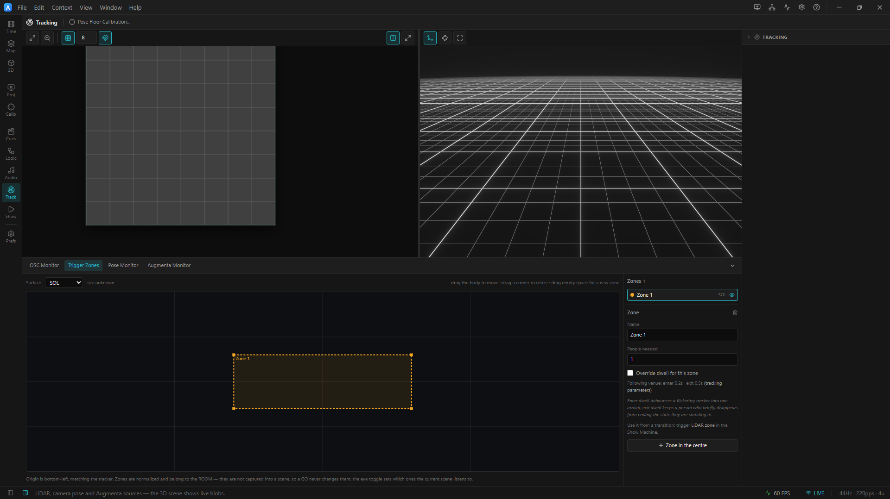

# 13. Tracking (LiDAR · camera · Augmenta)

**Tracking** brings the room into the show: live positions of people on the floor become data ArtLux
can visualize in 3D, project 1:1 onto the floor/wall, and — via **trigger zones** — use to drive the
[state machine](14-show-state-machine.md). A tracked person is a normalized `(u,v)` position (a
"blob"); every source maps onto a surface the same way, so the rest of the app doesn't care which
sensor produced it.

ArtLux ships three tracking sources, all interchangeable:

| Source | Sensor | How it arrives | Setup weight |
|---|---|---|---|
| **LiDAR** | a venue LiDAR/tracker server | custom OSC blob feed on **udp/10000** | the installation default |
| **MediaPipe** | any webcam | Google BlazePose, in‑app (no sensor) | lightest — a camera + one asset download |
| **Augmenta** | an [Augmenta](https://augmenta.tech) box | Augmenta **OSC v2** into the app's OSC listener | a pre‑calibrated optical box |


<!-- Ideal future shot: add live per-person blob markers (run scripts/lidar-emitter.cjs during capture) and a 2nd wall zone. -->
*Live tracking in the 3D Scene: the floor (SOL) and wall (MUR) zones at real scale, one glowing marker per person, with the Lighting panel's tracking toggles at the bottom‑right.*

---

## Enable the LiDAR feed (the installation default)

The venue tracker **sends** OSC to your machine; ArtLux **binds** to its own network card and receives.

1. **Preferences ▸ OSC / Tracking**:
   - **OSC receive** — on.
   - **Listen port** — **`10000`** (the installation default).
   - **Bind address** — **this** machine's IP (e.g. `192.168.61.32`) or **All**. *Never* bind the
     tracker server's IP.
   - **Control prefix** — `/artlux` (control messages only; the `/SOL` and `/MUR` tracking addresses
     are routed separately and never collide with it).
2. Confirm the bind in the log: `[osc] listening on 192.168.61.32:10000`.
3. **View ▸ OSC Monitor** (**Ctrl/Cmd+Shift+M**) — the fastest "is the tracker actually sending?"
   check. Expect a **green** dot, live **msg/s**, and **SOL** / **MUR** blob cards showing
   `active / total` slots. An **amber** dot at `0 msg/s` means the listener is up but nothing is
   arriving (server or network).

> **Ping the server first.** Being on the same subnet is not enough — `ping 192.168.61.21` (the
> tracker) before you expect blobs. 100% loss = the server is down or unreachable.

No tracker on the bench? Drive the whole pipeline with synthetic blobs:

```bash
node scripts/lidar-emitter.cjs 127.0.0.1 10000 3
```

---

## Enable camera tracking (MediaPipe)

A webcam + BlazePose, running in‑app — no specialized sensor. Inference runs in the main editor
window; projector windows receive the results.

1. **One‑time asset download:** `npm run assets:mediapipe` (fetches the WASM runtime + pose models).
   Without it the feature logs `[mediapipe] engine start failed` and no‑ops silently.
2. Select a surface → content type **MediaPipe**. Tune marker size / skeleton / IDs / trails / flip /
   rotate in the Inspector.
3. **Preferences ▸ Pose Tracking (MediaPipe)** — pick the **camera**, model (lite/full/heavy), and
   delegate.
4. **View ▸ Pose Monitor…** — live camera preview, fps, and the tracked‑people count.
5. Toggle **Camera pose markers (MediaPipe)** in the 3D scene panel for the simulator overlay.

**Floor calibration (real‑world position).** When the camera points *down* at the floor, the raw
image is perspective‑distorted. **View ▸ Pose Floor Calibration…**: drag the four handles onto the
corners of a floor rectangle whose real size you know, enter its **width × depth** in metres, and
**Save** (order: top‑left, top‑right, bottom‑right, bottom‑left; the image's top edge is the *far*
side). The 3D preview then places each person at their mapped metres. The mapping assumes feet on the
floor plane — a standing/walking person maps accurately, a jumping one momentarily doesn't.

---

## Enable Augmenta

A self‑contained, pre‑calibrated optical box that streams tracked objects over **OSC v2** into the
same OSC listener ArtLux already runs — no extra port, no native module.

1. **Enable OSC receive** and note the listen port (**Preferences ▸ OSC / Tracking**).
2. Configure the **Augmenta box (Fusion)** to send its **OSC v2** output to this machine on that port.
3. **View ▸ Augmenta Monitor…** — confirm `/au/…` messages arrive (the dot turns green) and check the
   live object count + field size.
4. Select a surface → content type **Augmenta**; configure markers / trails / IDs / flip / rotate.
5. Toggle **Augmenta field + objects** in the 3D scene panel for the overlay.

Because the box reports its field size in metres, the 3D viz places objects at their real position
directly — Augmenta needs **no** floor‑calibration wizard.

Testing without the box: `node scripts/augmenta-emitter.cjs 127.0.0.1 12000 3` (point it at the app's
OSC listen port).

---

## See people in the 3D scene — and merge the doubles

Open the **3D Scene** and enable **Tracking zones (LiDAR)** in the bottom‑right **Lighting** panel.
The SOL (floor) and MUR (wall) zones appear at real scale with a glowing marker per active blob.

**Merge people (2 blobs → 1).** This venue's tracker emits roughly **two blobs per person**, and its
raw ids flicker hard (median lifetime ~0.13 s). Turn on **Merge people** to run a small predictive
tracker that clusters blobs into stable people with steady ids:

- **Merge radius (m)** — default **0.8**. Lower it if distinct people merge into one; raise it
  (→1.0) if one person still shows two markers.
- **Predict (ms)** / **Smoothing** — motion tuning (≈66–100 ms predict at 30 Hz).

A steady marker count that matches your real headcount, with each person keeping one `#id` as they
move, means it's tuned. Counting downstream (zones, thresholds) is **post‑merge**: `1 person` means
one person, not one blob.

---

## Project the blobs onto the real floor/wall (1:1)

Blobs are a surface **content type**, so they flow through the normal projector pipeline
([Projector outputs](08-projector-outputs.md), [Calibration](10-calibration.md)):

1. Add a surface → Inspector → **Content** → **Tracking**. Pick **Source** (`SOL` floor / `MUR` wall /
   `SOL_MUR` combined). Options: **Blob size**, **Show IDs**, **Flip H/V**, **Rotate**, **Calibrate**
   (overlay), **Background** (a timeline layer drawn under the blobs).
2. Route each surface to its projector in the **Outputs** panel (floor surface → floor projector,
   wall surface → wall projector).
3. Tick **Calibrate** to project each zone's border + grid + corner labels + amber **U/V** arrows,
   then **Outputs ▸ Align** the corner‑pin/Bézier onto the physical edges.
4. Confirm orientation: a person stands at a known corner; toggle **Flip H/V / Rotate** until the blob
   lands on them. Then turn Calibrate off.

---

## Draw trigger zones (Tracking workbench ▸ Trigger Zones)

A **trigger zone** is a named rectangle of a tracking surface that the show machine can react to —
*someone enters the entrance zone → play the reaction state.* Zones are the bridge between the blob
feed and the [state machine](14-show-state-machine.md).

**The mental model, in one breath:** zones are **the room** — project‑scope geometry shared by every
scene and state. You draw the entrance / stage / doorway **once**; changing the show's look never
recreates or loses them.

<!-- TODO screenshot: the 3D (Venue & Rig) workbench with the Trigger Zones dock tab open — a tracking map with 2-3 drawn zones (Entrance, Stage), raw live blobs, the per-zone list with People-needed and the eye toggle, and the venue-wide Zone enter/exit dwell fields — capture via scripts/capture-docs.cjs -->
*The Trigger Zones panel: draw zones on the tracking map, set People needed per zone, and toggle the per‑scene eye. Live blobs are drawn **raw** (not merged) so the two‑blobs‑per‑person is visible.*

**Author them** in the **3D** (Venue & Rig) workbench, on the **Trigger Zones** dock tab. Three ways
to it, all landing on the same tab — use whichever you are nearest:

- the **Trigger Zones** button on the Venue & Rig action bar (top of the window, beside *Pose Floor
  Calibration…*);
- **Draw trigger zones…** at the top of the **Tracking** section in the right‑hand parameter column —
  where the dwell and merge settings below it already live;
- **View ▸ Trigger Zones**, from anywhere in the app — it switches to the venue workbench for you.

(There used to be a separate *Tracking* workbench; it merged into 3D — being *in* the 3D scene, where
the live blobs are drawn, is the better version of what it offered.)

- **drag on empty space** to draw a zone; **click** to select, **drag the body** to move, **drag a
  corner** to resize.
- Each zone carries **People needed** (default 1, counted *after* people‑merge).
- The **eye** toggle sets whether the **current scene** listens to this zone (dim + hollow = ignored
  in this scene). Leave every eye on and every zone is simply live everywhere.

**Tune the dwell once, on‑site.** How hard the tracker flickers is a property of the **room**, not of
any one zone, so the enter/exit dwell is a **venue‑wide** control in the tracking parameters (beside
*Smoothing* / *Merge radius*):

- **Zone enter dwell** (default **0.2 s**) — how long presence must last before a zone latches
  *occupied*. Raise it if arrivals fire too eagerly.
- **Zone exit dwell** (default **0.5 s**) — how long absence must last before it clears; also the
  **gap tolerance** for a person who briefly drops out. Raise it if a standing visitor keeps
  dropping.

A single zone can **Override dwell for this zone** for the odd entrance that must react faster (or a
lounge that must hold longer) than the rest of the room. The same zones appear in the 3D scene,
labelled with name and live headcount, so you can check they sit where you think.

---

## Wire a zone to the show

In the [state machine](14-show-state-machine.md), a transition's **trigger** can be **LiDAR zone**.
Pick it in the transition inspector and choose a mode:

- **One zone** — `someone enters` · `everyone leaves` · `occupied for…` · `empty for…` (the
  attract‑return rule) · `at least N people`.
- **Combination** — **ALL / ANY** of several zones, each optionally **NOT** — e.g. *"someone in the
  entrance **and** nobody on the stage"* as one rule. A combination is about **occupancy**, not
  events, and is one level deep on purpose.

Every rule is a **level** with an **arm‑and‑hold** behaviour: it can't fire until the world actually
changes (so a visitor still standing where they triggered the last hop doesn't re‑fire), and it stays
armed for as long as the condition lasts. Pair a zone trigger with **hold at end** + **only after the
state has finished** and you get the canonical installation state: *play the look to its end, freeze
there, advance when someone walks in* — instead of a visitor cutting the film three seconds in. See
[Show / state machine ▸ Hold a state at its end](14-show-state-machine.md#hold-a-state-at-its-end-interactive-installations).

---

## Record & replay takes (author with no tracker)

A **take** records the live blob feed so you can author, rehearse and run an interactive show with no
tracker present — replay is indistinguishable from the live feed.

1. **Record** — **Timeline** dock ▸ the **Takes** strip under the toolbar ▸ **● Record** (captures the
   feed independently of Play/Pause). Press **■** to stop; a take chip appears and a green **Tracking**
   lane is created.
2. **Place** — drag the take onto the tracking lane (or from the **Media** library). It shows a
   blob‑density sparkline; move/trim it like any clip.
3. **Replay** — with the tracker disconnected, **Play** or scrub: the recorded blobs drive the 3D
   scene, the trigger zones, and any *Tracking* projector outputs. Past the clip the blobs clear.
4. **Mixing with a live tracker** — while a take plays, the live feed is globally suppressed and
   resumes automatically once no take is under the playhead. Entering/leaving a take re‑arms every
   zone, so no phantom enter/exit fires across the boundary.

Takes are portable assets — they save into the project's `assets/tracking/` folder. See
[the timeline drawer ▸ Tracking takes](06-timeline.md#tracking-takes-record--replay-lidar-without-the-tracker).

---

## Tips & troubleshooting

- **Nothing arrives / OSC amber at 0 msg/s** — the listener is up but no packets: check the tracker
  server is running, the **Listen port** is `10000`, the **Bind address** is a local NIC (not the
  server's), and no firewall blocks inbound UDP.
- **`EADDRNOTAVAIL` in the log** — the bind address isn't on a local card. Use this machine's IP or
  **All**.
- **One person shows two markers** — turn on **Merge people**; raise the **Merge radius** toward 1.0.
  Distinct people merging → lower it.
- **Projected blobs mirrored / rotated** — toggle **Flip H / Flip V / Rotate** on the Tracking content
  until a person at a known spot lines up (the **Calibrate** overlay's U/V arrows show the data
  orientation).
- **A zone rule never fires** — confirm the current scene isn't **listening‑off** to that zone (the
  eye), that the transition leaves the current state (or is a **⚡ global rule**), and that the dwell
  isn't so high the flickery feed never latches.
- **MediaPipe does nothing** — you likely skipped `npm run assets:mediapipe`; check the log for
  `engine start failed`.

For the field procedure to sync with a real venue tracker (including the "1 person = 2 blobs" check),
see [`docs/TRACKING_SYNC.md`](../TRACKING_SYNC.md); protocol details in [`docs/OSC.md`](../OSC.md).

➡ Next: [Show / state machine](14-show-state-machine.md)
