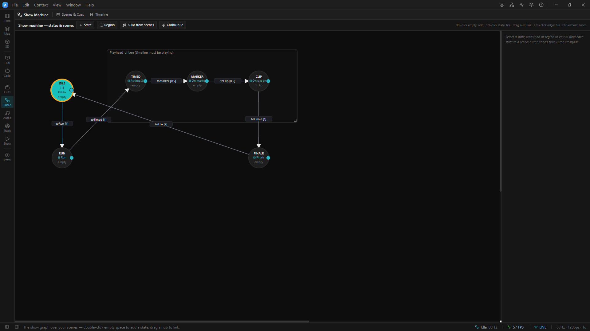

# 14. Show / state machine

The **state machine** (the *Show machine*) is an optional, always‑available **graph over your
Scenes**. Each **state** binds a Scene (recalled when you enter it) and can run transport actions;
**transitions** move between states when a **trigger** fires (a delay elapses, the playhead crosses a
time/marker, a clip or the timeline ends, a person walks into a [zone](13-tracking.md#draw-trigger-zones-tracking-workbench--trigger-zones),
or you fire it by hand/OSC/tablet). It turns a pile of looks into a **show that runs itself** — a timed
sequence, an unattended attract loop, or a live‑triggered installation.

You drive it from the desktop **Show** context (or the timeline's state lane), and unattended venues
can be run entirely from the **tablet remote**.


*The State Graph editor: nodes are Scenes, edges are transitions. The initial state is the cyan node, the current state gets an orange ring, and a firing edge flashes red.*

---

## The mental model in one breath

- A **state** is a node that usually **binds one Scene**. Entering the state **recalls that whole
  look** — surfaces, fixtures, brightness, groups, 3D, projector outputs, and (since every scene owns
  one) its **own timeline**. *A node is a look.*
- A **transition** is a directed edge with a **trigger**, and optionally a **guard**. While the machine
  is enabled, the runtime watches the current state's outgoing edges and, when one fires, enters the
  target state.
- Entering a state can also run **entry actions** (play / pause / stop / seek / loop / jump‑to‑marker /
  recall another scene / fire a cue), so a state controls the **transport**, not just the look.
- The machine lives at **project scope** and ticks **once per frame** — even while the transport is
  **stopped**, so a delay‑driven show loops without ever pressing Play.

It's plain JSON on `ProjectData.stateMachine`, so it saves with the project with **zero migration**.

> **New to it?** The hands‑on tutorial in [`examples/state-machine/`](../../examples/state-machine/)
> ships three `.artlux` files you can open and watch; [`docs/STATE-MACHINE.md`](../STATE-MACHINE.md) is
> the full reference.

---

## Build the graph

Open the editor from the **Show Machine** context, or from the timeline drawer's **state lane**
(**Edit logic**). *Edit Timeline* on a state pulls the drawer up right under the graph. The canvas is an AutomataUI‑style node editor + an inspector.

**Toolbar**
- **＋ State** — add a node (or **double‑click empty canvas**).
- **＋ Region** — a resizable group‑box that visually organizes states (purely cosmetic — regions have
  no runtime effect).
- **Build from scenes** — one node per existing Scene, each **pre‑bound** to its Scene, laid out in a
  grid. The fastest way to seed a show.
- **⚡ Global rule** — a transition evaluated from *every* state (see below).

**Canvas gestures**
- **Drag a node's right‑edge nub** onto another node to **create a transition** (starts as `manual`).
- **Double‑click a node** to **force‑enter that state live** — great for previewing a look.
- **Ctrl/Cmd+click an edge** to **fire that transition manually**.
- **Select an edge** to reveal its **bezier handles** (curve it for readability — cosmetic).
- **Middle‑drag** pans; **Ctrl/Cmd+wheel** zooms; **Del/Backspace** deletes the selection.

**Inspector — state selected:** Name · **Set as initial** (★) · **Scene (recalled on entry)** · **Edit
timeline** · **Lock time** · **Entry actions**.
**Inspector — transition selected:** the `from → to` label · **Trigger** kind + its params ·
**Transition time** (the arrival crossfade).

The **state lane** in the Timeline panel shows the live current state and **manual‑trigger buttons** for
its transitions, so you can drive a show without opening the editor.

---

## Triggers — when a transition fires

The runtime evaluates the current state's outgoing edges in order and fires **at most one per frame**
(no cascades).

| Trigger | Fires when… | Clock |
|---|---|---|
| **manual** | you fire it — state‑lane button, Ctrl/Cmd+click the edge, OSC, or the tablet | — |
| **after delay** | N seconds have elapsed since the state was entered | **wall clock** — advances even while stopped |
| **at time** | the playhead crosses an absolute time | playhead — only while playing |
| **on marker** | the playhead crosses a timeline marker | playhead |
| **on clip end** | the active clip on a track ends (a gap opens under the playhead) | playhead |
| **on timeline end** | the bound timeline reaches its end while playing and **not** looping | playhead — a loop wrap is not an end |
| **LiDAR zone** | a person enters/leaves a [trigger zone](13-tracking.md#wire-a-zone-to-the-show), a crowd threshold, a dwell | the world — every frame, transport or not |

### The dual‑clock rule (the #1 gotcha)

Which clock a trigger uses decides whether you must press **Play**:

- **after delay** runs off a standalone **wall clock** — it ticks regardless of the transport, so a
  delay‑only graph loops the instant you open the project, no Play needed.
- **at time / on marker / on clip end / on timeline end** follow the **playhead** — they only advance
  while playing, so those graphs need something to start playback (usually a **`play` entry action** on
  the state that opens the show).

**on clip end vs on timeline end:** a final, full‑length clip never opens a gap (the end‑stop parks the
playhead *inside* it), so it never fires *on clip end*. Use **on timeline end** for "the show finished".
A chain of scene‑bound states auto‑advances on *on timeline end* off the single `play` that started it —
each recalled scene restarts its timeline, so the transport never actually stops.

---

## Entry actions — what a state does on arrival

When a state is entered the runtime **recalls its bound Scene** (crossfading over the arriving
transition's **Transition time**), then runs its **entry actions** in order:

| Action | Effect |
|---|---|
| **play / pause / stop** | drive the timeline transport |
| **seek** | jump the playhead to N seconds |
| **set loop** | turn the loop region on/off |
| **jump to marker** | seek to a named marker |
| **recall scene** | recall another Scene by id (in addition to the bound one) |
| **fire cue** | fire a granular Cue by id |

A state with **no** bound scene and **no** actions is a harmless no‑op waypoint. Re‑entering a state
restarts it identically (its timeline seeks to frame 0) — entry is **idempotent and repeatable**, which
matters for shows that re‑enter a state many times.

**The bed keeps playing across a recall.** A scene recall resets the *scene* clock (the picture
restarts) but never the *show* clock — the global audio bed and global automation play straight through
the transition. See [Audio](07-audio.md) and [`docs/SCENE-TIMELINES.md`](../SCENE-TIMELINES.md) for the
two‑clock model.

---

## Hold a state at its end (interactive installations)

An interactive show needs a state that **plays its look to a chosen point, freezes there, and waits for
someone to walk in.** Two separate pieces do that:

1. **Hold at end** (a property of the *picture*) — set the timeline's **out‑point** where the state
   should finish (the ruler handle, **O**, or the toolbar's **End state here**) and turn on **Hold at
   end** (the snowflake, next to Loop). The playhead parks on that last frame **with the transport still
   running**: the picture holds on the outputs, but the **audio bed and global automation play straight
   through** — a room waiting for a visitor stays alive instead of going silent. *(Loop wins: a looping
   timeline never reaches an end, so Hold at end is ignored while Loop is on.)*
2. **Only after the state has finished** (a *guard* on the *edge*) — tick it in the transition inspector
   and that edge can't fire until its source state is held. It binds the **automatic** path (a zone
   rule, an after‑delay) so an early automatic trigger can't cut the film three seconds in. It does
   **not** bind a human: a **manual** button, OSC, or the tablet fires regardless (an early manual
   trigger is *flagged* with a dashed ⏱ border, never blocked).

Because a hold reports `playing: true` with a frozen timecode — which from the back of a venue looks
exactly like a hung show — it is signposted everywhere: a **HOLDING** chip in the state lane, a ⏱ prefix
on every gated edge, a snowflake badge on states that hold, and `held` on the tablet status.

**Lock time (dwell).** A state's **Lock time** is a *minimum dwell* — its **after‑delay** transitions
are held for N seconds after entry (only after‑delay is gated; manual and playhead triggers ignore it).
Use it to guarantee a look is shown for at least N seconds.

---

## Global rules — a trigger that fires from any state

Some installation rules must work *whatever the show is doing* — *someone walks into the entrance →
start the welcome.* Drawing that edge from every state (and re‑drawing it whenever you add one) is how a
show quietly stops responding in the one state somebody forgot.

Set **⚡ Global rule** (`fromAny`) and the transition is evaluated from **every** state. It's *listed*
in the inspector column (never drawn as an edge from nowhere), with a **⚡ badge** on any state it can
reach. Three rules keep it predictable: the current state's own transitions are evaluated **first** (a
state can always override a house rule); a global whose target **is** the current state is skipped (so a
"somebody standing in a zone" level doesn't re‑seek the state 60×/second); and it still shares the
**one‑transition‑per‑frame** budget.

---

## The cold start — the show waits for its content

**Opening a project does not start the machine — decoding the opening look does.** On every project
open, ArtLux **holds** the machine while a boot gate waits (at ~10 Hz) for the opening scene's media to
be genuinely ready (video seeked and buffered, surface media drawable, the audio engine loaded), then
arms it and seeks both clocks back to the top. This stops the first seconds going out black on the
projectors and silent on the bed while decoders warm up.

- The **status bar** shows a *Preloading n/m* chip; open projector outputs show a dim **PRELOADING
  SHOW** sign over black, which clears itself when the gate arms.
- It **always fails open** — after **Preferences ▸ Engine ▸ Preload wait** (default **15 s**) the
  machine arms regardless, and the log names whatever never became ready.
- **A human outranks it** — pressing Play (or a tablet/OSC transport command) during the hold arms it
  immediately.
- The **LED output is never held** — `Stage` keeps sampling and sending Art‑Net throughout (unmounting
  it would stop output mid‑show); only the projector picture waits behind the sign.

Live sources (camera / NDI / Spout / DMX‑in / tracking) and effects are **never** waited on — a live
feed may legitimately never arrive, and blocking on one would hold a venue dark.

---

## Drive it live — the desktop Show context

The **Show** workspace context puts everything the tablet offers in the app in front of you:

| Panel | What it does |
|---|---|
| **Show Deck** (viewport) | transport, scene pads, the live current state + its manual transitions |
| **Schedule** (dock tab) | in‑project wall‑clock actions — e.g. 09:00 recall "Opening", 18:00 stop — saved with the project |
| **Playlist** (dock tab) | the machine‑global unattended **broadcast playlist** (below) |
| **Metrics** (dock tab) | live engine / renderer / system series with green‑amber‑red health + the watchdog audit |
| **Show Control** (dock tab) | the tablet connect URL, QR code, PIN, and paired devices |

The deck and schedule go through the same `host.show` service the tablet's commands land on, so the two
surfaces always agree.

---

## Drive it from a tablet (Show Control remote)

Any phone/tablet browser becomes an operator surface — and in **broadcast mode** it's the only UI.

1. **Enable:** **Preferences ▸ Show Control** → *Enable the tablet remote*. Note the LAN URL(s) and the
   4‑digit **PIN**. (Also from **View ▸ Show Control…**, which shows a **QR code** — scan it and the
   tablet pairs automatically.)
2. **On the tablet:** open the URL, enter the PIN once (the device is remembered).
3. **Control tab** — recall scenes, fire cue columns, transport play/pause/stop; live status streams
   back.
4. **States tab** — enable/disable the state machine, fire manual transitions from the current state, or
   **jump to any state** to test.
5. **Schedule tab** — in‑project wall‑clock triggers, saved with the project.
6. **Projects tab** — point at a folder → scan for projects → build a **time‑of‑day playlist** → *Start
   in broadcast now*. The show then switches projects unattended, indefinitely (each switch relaunches
   into a fresh process, so nothing leaks over days of running).
7. **Metrics tab** — the same series ArtLux exposes to Prometheus/Grafana, live with sparklines and no
   Grafana required.

The remote uses HTTP + Server‑Sent Events, so a tablet **auto‑reconnects** across a broadcast relaunch.
An operator **Lock** can freeze or kick remotes mid‑show. See [`docs/SHOW-CONTROL.md`](../SHOW-CONTROL.md).

---

## Trigger it from OSC

Under the control prefix (default `/artlux`), fire a **transition by its id** — it only fires if that
transition leaves the **current** state ([Preferences ▸ OSC / Tracking](13-tracking.md#enable-the-lidar-feed-the-installation-default)):

```
/artlux/state/trigger   <s: transitionId>     # fire a named transition
/artlux/state/<id>                             # same, id in the address
```

Scenes and cues have their own addresses too (`/artlux/scene/<ref>/go`, `/artlux/cue/<ref>/go`). **Give
your transitions readable ids** and the OSC surface documents itself. Full list in
[`docs/OSC.md`](../OSC.md).

---

## Tips & troubleshooting

- **The graph does nothing** — the machine is **disabled by default**. Enable it (state lane, the
  editor, or the tablet's States tab). It's off = fully manual control.
- **A delay‑only show won't loop** — that's expected only if you used **at time / on marker / on clip
  end / on timeline end** somewhere, which need Play. Add a **`play` entry action** to the opening
  state, or use **after delay** (wall‑clock) triggers.
- **on timeline end never fires** — the timeline is **looping** (a wrap is not an end), or the last clip
  runs full length and you meant *on clip end*.
- **An interactive state advances too early** — pair the zone trigger with **Hold at end** + **Only
  after the state has finished** so it waits for the look to finish.
- **A hung‑looking show that reports playing** — that's a state **holding** at its end (frozen timecode,
  bed still running). Look for the **HOLDING** chip / snowflake badge; it's working as designed.
- **The show starts black/silent for a few seconds** — that's the cold‑start gate finishing (watch the
  *Preloading n/m* chip); raise **Preferences ▸ Engine ▸ Preload wait** if real media needs longer.

➡ Next: [Keyboard & mouse reference](15-keyboard-reference.md)
