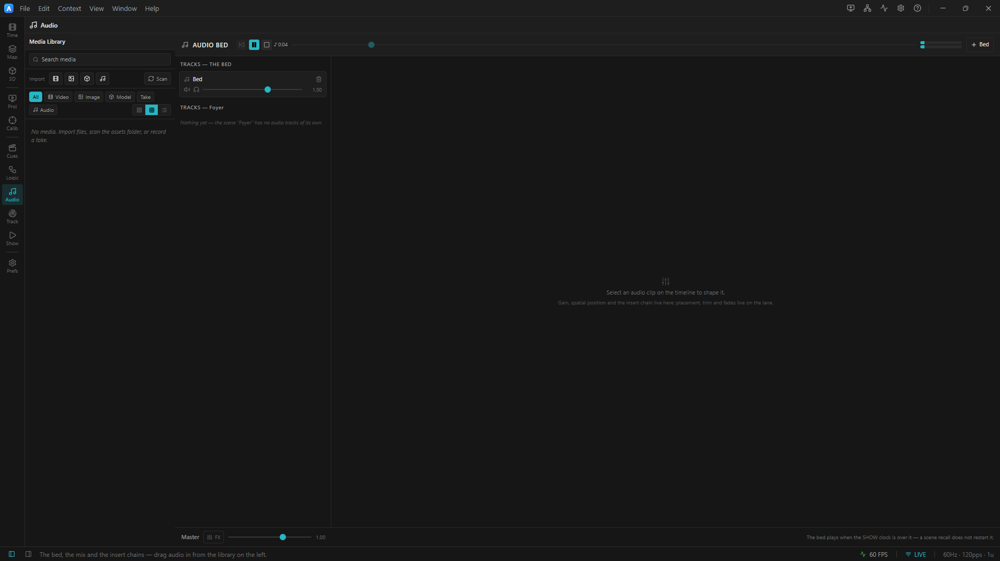
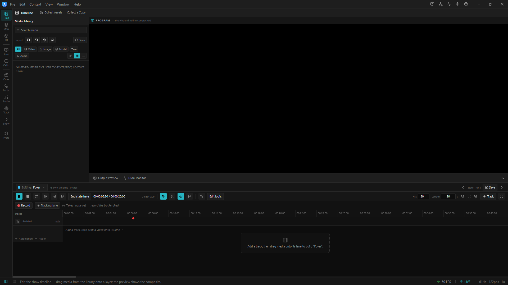

# 01 · The bed and the show clock

> Project: [`../01-the-bed.artlux`](../01-the-bed.artlux)
> You'll learn: the **bed**, the **show clock**, why a GO does **not** restart your music, the **parked
> show**, and how the show's own **loop** differs from a recall.

The single most important claim in ArtLux audio is this: **firing a cue does not restart the house music.**
Every other design decision in the subsystem exists to make that true. This chapter is you proving it to
yourself in about four minutes.

## 1. Open it and listen

**File ▸ Open…** → `01-the-bed.artlux`. Go to the **Audio** context in the left rail (the ♪ icon, *show*
cluster) — its viewport is the mixer. When a step sends you to the lanes, switch to the **Timeline** context
(the film icon, *build* cluster); its bottom region is the timeline. (**View ▸ Audio Bed…** still works and
just switches you to the Audio context.)

<!-- TODO screenshot: Audio context selected in the rail, mixer viewport showing the single Bed track + master strip -->

Press **Play** (`Space`).

You will hear a **counting bed**: a beep every second, a *higher* beep every fifth, and a higher one still on
every tenth — under a quiet drone. That is not decoration. **The bed tells you the time.** Beep 17 lands at
0:17. You will not need to squint at a readout to know whether it restarted; you will simply hear it.

Watch the **`♪`** readout in the Audio Bed header climb in step with the beeps.

## 2. Now break it. (Try to.)

Go to the **Scenes & Cues** context (the rail's *show* cluster, short title **Cues**). You have three:
**Foyer**, **Main**, **Exit**.

Let the bed reach somewhere unmistakable — wait for the high **beep 10**, then a couple more. Now **click
Main.**

The picture changes instantly: the wall goes from a calm blue *Wave* to a bright *Rainbow*, the strip follows,
the brightness comes up. A cue landed.

**And the count did not flinch.** …11, 12, 13…

Do it again. **Exit.** **Foyer.** **Main.** Fire them as fast as you can click.

The picture snaps around. The music does not care. That is the bed.

> ### What you just proved
> The bed lives in `ProjectData.audio` — **one document, for the whole project**. It rides the **SHOW
> clock**, which a Scene recall does not touch. There is no clever fade or crossfade hiding the seam. There
> is no seam: *the bed was never interrupted.*

## 3. Look at where it lives

Back in the **Audio** context, look at the mixer's left column. Two headings:

- **Tracks — the bed** → one track, **Bed**, holding your counting clip.
- **Tracks — Global** → empty. (Recall a Scene and watch this heading change to **Foyer** / **Main** /
  **Exit** — it names whichever document is currently bound. It is empty in all of them, for now. Chapter 3
  fills it.)

Now switch to the **Timeline** context. While **Global** is bound (the pill above the ruler) you can see the
bed's audio lane, with its waveform.

**Recall a Scene** — from **Scenes & Cues**, or by clicking a scene pill above the ruler. The bed's lane
**vanishes from the timeline.**

<!-- TODO screenshot: Timeline context, top the bed lane with Global bound, bottom the same timeline with a scene bound (bed lane gone, scene ruler at 0) -->

That is deliberate, and it is a signal rather than a bug. The ruler you are now looking at belongs to the
*scene's* timeline — its playhead, its length. The bed is not on that clock, so drawing it against that ruler
would be a lie about where it is. Go back to **Global** (the pill above the ruler) and it comes back.

> **Rule of thumb:** you can *hear* the bed everywhere. You can only *edit* it on **Global**.

## 4. The two clocks, on screen

With a Scene bound, look at the timeline toolbar. A new readout has appeared:

**`♪ BED 0:23`**

That is the **show clock** — and it only shows up while a Scene is bound, precisely because that is when it
stops agreeing with the ruler underneath it. Compare:

| Readout | Where | What it is |
|---|---|---|
| the **ruler** / playhead | timeline, under a bound Scene | the **scene's** time. Resets to 0 on every entry. |
| **`♪ BED`** | timeline toolbar | the **show** clock. Ignores the recall completely. |
| **`♪`** | Audio Bed header | the same show clock, with a scrub slider |

Recall a Scene and watch them **disagree**. They are supposed to. That disagreement *is* the feature.

## 5. Two things that DO restart the bed — and neither one is a cue

It would be a poor lesson if you left thinking the bed is immortal. It is not. Two things move the show clock,
and the bed follows it faithfully:

**a) The show loops.** This project's global timeline is **40 s long with Loop ON**. Let it run: the 36-second
bed plays out, four seconds of air, and then the count **starts again from 1**.

That is correct. **The show wrapped**, so the show clock went back to zero, so the bed went back to zero. It
is not the same event as a recall and it should not feel like one — nothing was *recalled*, the whole show
started over.

**b) You scrub or Stop.** Drag the **`♪`** slider in the Audio Bed header. The bed jumps. Press **Stop**
(`.`) — the show clock returns to the start and the bed resets with it. Both are you moving the show clock on
purpose.

> Try this: bind **Main**, then try to scrub the Audio Bed's slider. **It is disabled**, with a tooltip:
> *"Scrub Global to move the bed."* A seek inside a scene moves the **scene**, not the show — an enabled
> slider there would recall your picture to an arbitrary point mid-show while the bed did not move at all.
> The control is greyed out because it would otherwise do something you did not ask for.

## 6. The parked show

Set the global **Loop** to **off** (the ⟳ button in the timeline toolbar, with **Global** bound).

Now play past 40 s.

The show clock **parks**. The bed stops. And an amber **`show ended`** badge appears in the Audio Bed header.

Nothing is broken. The show's Length ran out with Loop off, so it is over. But without that badge the state is
genuinely undiagnosable from the mixer — the transport still says *playing* (a scene may be looping
underneath), the Play button is still lit, the readout is frozen and the room is silent. "The audio engine
crashed" is what a venue tech would reasonably conclude, and they would be wrong.

**Raise the global Length, or turn Loop on, or press Stop then Play.**

## 7. The pieces, named

| Concept | Here | In the file |
|---|---|---|
| **The bed** | the counting clip | `audio.tracks[]` + `audio.clips[]` (top-level — one per project) |
| **A bed clip** | `bed-count.wav`, 36 s at 0:00 | `{ trackId, path, start, duration, inPoint, gain }` |
| **The show clock** | `♪ BED` / `♪` | derived in the transport; **not** persisted |
| **The show's Length** | 40 s | `timeline.duration` |
| **The show's Loop** | ⟳, on | `timeline.loop` |
| **A Scene** | Foyer / Main / Exit | `scenes[]` — a full-look snapshot **and its own timeline** |

Note what is *not* in that table: there is no "don't restart the bed" flag. **The bed does not restart
because of where it lives**, not because something remembered to protect it.

---

## Try it yourself

1. **Move the bed into a Scene and watch it break.** Bind **Main**. In the Audio Bed, press **`+ Bed`** —
   no, wait: that adds to the bed. Instead, on the **timeline** (with Main bound), use the gutter's **`+`**
   to add an audio track *to the scene*, and drag `bed-count.wav` onto it from the **Media** library. Mute
   the real bed track. Now fire GOs. **The count restarts every single time.** That is the bug this whole
   design exists to prevent, and you just built it on purpose. Undo (`Ctrl+Z`).
2. **Give the bed a fade.** Grab the top corner of the bed clip on its lane and drag — that is a fade
   handle. Fade it in over 3 s and listen to the drone swell.
3. **Trim it.** Drag the clip's left edge to start at beep 10 instead of beep 1. Press Stop, then Play.

➡ **[Chapter 2 — The mixer](02-the-mixer.md)**
