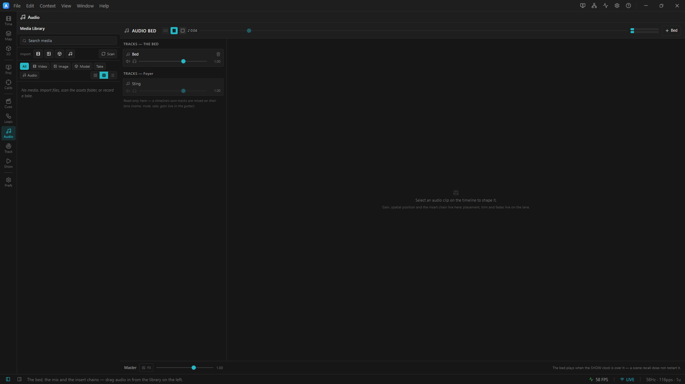

# 02 · The mixer

> Project: [`../01-the-bed.artlux`](../01-the-bed.artlux) — the same one. Keep it open.
> You'll learn: the **Audio Bed** panel; tracks, **faders**, mute and solo; the **master strip**; the
> **meters**, **headroom**, and the clipping badge; and the division of labour between the mixer and the
> lanes.

The mixer answers **"how loud, and what does it sound like."** The timeline lanes answer **"when."** That
split is not a style choice — chapter 4 will show you the engine constraint that forces it.

## 1. The anatomy

Go to the **Audio** context (the ♪ icon in the left rail) — the mixer **is** its viewport. Four regions:

```
┌─ header ─────────────────────────────────────────────────────────────────┐
│  ♪ Audio Bed   [transport] [♪ 0:14] [══ scrub ══] [L/R meters]  [+ Bed]  │
├─ TRACKS ────────────────┬─ INSPECTOR ─────────────────────────────────── ┤
│  Tracks — the bed       │   (select a clip on a lane, or click a         │
│    ▸ Bed   [M][S] ══╪══ │    track row on the left, and it appears here) │
│                         │                                                │
│  Tracks — Global        │    gain · spatial · FX                         │
│    (empty)              │                                                │
│                         │                                                │
│  Video layers           │                                                │
│    (only when a video   │                                                │
│     layer is sounding)  │                                                │
├─ MASTER ────────────────┴────────────────────────────────────────────────┤
│  Master  [FX]  ═══╪═══  1.00              "the bed plays when the SHOW…" │
└──────────────────────────────────────────────────────────────────────────┘
```

**The header carries the transport** — and it is the *same* transport as the timeline's and as `Space`. There
is one. The `♪` readout and its scrub slider are the **show clock** (chapter 1).

**Three lists, not one.** Each is a **container** — a separate place a sound can live. You have met the
first (the bed, chapter 1). The second is a Scene's own audio, and chapter 3 is entirely about it. The
third appears only when a **video clip on the timeline is playing its own soundtrack**, and it lists the
video *layers* that are making sound right now — so a layer whose clips are silent or switched off is
simply not drawn. All three are editable. If a layer you expected is missing from that list, the panel is
telling you it is making no sound.


<!-- shot spec (this image exists; use when re-shooting): Audio context mixer showing the four regions, master fader pushed up with the red `clipping` badge lit -->

## 2. Faders, and the one thing that is unusual about them

Grab the **Bed** track's fader and ride it while the count plays. The number under it tracks your thumb.
Let go.

Nothing surprising — except for what happened *underneath*:

> **A fader drafts locally and commits ONCE, on release.** It does not write the document on every
> `pointermove`. One commit is a full document write, an engine re-sync (a lock per clip), and a re-compile of
> every automation lane. Doing that sixty times a second while you idly ride a fader — on a *live show* —
> is the difference between a mixer and a stutter.
>
> You will not notice this. That is the point. It is called out because if you ever add a control to this
> panel, **read `Fader.tsx` before you do.**

## 3. Mute, solo, and which container they scope to

Add a second bed track: **`+ Bed`** in the header. Call it *Room*. Then pull the **timeline drawer** up (**Ctrl+T**) and
drag `orbit.wav` from the **Media** library onto its lane (with **Global** bound — remember chapter 1: you can
only *edit* the bed on Global). Switch back to **Audio** for the faders.

Now you have two bed tracks. Try:

- **M** on *Bed* → the count goes, the orbit stays.
- **S** on *Bed* → *only* the count. Solo silences the other tracks **in the same container**.

That last word matters. **Solo is scoped per container.** Soloing a *bed* track does not silence a Scene's own
audio, and vice versa — they are two mixes on two clocks, and a solo reaching across them would make no sense
to an operator. (You will feel this in chapter 3.)

## 4. The master strip, and headroom

At the bottom: **Master**, a fader, and an **FX** button. This is the house level — the last thing before the
signal leaves for the device.

Watch the **L/R meters** in the header while the count plays. Each beep kicks them.

Now do something deliberately dumb: push the **Master** fader up towards its maximum (**1.5**, which is about
**+3.5 dB**).

A red **`clipping`** badge appears.

> ### Clipping is *latched*, not sampled — and that is a real design decision.
> `peak` is one audio block's peak, and the panel polls at about 10 Hz. Nine blocks in ten are never seen. A
> clip indicator built on that sampling would **miss most of the clipping it exists to catch**, which is
> strictly worse than not having one — you would learn to trust a light that lies. So the engine **latches**
> the flag the instant any block clips, and clears it only when the panel reads it. If it lit, it happened.

Pull the master back to **1.00**. The badge clears after a moment.

**Headroom, concretely.** In this project the bed peaks around **−5.7 dBFS**. Chapter 3's stings peak around
**−2.5 dBFS** — and they are given a clip gain of **0.5** in the file precisely so that a sting landing on top
of the bed does not slam the master into the ceiling on the very first GO. Summing is addition. Two sounds at
−3 dBFS are one sound at **0 dBFS**.

## 5. What is NOT in this panel, and where it went

| You want to… | It is **not** here. It is… |
|---|---|
| move a clip in time, trim it, blade it | on its **lane**, on the timeline |
| fade a clip in or out | the **corner handles** of the clip, on its lane |
| rename a track, mute/solo/gain it | *either* here *or* the lane's **gutter** — the same fields, two doors |
| a clip's gain, position, FX | the **clip inspector**, right-hand side — but you have to **select the clip on a lane first** |

**The inspector follows what you last picked.** That is the entire arrangement/mixer split: you *place* the
clip on the lane, you *shape* it here. Click the bed clip on its lane now — the inspector fills in, and you
get **gain**, a **Spatial** checkbox, and an **FX** chain. Chapter 4 is those three.

Now click the **track row** itself, on the left. The inspector switches to the *track*, with the same
controls writing the track's own fields — a position and a chain that apply to **every clip on it**.
Click the clip again and the inspector goes back. One set of controls, two doors, and the panel always
says which one you came through.

> **The small ● beside a track name** means that track carries a position or an insert chain. It saves you
> opening each row to find out which ones are shaped.

## 6. Two badges that mean "there is no sound", and they are not the same

You may never see either. Know them anyway, because both mean *silence*, and a mixer that looks healthy over a
silent room is the failure this subsystem takes most seriously.

| Badge | Means | Fix |
|---|---|---|
| **`no audio engine`** (amber) | ArtLux started **without its native addon**. Authoring, saving, DMX, projectors and OSC all work normally — there is simply nothing to make sound with. | Built from source: `npm run build:audio`, **with the app closed**. |
| **`no output device`** (red) | The engine is loaded and the show is running, but **the audio interface has gone** — a bumped USB cable, a driver reload. | Reconnect it, then **Preferences ▸ Audio ▸ Reconnect**. Sound returns with no restart. ⚠ ArtLux will **not** re-open a device by itself. |

And one that means the opposite of broken:

| **`show ended`** (amber) | The global Length ran out with Loop off. **The show is over.** Not a fault. | Raise the Length, turn Loop on, or Stop → Play. |

---

## Try it yourself

1. **Find the clipping point.** With both tracks playing, raise the *Room* track's gain until the badge
   lights. Now bring the **master** down and see that the badge **still** lights — because the clip happened
   *before* the master fader, in the sum. Then bring the *Room* **track** gain down instead. That is where the
   problem was. **Gain staging, in thirty seconds.**
2. **Two doors, one field.** Rename the *Bed* track in the Audio Bed. Look at the lane's gutter — it changed
   there too. They are the same field.
3. **Prove the solo scoping.** You cannot yet — a Scene has no audio until chapter 3. Come back after it and
   try: solo a bed track, then recall a Scene with a sting. The sting still fires.

➡ **[Chapter 3 — A scene's own audio](03-a-scenes-own-audio.md)**
