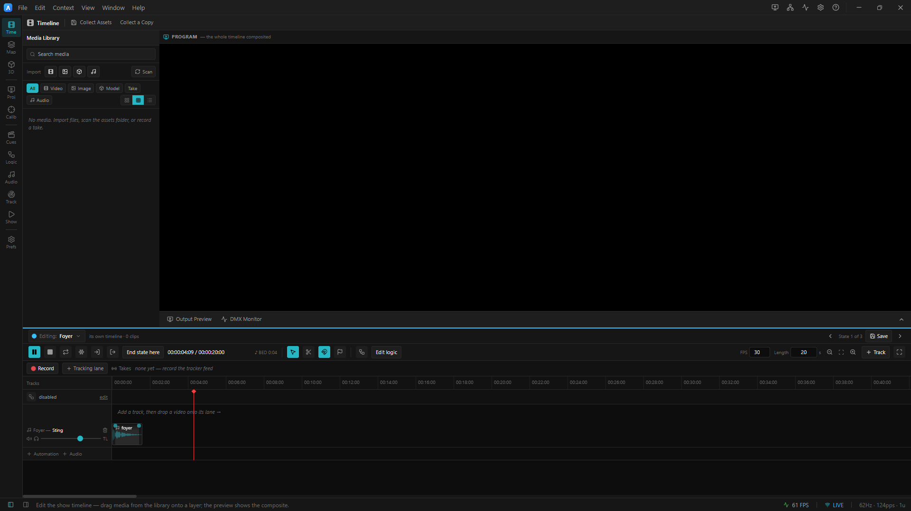

# 03 · A scene's own audio

> Project: [`../02-per-scene-audio.artlux`](../02-per-scene-audio.artlux)
> You'll learn: the **second container**; the sting that *should* restart on every entry; **two clocks heard
> side by side**; and the one question that tells you which container a sound belongs in.

Chapter 1 proved the bed survives a cue. That is only half the design, and on its own it would be a
straitjacket — because sometimes you want a sound that fires **exactly when the cue lands, every single
time**. That is what a scene's own audio is for.

## 1. Open it and fire a cue

**File ▸ Open…** → `02-per-scene-audio.artlux`. Press **Play**. Let the count run a few beeps.

Now, in the **Scenes & Cues** context (rail, *show* cluster, short title **Cues**): **Main.**

You hear **two things at once**:

1. a bright bell — *the sting*; and
2. the count, carrying straight on. …14, 15, 16…

Click **Exit**. A falling two-note gesture. The count carries on.
Click **Foyer**. A soft, warm mallet. The count carries on.

Click **Main** again. **The bell fires again.**

Click it five more times. **It fires every single time.**

> ### Both halves are the feature
> The bed **never restarts**, because it is in `ProjectData.audio` and rides the **show clock**.
> The sting **always restarts**, because it is in that Scene's `timeline.audio` and rides the **playhead** —
> and a recall resets the playhead to zero. Every time. On purpose.
>
> You are hearing two clocks at once. That is the whole subsystem, in one click.

## 2. See it

Bind **Main** (click it once). Now, in the **Audio** context, look at the mixer's left column:

- **Tracks — the bed** → *Bed*, with the count.
- **Tracks — Main** → *Sting*. The heading **names the scene you are in.**

And in the **timeline drawer**, with Main bound: there is one audio lane, holding a short clip at **0:00** —
with its waveform, a sharp attack at the very start. **That clip sits at zero.** That is why the recall fires
it: the playhead resets to 0, and there is the clip.

<!-- TODO screenshot: the timeline drawer with the Main scene bound, one audio lane holding the sting clip at 0:00, the scene's playhead ruler (not the bed's show clock) -->

Now look at the note under the clip inspector:

> *"This clip belongs to the scene 'Main', so it rides the PLAYHEAD and restarts whenever that timeline does —
> it is not on the show clock."*

The panel names the document it is writing. It has to: a Capture-Scene clone gives two scenes **byte-identical
clip ids and names**, so "the bound timeline" would leave you no way to see *which* scene the reverb you are
dialling is going into.

## 3. The question that decides which container

Every time you add a sound to an ArtLux show, ask exactly one thing:

> ### **"When I fire this cue again, should this sound start over?"**
>
> **Yes** → it belongs in the **Scene's** timeline. (A sting, a stab, a voice line, a whoosh on entry.)
> **No** → it belongs in the **bed**. (House music, room tone, an ambient drone, a five-minute score.)

That is it. There is no third case and no flag to set. **Put it in the right container and the behaviour is
free.**

| Symptom | Diagnosis |
|---|---|
| *"My music keeps restarting whenever a cue fires."* | It is in a **Scene's** timeline. Move it to the bed. |
| *"My sting only played once and never again."* | It is in the **bed**. Move it to the Scene. |

## 4. Where each one is edited (and the trap)

Here is the part that catches everyone once:

| | Edit it on the timeline when… |
|---|---|
| **the bed** | **Global** is bound — *and only then* |
| **a Scene's audio** | **that Scene** is bound |

So while **Main** is bound, the bed's lanes are **not on screen**. You can hear the bed perfectly well. You
cannot touch it. Click the **Global** pill above the ruler and it returns.

> **This is a deliberate signal, not a missing feature.** The ruler under a bound Scene is *that scene's*
> playhead. The bed is not on that clock. Drawing the bed's waveform against a ruler it does not obey would be
> a lie about where the music is — so the panel refuses to draw it, rather than draw it wrong.

## 5. Build one

Let's give **Exit** a second sound.

1. Bind **Exit**.
2. In the **timeline drawer**, in the audio gutter, click **`+`** to add an audio track to *this scene*.
   Call it *Tail*.
3. From the **Media** library (the browser column on the left), drag **`orbit.wav`** onto that lane.
4. Drag it so it starts at about **0.5 s** — a beat after the sting.
5. Select the clip on its lane, then switch to the **Audio** context and pull its **gain** down to about
   **0.4** in the clip inspector.

Now fire **Foyer → Exit → Foyer → Exit.**

Both sounds fire, together, every time. And the count never so much as hiccups underneath.

## 6. Solo, scoped

Remember chapter 2's claim that **solo is scoped per container**? Test it now.

In the **Audio** context, hit **S** on the **Bed** track. Only the count plays; your *Room* track (if you
added one) goes quiet.

Now fire **Main.**

**The sting still fires.** A solo in the bed does not reach into a scene's audio. They are two mixes, on two
clocks, and a solo that crossed between them would make no sense to anyone standing at the desk.

## 7. The pieces, named

| Concept | Here | In the file |
|---|---|---|
| **The bed** | the count | `audio` (top level — one per project) |
| **A scene's own audio** | the sting | `scenes[i].timeline.audio` |
| **…which is just a timeline's audio** | | `Timeline.audio` — the *global* timeline can have one too |
| **The clip that fires on entry** | the sting, at 0:00 | `start: 0` — that is the whole mechanism |
| **The two clocks** | `♪ BED` vs the ruler | `showTime` vs `playhead` |

> **Every Scene owns a timeline.** There is no such thing as a Scene without one. (There used to be — a scene
> could have *no* timeline and "play the global one" — and that shape turned out to be the root of two
> serious automation bugs, so it was deleted. If you open a project made before that, its scenes get an
> empty timeline on load.)

---

## Try it yourself

1. **Make a sting that does NOT fire on entry.** Move Main's sting from 0:00 to 3 s. Recall Main, and wait —
   it fires three seconds *in*. Recall it again before those three seconds are up and it never fires at all.
   **A scene's audio is a timeline, and it obeys the playhead like anything else.**
2. **Make a scene loop its sting.** Bind Main, set its **Length** to 4 s and turn its **Loop** on. Now the
   sting fires every four seconds for as long as you sit in that scene — and the bed *still* does not care.
3. **Put the bed in the wrong place, on purpose.** Drag `bed-count.wav` onto Main's audio lane. Now GO to
   Main repeatedly. Two counts, out of phase, one restarting and one not. It is an unholy noise — and it is
   the clearest possible demonstration of what the bed and a scene's own audio actually do. `Ctrl+Z`.

➡ **[Chapter 4 — Spatial audio and FX](04-spatial-audio-and-fx.md)**
