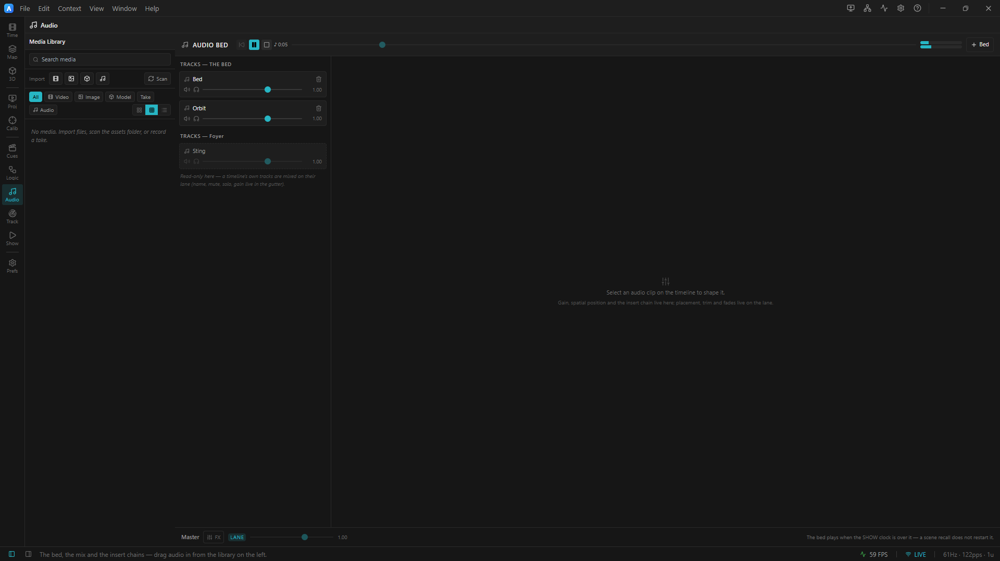

# 04 · Spatial audio and FX

> Project: [`../03-spatial-and-fx.artlux`](../03-spatial-and-fx.artlux)
> 🎧 **Headphones. This chapter does not work without them.**
> You'll learn: the **positioner pad**; **ambisonics + HRTF**, and why that means headphones; the **clip
> insert chain**; and **why a reverb on the master does nothing at all**.

ArtLux audio is **object-based**. A sound is not "panned 30% left" — it is *a direction in the room*: a
**bearing** (0° front, 90° right, 180° behind, 270° left) and a **height** (−90° to +90°). The engine
encodes every placed source into one shared **ambisonic** field, then decodes that field to whatever you
are listening on. There is no distance in that model, and later in this chapter you will see why.

## 1. Put your headphones on, and press Play

**File ▸ Open…** → `03-spatial-and-fx.artlux`. Press **Play**.

Under the counting bed you now hear a second sound: a pulsing, buzzy tone. It is sitting **in front of you**,
about a metre and a half out.

In the **Audio** context, look at **Tracks — the bed**: there are two now. *Bed* (the count) and *Orbit*.

## 2. The positioner pad

In the **timeline drawer**, with **Global** bound, click the **first orbit clip** on its lane to select it.
Now switch to the **Audio** context: the clip inspector on the right has filled in for the selected clip.

This time it has a **Spatial** section: a checkbox (ticked), a small **top-down pad** with a dot in it, and a
**height** slider.


<!-- TODO screenshot: Audio context clip inspector showing the top-down Spatial pad + height slider, the clip FX chain with a Reverb, and the master FX popover where a dropped Reverb node shows dimmed/disabled -->

**Drag the dot.**

The sound *moves around your head*. Left, right, behind you, close, far. The **L/R meters** in the header
shift as you drag. This is not a pan pot — you are moving an object through a field.

```
                    front
              ┌───────────────┐
              │       ·       │      the pad is TOP-DOWN:
              │               │        ← left        right →
              │       ●───────│──▶ x     up = IN FRONT of you
              │    listener   │        down = behind you
              │               │
              └───────────────┘      the HEIGHT slider is the third axis (y)
                     back
```

Now drag the **height** slider. The source lifts above you and drops below.

> ### Why headphones?
> The engine's default output mode is **binaural** — the ambisonic field is decoded through an **HRTF**
> (head-related transfer function), which recreates the way your own head, ears and shoulders filter a sound
> coming from a given direction. That produces a genuine 3-D image, **and it only works over headphones.**
> On speakers, the same field is decoded to a real speaker array (**Preferences ▸ Audio ▸ Speaker layout**) —
> which is the mode for an actual installation, and needs an actual array. With neither, it collapses to a
> stereo pan and the magic goes away.

> ### Why *this* sound?
> `orbit.wav` is deliberately **harmonically rich**. An HRTF localises using interaural *time* differences at
> low frequencies and interaural *level* differences plus **pinna filtering above about 2 kHz**. A pure sine
> gives your ears almost nothing to work with, and the orbit falls completely flat. The choice of source
> material is not cosmetic — it is the difference between a demo that works and one that does not.

## 3. The clip insert chain

Still on that first orbit clip, look at the **FX** section of the inspector. There is one effect in the chain:
a **Reverb** — room size 0.72, wet 0.34.

**Bypass it** (the toggle on the effect row). The sound goes dry and small.
**Un-bypass it.** The room comes back.

Now — with the reverb on — **drag the positioner dot around again.**

Listen to what happens: **the room moves with the source.** That is not an accident of the implementation, it
is the whole reason the insert is on the *clip*:

```
   source ──▶ [ insert chain ] ──▶ [ ambisonic encoder ] ──▶ field ──▶ decode
              "put it in a room"    "now place the room"
```

The reverb runs **before** the encoder. So you are not adding reverb to a placed sound — you are **placing a
sound that is already in a room**. The room is part of the object. This is the object-audio convention, and it
is what you want.

Add a **Filter** to the chain (**+**, then pick Filter). Sweep its **Cutoff** down. The source dulls, as
though it moved behind a wall — and it *stays* dull as you move it around, because the filter belongs to the
object.

## 4. ⚠ The master chain, and the trap

Open the **Master** strip's **FX** button (bottom of the mixer, in the **Audio** context).

There is a **Compressor** in it — threshold −12 dB, ratio 3:1. That is what a master chain is *for*: it is
the last thing before the amplifier, and its job is to keep the rig safe.

Now try to add a **Reverb** to the master chain.

You can. The UI lets you. **And you will hear absolutely nothing change.**

> ### This is not a bug, and it is worth understanding.
> `juce::dsp::Reverb` is a **≤ 2-channel** processor. The master chain runs **after** the ambisonic decode —
> where the signal may be **8 channels wide** on a speaker rig. A reverb there cannot process that, so it
> would silently pass the signal **dry**. Rather than pretend, **the engine drops reverb nodes from the master
> chain entirely.**
>
> And you would not want it anyway. A reverb on the master would put your *entire field* — every source, the
> bed, everything — into one flat room, *after* they had all been placed. It would smear the spatial image you
> just built. **Reverb belongs on the object.**

**Remove it.** Put reverb on the clip, where it works and where it means something.

### The two insert points, and why there are exactly two

| Scope | Runs | For | Reverb? |
|---|---|---|---|
| **Clip** (`AudioClip.effects`) | on the source, **before** encoding | *character* — reverb, filter, delay | ✅ **yes, here** |
| **Master** (`AudioBus.effects`) | on the **decoded** output | *protection* — compressor, limiter, corrective EQ | ❌ **dropped** |

There is **no per-track insert**, and there never will be. A spatial source is a point in a field — it cannot
be summed into a bus *before* it is placed, because the encoder needs each source's signal on its own. The
engine's shape forces the mixer's shape.

## 5. Spatial is a *flag*, and turning it off changes the chain

Untick the **Spatial** checkbox on the orbit clip. The sound goes flat — straight into the mix, unplaced.

Tick it again: it comes back at `{0, 0, 1}`, a metre in front of you.

That flip is not free. A spatial clip's chain is **mono** (the encoder needs one signal); a flat clip's is
**stereo**. Flipping the flag changes the channel count and **forces the whole chain to rebuild**. That is
exactly why the *flag* cannot be automated while the three *axes* can be (chapter 5): you can slide a source
across the room sixty times a second, but you cannot rebuild its DSP graph sixty times a second.

> **Why the pad has no metres on it.** It used to: a 3-metre square you dropped a source into. The
> numbers were fiction. The ambisonic encoder takes an azimuth and an elevation and *discards the
> distance* — libspatialaudio says so in its own header — so sliding a source from 1 m to 6 m along the
> same bearing changed **nothing at all**, while the readout reported the move to two decimal places.
>
> So the pad now measures the two things that are real. **Round the ring** is the bearing. Dragging **in
> to the centre** is not a distance either — it is a *place*: the source goes **omni**, equal in every
> speaker of any layout. Its bearing is remembered, so dragging back out to the ring returns it where it
> was. If you want it quieter, that is the clip's **gain** fader. (0.26 briefly offered an
> "attenuation" here — a level wearing the name of a distance — and 0.27 removed it. Projects that used
> it keep their exact levels: the value is folded into the clip's gain on load.) That is not distance
> pretending to be gain; it *is* gain, and it is the only kind of "further away" this engine has.
>
> The centre earns its keep for a different reason: a **bearing is meaningless at zero radius**, so the
> one gesture the ring genuinely cannot express is "from everywhere at once" — and that is exactly what
> the middle of the pad now authors.

---

## 5b. The same two controls, one level up: the track

Everything so far has been authored on **one clip**. Both controls also exist on the **track**, where they
apply to every clip on it — and that is how you place a whole layer of sound without dialling each one.

**Try it.** Click the **track row** on the left (not the clip). The inspector switches to the track, and you
get the same **positioner pad** and the same **FX** chain. Give the track a position — drag its dot hard
right — and play.

Two rules, and they are different from each other. This is the part worth getting into your hands:

1. **Chains stack.** The clip's chain runs, then the track's, then the sound is placed. So a filter on the
   track colours everything on that track, on top of whatever each clip already does. Nothing is replaced.
2. **Positions do not stack — they rank.** A sound has exactly one place in the room, so there is nothing to
   add together. **The clip's own position wins.** A clip with no position of its own goes wherever its
   track says.

**Prove the second one.** With the track aimed hard right, select a clip on it that has **Spatial** ticked
and aim *that* hard left. It goes left, and stays left — the clip is the more specific statement. Now untick
its **Spatial** box. It jumps to the right, with the track, and the inspector tells you so in words:
*"Placed by its track (Bed) at 90°."* Tick the box again to take the position back.

> **Why not the other way round?** If the track overrode the clip, then the moment a track had a position
> every clip's own pad would move and change nothing — a control that lies. This panel is built not to have
> those.

> **One real difference from a mixing desk's bus:** the track's chain is run **per clip**, not on a summed
> signal — it has to be, because a spatial source has to reach the encoder on its own or its placement is
> destroyed. You will only ever hear the difference in a **reverb or delay tail**, which stops at a cut
> instead of ringing across it.

## 6. The pieces, named

| Concept | Here | In the file |
|---|---|---|
| **A spatial source** | the orbit clip | `clip.spatial = { angle, elevation, omni? }` — absent ⇒ not spatial |
| **Which way** | round the pad | `spatial.angle` — degrees **clockwise from front** (0 front, 90 right, 180 behind, 270 left) |
| **Height** | the slider | `spatial.elevation` — degrees, −90 below … +90 above |
| **A clip insert** | the reverb | `clip.effects[]` |
| **A master insert** | the compressor | `audio.buses[0].effects[]` (id `master`) |
| **The output mode** | binaural | Preferences ▸ Audio |

---

## Try it yourself

1. **Build a delay throw.** Add a **Delay** to the orbit clip — time 380 ms, feedback 0.5, mix 0.4. Now move
   the source hard left. **The echoes are left too**, because they were generated before the placement. Now
   imagine trying to do that with a master delay. You could not.
2. **Spatialise a sting.** Bind **Main**, select its sting clip, tick **Spatial**, and place it *behind* you
   (drag the dot to the bottom of the pad). Fire the cue. The bell rings out behind your head. Cues can come
   from anywhere in the room.
3. **Break the master, then fix it.** Set the master compressor's ratio to **20:1** and its threshold to
   **−45 dB**. Everything goes flat and lifeless and pumps on every beep. That is over-compression, and it is
   what a limiter set wrong does to a show. Put it back.
4. **Fight the track and win.** Aim the **track** hard left and a clip on it hard right, then play. The clip
   is on the right — it said so more specifically. Untick that clip's **Spatial** and it snaps left to join
   the rest. That one gesture is the whole precedence rule, and you can hear it.

➡ **[Chapter 5 — Automating the mix](05-automating-the-mix.md)**
