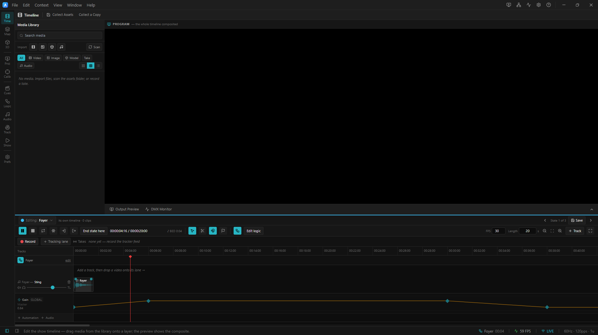

# 05 · Automating the mix

> Project: [`../04-automation.artlux`](../04-automation.artlux)
> 🎧 Headphones again for the second half.
> You'll learn: **automation lanes**; which **clock** a lane rides; the **`GLOBAL`** badge; the **`LANE`**
> badge and the read-only fader; and how to **take a parameter back**.

A fader you have to hold is not a show. Automation is how the mix runs itself — and audio is automated by the
**same curve engine** that drives everything else in ArtLux. An audio lane is not a special kind of lane. It
is a lane.

## 1. Open it and watch the room duck

**File ▸ Open…** → `04-automation.artlux`. Pull the **timeline drawer** up (**Ctrl+T**) and make sure **Global** is bound
(the pill above the ruler). Press **Play**.

Look at the timeline. Below the clips there are two new lanes with curves drawn on them:

- **Master ▸ Gain** — flat, then a steep drop at 0:08, a long plateau, and a climb back at 0:26.
- **Orbit ▸ Position X** — a triangle, sweeping back and forth.

Listen:

- At **0:12** the whole room **ducks** to about a quarter, and stays there. (The announcement is speaking.)
- At **0:31** it comes **back up**.
- Meanwhile the buzzy orbit source is sweeping **left → right → left**, on its own, without you touching the
  pad.

Nobody is holding a fader. That is the point.

## 2. Watch the fader move — and refuse to be moved

Switch to the **Audio** context. Watch the **Master** fader while the duck happens.

**The thumb slides down with the sound.** It is greyed out, and it wears a badge: **`LANE`**.

Now **try to grab it.**

It will not move.

> ### This is the fader telling you the truth, and it is worth dwelling on.
> Three layers can write any audio parameter, and the priority is fixed:
>
> ```
>   authored   what the document says (what you typed)
>     ↑
>   fade       a Scene or Cue recall faded it here — and it PERSISTS after landing
>     ↑
>   lane       an automation lane owns it, and it WINS
> ```
>
> **What the fader draws is what the engine is playing** — not what the document says. And when a **lane**
> owns a parameter, moving the fader would land a value in the document, change **nothing audible**, and be
> overwritten on the very next frame. So the fader goes **read-only** rather than lie to you about being in
> charge.
>
> (A **`FADE`** badge is different: there the fader *still works*, and moving it is a genuine **takeover** —
> it drops the fade and its in-flight leg. That is your recovery gesture when a scene recall has ducked
> something and left it ducked.)

**Take the master back:** in the lane's gutter, click the **⚡** icon. The lane goes dark, the badge clears,
the fader comes **back to life** at its authored value. Click ⚡ again to hand it back.

## 3. Which clock does a lane ride?

Here is the question that decides everything about a lane, and it has a beautifully simple answer:

> ### A lane rides the clock of **the document it lives in**.
>
> - A lane on the **GLOBAL** timeline rides the **SHOW clock**. It keeps driving underneath every Scene.
> - A lane on a **Scene's** timeline rides that Scene's **playhead**, and restarts with it.

Both lanes in this project are on the **global** timeline. So: **recall a Scene** (from **Scenes & Cues**, or a
scene pill above the ruler) while the duck is running.

The picture changes. **The duck carries on descending, exactly as if you had not touched anything.** It is on
the show clock — the same clock as the bed — so a cue does not reset it, any more than a cue resets the music.

## 4. …and you can *see* it, which is new

With the Scene still bound, go back to the **timeline drawer**.

The two lanes are **still drawn** — dimmed, and each badged **`GLOBAL`**.


<!-- TODO screenshot: left, the timeline drawer with a base lane badged GLOBAL and struck through because a scene lane owns the same target; right, the Audio context master fader greyed out and badged LANE -->

> ### Why they are on screen at all
> They do not belong to this Scene. They belong to the **global** timeline, and they are *what is currently
> moving your master*. If they vanished the moment you bound a Scene, you would be watching your house level
> slide with **no visible cause** — and the only way to find out why would be to leave the scene.
>
> They are **read-only** here, because you edit a lane where it lives: switch to the **Global** pill to change
> them. No handler, no edit — structurally, not by a flag someone can forget to check.

Now do something interesting. **Bind Main.** On Main's timeline, add a lane on the *same* parameter:

1. In the automation gutter, click **`+`** and pick **Master ▸ Gain**.
2. Draw a couple of keyframes.

Look at the **`GLOBAL`** lane now: it is **struck through** and dimmed harder.

> The engine filters a base lane out when a scene lane owns the **same target**. Only one of them is applying,
> and the panel says which. Without that strike-through you would see two lanes both apparently driving your
> master, with nothing to tell you which one wins — **worse than seeing none.**

## 5. Drawing a curve

Bind **Global**. On the **Master ▸ Gain** lane:

- **Double-click** an empty spot → adds a keyframe.
- **Drag** a keyframe → moves it. The **value and the time are printed right next to it while you drag**,
  because a number you cannot see while you are setting it is a number you do not have.
- **Shift-drag** → value only (time locked). **Alt-drag** → time only.
- **Double-click a keyframe** → cycles its curve: `linear → hold → bezier`.
- **Right-click** → deletes it.
- The **⧫** button in the gutter → adds a keyframe *at the playhead*, holding the current value. This is how
  you "punch in" a value where you are.

The readout in the gutter shows the value the engine is applying **right now**, sampled on that lane's own
clock.

## 6. What you can automate

Anything the audio provider publishes. Click **`+`** in the automation gutter and read the list:

| Path | What |
|---|---|
| `audio.master.gain` | the house level — **the** lane a show recall exists to move |
| `audio.master.fx.<id>.<param>` | any master-FX parameter (the compressor's threshold, say) |
| `audio.track.<id>.gain` | a track's level |
| `audio.clip.<id>.gain` | one clip's level |
| `audio.clip.<id>.spatial.x` / `.y` / `.z` | **a source's position** — this is how you fly a sound around a room |
| `audio.clip.<id>.fx.<id>.<param>` | any clip-FX parameter — automate a filter sweep, a reverb's wet |

Note what is **not** there: the **Spatial checkbox**, and **mute**. Neither is a number. Flipping spatial
rebuilds the clip's DSP chain (chapter 4), and a mute is a boolean — the fade grammar admits only continuous
paths. **If it is not a number, it is not automatable**, and the list simply will not offer it.

## 7. The pieces, named

| Concept | Here | In the file |
|---|---|---|
| **A lane** | Master ▸ Gain | `timeline.automation[]` |
| **Its target** | the house level | `lane.targetPath: "audio.master.gain"` |
| **A keyframe** | a diamond | `{ t, v, curve }` |
| **Which clock it rides** | the show clock | *whichever document the lane is in* |
| **Lane on / off** | the ⚡ | `lane.enabled` |
| **The read order** | `LANE` beats `FADE` beats the fader | see [`docs/AUDIO.md`](../../../docs/AUDIO.md) |

---

## Try it yourself

1. **Fly a sound around the room.** Add a lane on `audio.clip.acl_orbit0.spatial.z` (front/back) with a
   sine-ish set of keyframes, out of phase with the existing X lane. The source now traces a **circle** around
   your head, hands-free. Two lanes, one orbit.
2. **Automate a filter sweep.** Put a **Filter** on the orbit clip, then add a lane on its `cutoff` and sweep
   it from 200 Hz to 12 kHz over eight seconds. Note the lane's axis is **logarithmic** — because your ears
   are, and a linear cutoff sweep sounds wrong at both ends.
3. **Build the classic.** Give **Main** a lane on `audio.master.gain` that ducks to 0.3 over 1 s on entry and
   recovers over 4 s. Now every time you GO to Main, the house ducks for the announcement **and recovers by
   itself** — and because the lane lives in *Main's* timeline, it rides Main's playhead and re-fires on every
   entry. Compare that with the global lane, which would only do it once.
4. **Watch a lane get shadowed.** With that Main lane in place, bind Main and look at the global lane:
   struck through. Now delete Main's lane. The global one comes back to life. **You have just watched the
   base layer take over.**

➡ **[Chapter 6 — The unattended show](06-the-unattended-show.md)**
