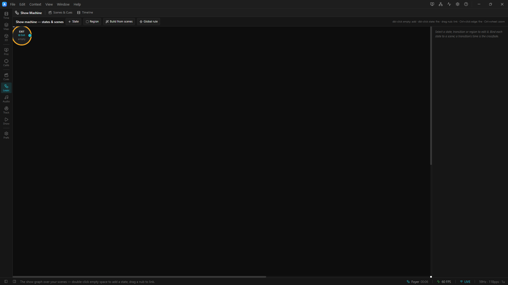

# 06 · The unattended show

> Project: [`../05-the-unattended-show.artlux`](../05-the-unattended-show.artlux)
> You'll learn: the **state machine** driving all of it; how the two clocks behave when *nobody is holding
> the mouse*; and — the part that actually matters — **what fails at 3 a.m., and how you would know.**

Everything so far has had you clicking. That is not what this application is for. ArtLux exists to be
**installed in a venue and left there** — running for hours, unattended, with the audience arriving and
leaving and nobody at the desk.

This chapter puts the whole subsystem together and then, more usefully, tries to break it the way a real
venue will.

## 1. Open it. Do nothing.

**File ▸ Open…** → `05-the-unattended-show.artlux`.

**Do not press Play.**

Within a second or two, the show starts running by itself:

- The look cycles: **Foyer → Main → Exit → Foyer → …**
- Each entry fires **its own sting** — the mallet, the bell, the falling gesture.
- The **counting bed** plays straight through **all** of it, never restarting.
- The **master gain** rises from 0.35 as the show comes up, holds, and falls again before the show wraps.

In the **Timeline** context, watch the **state lane** (the top row): the ⚙ toggle is lit, and the current
state's name changes as it advances. Switch to the **Audio** context and watch the **master fader** drift up
and down on its own, greyed out, badged **`LANE`**.

Nobody is doing anything. **This is the deployment.**

> ### Why does it start with no Play?
> The state machine's `afterDelay` trigger runs on a **wall clock**, which ticks whether or not the transport
> is playing. That is a third clock, and it is deliberate: an installation should come up and run when the
> venue's power comes on, not when someone remembers to press a button. (See
> [`docs/STATE-MACHINE.md`](../../../docs/STATE-MACHINE.md), and the
> [state-machine tutorial](../../state-machine/tuto/README.md) for the full story.)

## 2. Everything you learned, in one file

Click **edit** on the state lane — it opens the **Show Machine** context (rail, *show* cluster, short title
**Logic**), where the graph gets the whole window instead of the old modal box. Three states in a ring, each
bound to a Scene. Then map it back:

<!-- TODO screenshot: Show Machine context (Logic) showing the three-state ring graph, one state highlighted as current -->

| Layer | Where it lives | Which clock | What it does here |
|---|---|---|---|
| **The show** | `stateMachine` | **wall clock** | cycles the three states, forever |
| **The look** | `scenes[].surfaces` | — | snapped on entry, crossfaded |
| **The bed** | `audio` | **SHOW clock** | the count. Never restarts. |
| **The stings** | `scenes[].timeline.audio` | **PLAYHEAD** | fire on every entry. Always restart. |
| **The master fade** | `timeline.automation` | **SHOW clock** | rises and falls with the show, under everything |

Five layers, three clocks, and every one of them is doing exactly what its container says it should. **Nothing
here is configured to behave this way. It behaves this way because of where it lives.**

## 3. Now break it like a venue will

This is the important half of the chapter. Leave it running and do these in order.

### a) Fire a cue at the worst possible moment

Click **Main** by hand, right in the middle of the master's fade-up.

The show jumps to Main. The sting fires. **The fade carries on**, smoothly, from where it was — because it is
on the *show* clock, and your recall did not touch that.

Now imagine the alternative: a house fade that **snapped back to its starting value on every GO**. In a venue,
on a cue, that is a step change in the master gain — which is a **click**, and possibly a very loud one. This
is not hypothetical; it is a real bug that shipped in a pre-release build of this subsystem and had to be
found by ear.

### b) Pull the audio interface out

If you have a USB audio interface, **unplug it**. (No interface? **Windows ▸ Settings ▸ System ▸ Sound ▸ All
sound devices ▸** your output **▸ Don't allow** — same effect, one click to undo.)

The room goes silent. And:

- a red **`no output device`** badge appears in the Audio Bed within about 100 ms;
- **Preferences ▸ Audio** says *"The output device is gone — the room is silent"* and **names what it lost**;
- a **Reconnect** button appears.

Plug it back in, press **Reconnect**, and sound returns **with no restart**.

> ### ⚠ And here is the honest bit.
> **ArtLux does not re-open a device by itself.** In an attended show that is fine — you see the badge, you
> press the button. **In an unattended install, nobody is there to press it, and the room stays silent until
> someone visits.** That gap is known, it is written down, and it is scheduled. Do not mistake the badge for a
> cure. It buys you a failure that is *visible and recoverable* instead of one that is invisible and terminal.

### c) Let the show run out

Bind **Global**, turn the global **Loop** off, and wait for the Length to expire.

The show **parks**. The bed stops. The amber **`show ended`** badge appears.

But the **state machine keeps cycling**, because it is on the wall clock — so the picture keeps changing over
a silent room. Everything is behaving correctly and the result is still wrong for a venue. **This is the
failure mode to design against:** an unattended install whose global Length runs out at 2 a.m. and plays
pictures to nobody, in silence, until morning.

**The fix is one field.** Turn the global **Loop** back **on**. An installation's global timeline should
essentially always loop.

## 4. The checklist for a real install

Before you leave a show running overnight:

- [ ] **Global Loop is ON.** Otherwise the show clock parks and the bed stops (§3c). The default
      project is 60 s with Loop **off** — an unattended install reaches the end of it in one minute.
- [ ] **The bed is in the bed.** Anything that must not restart on a cue is in `ProjectData.audio`, not in a
      Scene. Fire ten GOs in a row and listen.
- [ ] **Headroom.** Fire the loudest cue over the loudest part of the bed and watch the **clipping** badge.
      It is latched — if it lights once, it happened.
- [ ] **The master is where you think it is.** If a lane owns `audio.master.gain`, the fader is read-only and
      badged `LANE`. If it is badged `FADE`, a scene recall ducked it and **left it there** — move the fader
      to take it back.
- [ ] **Audio device chosen and tested.** Preferences ▸ Audio. Confirm the name, and that it is not "default"
      if you care which box the sound comes out of.
- [ ] **You know what silence looks like.** `no audio engine` = the addon is missing. `no output device` = the
      interface is gone. `show ended` = the show is over and this is not a fault. Three different silences,
      three different badges, three different fixes.

## 5. Where to go next

- **[`docs/AUDIO.md`](../../../docs/AUDIO.md)** — the reference: the signal path, every automation target
  path, the layer order, and the invariants (including the ones that will bite you if you ever touch the
  engine).
- **[`docs/TIMELINE.md`](../../../docs/TIMELINE.md)** — the full **reset table**: every transport event ×
  both clocks. Print it.
- **[`examples/state-machine/`](../../state-machine/README.md)** — the show layer in its own right: triggers,
  entry actions, regions, OSC.
- **[`docs/SHOW-CONTROL.md`](../../../docs/SHOW-CONTROL.md)** — driving all of this from a tablet, OSC, or a
  wall-clock schedule.

---

## Try it yourself

1. **Give the show a voice.** Add a fourth Scene, *Announcement*, with a spoken clip in its own timeline
   audio and a lane on `audio.master.gain` ducking to 0.2 for its duration. Wire it into the state machine as
   a **manual** trigger. You now have a duck-and-announce button that recovers by itself.
2. **Make it survive the night.** Set the global Length to five minutes with Loop ON, and put a five-minute
   bed in it. Leave it running while you do something else. Come back in an hour. It should be exactly where
   you left it, and the bed should never have stuttered.
3. **Then go and read [`docs/AUDIO.md`](../../../docs/AUDIO.md)'s invariants** — five rules, each of which
   exists because breaking it made an audible noise in a room.
