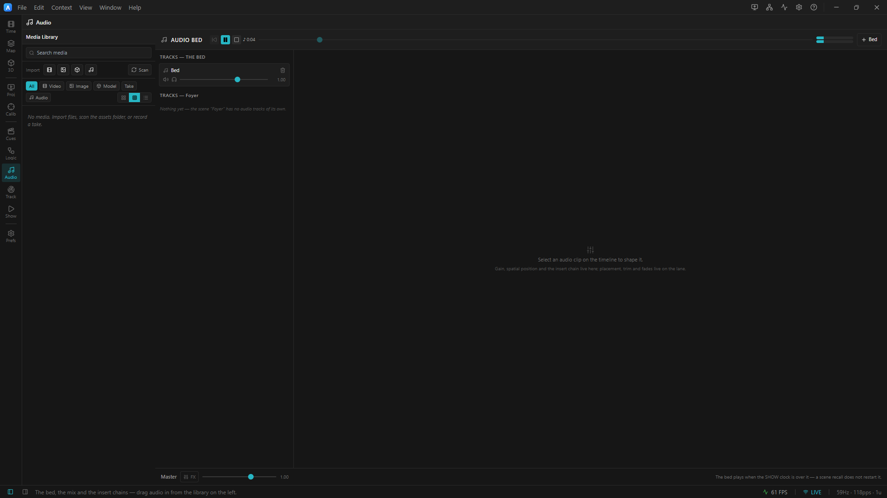

# Audio — the tutorial

Six chapters. By the end you will have built a show that runs itself: house music that never stutters, a
sting that fires every time a cue lands, a sound that orbits your head, and a master fade that ducks the room
for an announcement — none of it touched by a human.

Work through them in order. Each opens a project, takes it apart in the editor, and then **has you break it**,
because the fastest way to understand a rule is to watch what happens without it.

> ## 🎧 Headphones, at least for chapters 4 and 5.
> The engine decodes ambisonics **binaurally** (HRTF) by default. That is a real 3-D image and it only exists
> over headphones — on speakers it collapses to a stereo pan.

| # | Chapter | Project | You will learn |
|---|---|---|---|
| **1** | [The bed and the show clock](01-the-bed-and-the-show-clock.md) | [`01-the-bed`](../01-the-bed.artlux) | the **bed**; the **show clock** vs the **playhead**; why a GO does not restart your music; the parked show |
| **2** | [The mixer](02-the-mixer.md) | [`01-the-bed`](../01-the-bed.artlux) | the **Audio Bed** panel; tracks, faders, mute/solo; the master strip; meters, **headroom** and the clipping badge |
| **3** | [A scene's own audio](03-a-scenes-own-audio.md) | [`02-per-scene-audio`](../02-per-scene-audio.artlux) | the **second container**; the sting that *should* restart; two clocks, heard side by side; which one to put a sound in |
| **4** | [Spatial audio and FX](04-spatial-audio-and-fx.md) | [`03-spatial-and-fx`](../03-spatial-and-fx.artlux) | the **positioner pad**; ambisonics + HRTF; the **clip insert chain**; **why a reverb on the master does nothing** |
| **5** | [Automating the mix](05-automating-the-mix.md) | [`04-automation`](../04-automation.artlux) | **lanes**; which **clock** a lane rides; the `GLOBAL` and `LANE` badges; taking a parameter back |
| **6** | [The unattended show](06-the-unattended-show.md) | [`05-the-unattended-show`](../05-the-unattended-show.artlux) | the **state machine** driving all of it; what breaks at 3 a.m. and how you would know |

---

## The mental model — read this first

Everything below follows from one sentence:

> ### There are **three audio containers**, and they ride **two clocks**.

|  | **The BED** | **A timeline's OWN audio** | **A video clip's own soundtrack** |
|---|---|---|---|
| Lives in | `ProjectData.audio` — **one per project** | `Timeline.audio` — one per timeline, **so one per Scene** | nowhere — **derived** from the video clips on a timeline |
| Rides | the **SHOW clock** | the **PLAYHEAD** | the **PLAYHEAD** |
| A Scene recall (a GO) | **does not touch it** | **restarts it** | **restarts it** |
| Edit it on the timeline | only while **Global** is bound | whenever that timeline is bound | you don't — only *how it sounds* is authored (`VideoClip.audio`), never *when* |
| It is for | house music, room tone, the ambient bed — **the thing that must not stutter when you fire a cue** | the scene's **sting** — the thing that *should* fire again every time you enter | a movie's own audio, locked to its picture — no lane, no separate import, nothing to keep in sync |

Three containers, but only **two clocks**: the bed on the show clock, and *both* of the others on the
playhead. This tutorial teaches the two you **author** — the bed and a scene's own audio. The third one you
never place: drop an `.mp4` or `.mov` on a video track and it simply plays its own sound, on the picture's
playhead, through the same rig. It carries the picture's audio and cannot drift from it, so there is nothing
to learn about *when* — only *how it sounds*, which is the same clip-inspector controls chapter 4 covers. See
[`docs/AUDIO.md`](../../../docs/AUDIO.md) → *A video clip's own soundtrack*.

That is the whole design. Almost every question you will ever ask about ArtLux audio —

- *"Why did my music restart?"* → it is in a **Scene's** timeline. Move it to the bed.
- *"Why does my sting only fire once?"* → it is in the **bed**. Move it to the Scene.

— is answered by asking **which container is it in**.

### The two clocks, drawn

```
   press Play
       │
       ▼
  ┌──────────────────────────────────────────────────────────────────────┐
  │  SHOW CLOCK   0────5────10───15───20───25───30───35───40  (wraps)     │   the BED rides this
  └──────────────────────────────────────────────────────────────────────┘
                       │                    │
                    GO Main             GO Exit          ← a recall does NOT reset the show clock
                       │                    │
                       ▼                    ▼
                  ┌─────────┐          ┌─────────┐
                  │PLAYHEAD │          │PLAYHEAD │                          a SCENE's audio rides this
                  │0──►     │          │0──►     │       ← …but it DOES reset the playhead, to zero,
                  └─────────┘          └─────────┘          every single time. That is the sting firing.
```

**One transport, two playheads.** You press Play once. The show clock counts the *show*; the playhead counts
the *document that is currently bound*. A GO rebinds the document — so the playhead restarts and the show
clock does not.

You can see both, always:

- **`♪ BED m:ss`** in the timeline toolbar (the **timeline drawer**) — the **show** clock. It appears
  whenever a Scene is bound.
- **`♪ m:ss`** in the mixer header (the **Audio** context) — the same number, plus a scrub slider for it.
- The **ruler** under a bound Scene is that scene's **playhead**. A different number, on purpose.

If those two ever tell you the same story while a Scene is bound, something is wrong. They are *supposed*
to disagree.

---

## Before you start

1. **Go to the Audio context** — it is in the left rail, in the *show* cluster (the ♪ icon). Its viewport
   **is** the mixer, so switching to it is how you "open" the mixer; every chapter uses it. (**View ▸ Audio
   Bed…** still works and simply switches you here — there is no keyboard shortcut for it.)


<!-- TODO screenshot: Audio context selected in the left rail, mixer viewport showing tracks + master strip -->
2. **Check you have sound.** If the Audio Bed header shows a **`no audio engine`** badge, ArtLux started
   without its native audio addon and there will be **silence, with everything else working normally**.
   Built from source, that addon is a separate step: `npm run build:audio`, **with the app closed**
   (a running app locks the file and the build fails). See
   [`docs/DEVELOPMENT.md`](../../../docs/DEVELOPMENT.md).
3. **Keep your edits.** These projects are a sandbox. **File ▸ Save As…** to a new file if you want to keep
   what you build; the originals stay clean for the next read-through.

## Reference

- **[`docs/AUDIO.md`](../../../docs/AUDIO.md)** — the data model, the signal path, the automation target
  paths, and the invariants.
- [`docs/TIMELINE.md`](../../../docs/TIMELINE.md) — the transport and the full reset table (every transport
  event × both clocks).
- [`docs/SCENES.md`](../../../docs/SCENES.md) — what a Scene captures.
- [`docs/STATE-MACHINE.md`](../../../docs/STATE-MACHINE.md) — chapter 6's subject, in full.

➡ **[Chapter 1 — The bed and the show clock](01-the-bed-and-the-show-clock.md)**
