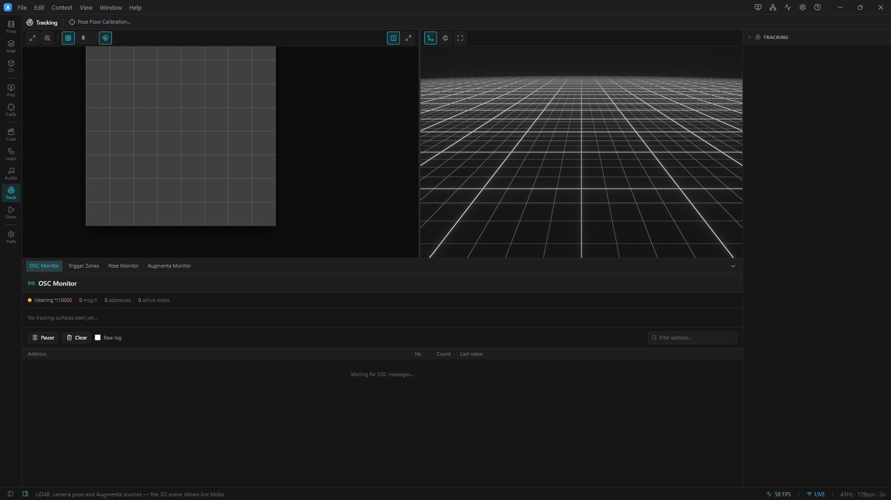
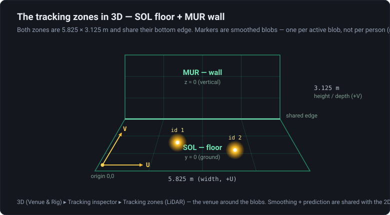
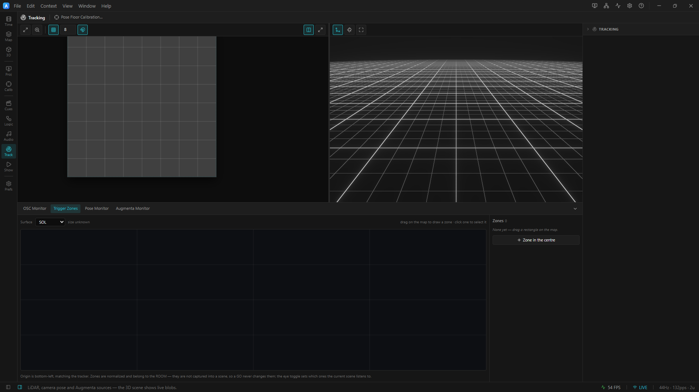

# 01 · Blob Viewer

> Project: [`../01-blob-viewer.artlux`](../01-blob-viewer.artlux)
> You'll learn: the **LiDAR blob feed**, the **synthetic emitter**, the **OSC Monitor** sniffer, the
> **TRACKING surface content** inspector, and the **3D tracking-zone** viz.

The tracker isn't here — but the whole pipeline is. This chapter feeds ArtLux a **synthetic** blob
stream from a script, watches two blobs orbit the floor, and takes apart the two places blobs show up:
the 2D **Stage** and the **3D Scene**. No real LiDAR, no venue network.

## 1. Open it

**File ▸ Open…** (`Ctrl+O`) → `01-blob-viewer.artlux`. (Single-file project — use *Open…*, not *Open
Project Folder…*.)

On the 2D **Stage** you'll see one full-screen **Floor (SOL)** surface — dark and empty, with **no
blobs yet**. Nothing is moving on the floor because nothing is sending. (This surface ships with its
**Background** set to *none*; a media-free effect wash drawn *under* the blobs is chapter 02's job.)
Make sure ArtLux is **listening** — but note **OSC receive is a machine setting, not part of the
`.artlux`**: open **Preferences ▸ OSC / Tracking** (`Ctrl+,`) and confirm **OSC receive** on, **Listen
port** `10000`, **Bind address** **All**. (Any `settings` block older project files carry is ignored on
load, so nothing about OSC ships inside the project.) We just need a sender.

> **Why "Bind: All" matters.** Binding every NIC includes loopback, so the local emitter on `127.0.0.1`
> arrives. A real venue NIC IP (e.g. `192.168.61.32`) would *not* receive the local emitter — see the
> `EADDRNOTAVAIL` note in [`../../../docs/OSC.md`](../../../docs/OSC.md#troubleshooting).

## 2. Run the emitter → orbiting blobs

From the repo root, in a terminal:

```
node scripts/lidar-emitter.cjs            # 127.0.0.1  10000  2 blobs/surface (defaults)
```

It prints `emitting 2 blobs/surface (SOL+MUR) at 61fps -> 127.0.0.1:10000` and starts sending. Switch
back to ArtLux: **two blobs now orbit the Floor (SOL) surface** on the Stage, each tracing a slow
Lissajous loop (the script gives every blob its own phase so smoothing/motion is visible). `Ctrl+C` in
the terminal stops the feed; the blobs fade out.

The emitter speaks the exact venue protocol — for each surface it sends
`/<surface>/specs/Scalex|Scaley` (the zone size, **5.825 × 3.125 m**) and, per blob slot,
`id / tx / ty / u / v`. It emits **both `SOL` (floor) and `MUR` (wall)** every frame, so the wall zone
is being fed too even though this project only shows the floor.

> **What the Stage shows is un-merged, but not unfiltered.** The editor Stage runs the *same* One-Euro
> smoothing and prediction as the projector, from the same **Smoothing** / **Predict** settings — the
> stage drawable and the projector share `trackingRenderer`, precisely so the look and the calibration
> math cannot diverge. What the Stage does **not** do is the "2 blobs → 1 person" merge: that is applied
> only in the projector-output channel (and in trigger-zone counting), so here you get one marker per
> active slot. The editor 3D Scene shows raw blobs too — see chapter 03.

## 3. OSC Monitor — read the wire

**View ▸ OSC Monitor** (`Ctrl+Shift+M`) opens a live sniffer of the raw incoming stream — a dock tab on
the **3D** (Venue & Rig) workspace context (the menu action just switches there and selects it), and the fastest
way to confirm *"is anything actually arriving on this machine?"* With the emitter running you'll see:

- **Status strip** — a **green** dot (receiving), the bind target **`*:10000`**, live **msg/s**, the
  number of distinct addresses, and total **active blobs**. (Amber + `0 msg/s` = listening but nothing
  arriving; grey = OSC receive off.)
- **Blob cards** — one per surface seen: **`SOL`** and **`MUR`**, each showing `active / total` slots
  and the zone size in metres. A card glows **green** while it has active blobs.
- **Address table** — every address with its update **rate (Hz)**, count, and last value. Type
  `SOL` in the **filter** box to isolate the floor: you'll see `/SOL/specs/Scalex`,
  `/SOL/specs/Scaley`, and `/SOL/blobs/blob0/…`, `/SOL/blobs/blob1/…` each ticking near the wire rate.


<!-- TODO screenshot: 3D (Venue & Rig) context ▸ OSC Monitor dock tab, green status dot, bind target *:10000, live msg/s, SOL + MUR blob cards (green, 2 active), address table filtered to /SOL. -->

Because the Monitor taps the **raw wire**, the per-address rate reads close to the emitter's **61 fps**.
ArtLux's tracking store then **coalesces** that to one update per animation frame before it reaches the
Stage, 3D viz, or a recording — which is why a captured take holds **up to ~60fps**, not 61. (Recording
takes is chapter 03's job; here we're just watching.)

### The `id == 0` empty-slot rule (protocol, not live)

In the real protocol each blob slot carries an **`id`**, and **`id == 0` means the slot is empty** — it
is how the tracker signals *"this person left"* (see the protocol table in
[`../../../docs/OSC.md`](../../../docs/OSC.md#protocol-reference-tracking)). You will **not** see this
on the wire here: `scripts/lidar-emitter.cjs` always sends `id = i + 1` for every slot and **never
sends `0`**, so its blobs never "leave" — they just orbit forever. To *observe* a leave-signal you'd
have to teach the emitter to drop a slot (a ~3-line tweak: stop firing a blob's fields, or emit its
`id` as `0`, for part of the loop). Read the rule from the protocol; don't expect the shipped emitter
to demonstrate it.

## 4. Take apart the TRACKING inspector

Click the **Floor (SOL)** surface on the Stage, then open its **Content** in the Inspector. Because its
type is **Tracking**, you get the LiDAR content controls (grounded in `ContentEditor.tsx`):

| Control | What it does |
|---|---|
| **Source** | `SOL — floor` / `MUR — wall` / `SOL_MUR — combined` — which zone's blobs this surface draws. |
| **Background** | a timeline video/effect layer drawn *under* the blobs (here **— none —**; chapter 02 wires an EFFECT wash in). |
| **Blob size** | marker **radius** as a fraction of the zone **height** (0.01–0.15) — the shipped `0.06` draws a disc 12 % of the zone height across. |
| **Trail (s)** | how long each blob smears a fading tail (0–3 s); the **Trail** checkbox turns it on/off. |
| **Rotate** | 0 / 90 / 180 / 270° of the whole zone. |
| **Flip H / Flip V** | mirror the mapping — used on-site to line the projection up with the real floor. |
| **Show IDs** | draw each blob's tracking `id` next to its marker. |
| **Calibrate** | overlay the zone border + grid + amber U/V axis arrows (a projector-alignment aid). |

**Try it:**

1. **Show IDs** — this project ships with it **on**, so labels `1` and `2` already sit beside the two
   blobs (the emitter's `i + 1`). Untick to hide them, re-tick to bring them back.
2. **Blob size** — drag it up; the markers swell.
3. **Source → `MUR`** — switch the floor surface to read the **wall** feed instead. The emitter sends
   `MUR` too (phase-shifted by π), so two blobs keep orbiting — sourced from the other zone. Switch
   back to `SOL` when done.
4. **Calibrate** — tick it to see the zone border + U/V arrows; the arrows show the data's orientation
   (`u` right, `v` up — a **bottom-left** origin). Untick it.

## 5. The 3D tracking-zone viz


*The two zones at real scale — **SOL** floor on `y = 0` and **MUR** wall on `z = 0`, sharing their bottom edge. Each active blob is a bloom-lit marker. (The amber **U/V** arrows are a diagram annotation showing the bottom-left origin — `u` across the width, `v` up the zone toward the wall. The 3D viz draws no gizmo; that lives on the 2D **Calibrate** overlay, which chapter 02 turns on.)*

Blobs live in real 3D space, not just the flat Stage. Open the
**3D** (Venue & Rig) workspace context from the left rail (the **cube** icon), and in the right-hand
**Inspector** find the **Tracking** section (`SceneTrackingPanel`, in
`src/renderer/contexts/panels/scene3d.tsx` — the old floating `ScenePanel3D` column is gone). Enable
**Tracking zones (LiDAR)**: the **SOL** floor (on `y = 0`) and **MUR** wall (on `z = 0`) appear at real
scale in the 3D scene, sharing their bottom edge, with a glowing bloom-lit marker per active blob. (The
**3D** context is the shortcut — it puts the 3D scene in its right pane, so you tune the overlays
with the venue in view.) Toggling it on reveals its sub-controls:

- **Smoothing** (0–1) — One-Euro filter strength on the marker motion.
- **Predict (ms)** — how far ahead motion is extrapolated to hide latency.
- **Show IDs** — label markers in 3D.
- **Zone enter dwell (s)** / **Zone exit dwell (s)** — the venue-wide dwell every trigger zone follows
  (defaults **0.2** / **0.5**). They belong to the interactive path in
  [`03 · Replayed Take`](03-replayed-take.md#5-trigger-zones--make-the-room-drive-the-show) and
  [`docs/TRACKING_SYNC.md`](../../../docs/TRACKING_SYNC.md), not to this viewer.


<!-- TODO screenshot: the Tracking inspector section (SceneTrackingPanel) with "Tracking zones (LiDAR)" enabled, showing Smoothing / Predict (ms) / Show IDs / Zone enter dwell / Zone exit dwell, and below it the "Merge people (2 blobs → 1)" toggle + Merge radius. -->

Below those, **Merge people (2 blobs → 1)** (and its **Merge radius**) is the on-site people-merge — also
chapter 03's topic. Nudge **Smoothing** up and the orbiting markers glide more; drop it to `0` and they
snap frame-to-frame. **Smoothing and Predict drive the 2D Stage too** — one setting, read by both. What
this view adds over the Stage is the 3D venue around the blobs. It does **not** add the people-merge:
that runs only in a projector-output window and in zone counting.

## 6. The pieces, named

| Concept | Here | Where it lives |
|---|---|---|
| **Zone** | `SOL` floor, `MUR` wall | `/<surface>/specs/Scale*` → 5.825 × 3.125 m |
| **Blob** | an orbiting marker | `/<surface>/blobs/blob<n>/{id,tx,ty,u,v}` |
| **Empty slot** | (not shown live) | `id == 0` in the protocol |
| **Surface content** | Floor (SOL) surface | `content.type: "TRACKING"`, `trackingSource: "SOL"` |
| **OSC listener** | receives the feed | **Preferences ▸ OSC / Tracking** — port `10000`, Bind **All** (not in the `.artlux`) |
| **Un-merged view** | the 2D Stage | one marker per slot; One-Euro + prediction still applied |
| **Merged view** | a projector output window | the same data, plus "2 blobs → 1 person" |

## Recap

A **blob** is a tracked person's position, streamed over OSC per-zone. You fed ArtLux with the
**synthetic emitter**, confirmed it on the **OSC Monitor** (green dot, `/SOL` addresses ticking near
the ~61 fps wire rate), took apart the **TRACKING** surface inspector, and saw the smoothed **3D zone**
viz. Remember the two invariants you *read* rather than saw: `id == 0` marks an empty slot, and the
store coalesces the feed to **up to ~60fps**.

Next in this set: **calibrate and project** these blobs onto a real floor and wall — the **Calibrate**
overlay, fixing a mirrored feed with **Flip / Rotate**, and wiring the media-free **EFFECT background**
under the blobs. Chapter 03 then replays a **bundled take** so the whole show runs with **no emitter and
no scripts** at all. Deeper reference: [`../../../docs/OSC.md`](../../../docs/OSC.md) (protocol +
Monitor) and [`../../../docs/TRACKING_TAKES.md`](../../../docs/TRACKING_TAKES.md) (record & replay).

➡ **[02 · Calibrated Projection](02-calibrated-projection.md)** · project [`../02-calibrated-projection.artlux`](../02-calibrated-projection.artlux)

> **Tip — keep your edits.** These templates are a sandbox. To keep changes, **File ▸ Save As…** to a
> new file so the original stays pristine for the next read-through.
