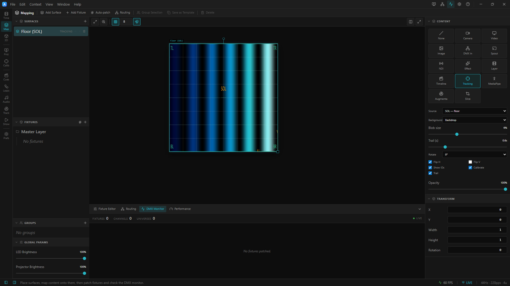

# 02 · Calibrated Projection

> Project: [`../02-calibrated-projection.artlux`](../02-calibrated-projection.artlux)
> You'll learn: the **Calibrate** overlay (and exactly what it does), fixing a mirrored feed with
> **Flip H / Flip V / Rotate**, the **rotate-then-flip** order, and the media-free **EFFECT
> background** drawn under the blobs.

Chapter 1 got live blobs onto the Stage. But a tracker bolted to a ceiling almost never agrees with
your projector out of the box — the floor comes in **mirrored or rotated**. This project ships that
way *on purpose*: a `SOL` (floor) tracking surface whose data lands the wrong way round. You'll
diagnose it with the **Calibrate** overlay and fix it with three checkboxes.

```
 raw feed  ─▶  looks mirrored on the Stage  ─▶  Calibrate ON (read the amber U/V gizmo)
                                              ─▶  Flip / Rotate until it lands right  ─▶  Calibrate OFF, run the show
```

## 1. Feed it, then open it

This set uses the repo's synthetic emitter — no tracker hardware. From the ArtLux repo root:

```
node scripts/lidar-emitter.cjs          # 127.0.0.1:10000, 2 blobs/zone, ~61 fps
```

That's [`../../../scripts/lidar-emitter.cjs`](../../../scripts/lidar-emitter.cjs); it speaks the
venue's OSC protocol on `SOL` and `MUR`. Leave it running. Then **File ▸ Open…** →
`02-calibrated-projection.artlux`.

The backdrop is a timeline clip and rides the transport, and the transport comes up **running** — so it
is already animating. Do not press Play: it is a toggle, and here it would pause the show and freeze the
very wash this chapter is about. (The blobs move either way — live OSC does not care about the
transport, which is exactly why a frozen wash is easy to miss. If you do see a still frame, something
paused it and Play will bring it back.) On the 2D **Stage** you get one full-screen surface: a couple of
coloured discs (the two emitter blobs) drifting in slow orbits, over an animated backdrop. Watch a disc for a second — it moves, but
**the wrong way**. A blob the emitter is sweeping toward the *right* of its zone tracks toward the
*left* of your surface. That horizontal mirror is the whole point of this chapter.

This project ships with the **Calibrate** overlay already **on** (and **Show IDs** on), so over the
discs you'll also see an emerald zone border, a grid, corner labels `TL/TR/BR/BL`, an amber **U/V**
gizmo and each blob's `#id` — that's your diagnostic. Reading it is step 2.

> **Sanity check first.** If you see *no* discs at all, the feed isn't arriving — open the **OSC
> Monitor** (**View ▸ OSC Monitor**, `Ctrl+Shift+M`; a dock tab on the **3D** context) and confirm
> a green **SOL** card with active blobs before chasing orientation. The emitter binds to
> `127.0.0.1:10000`; keep **Preferences ▸ OSC / Tracking ▸ Bind address** on **All** so loopback works
> (OSC receive is a machine setting, not carried in the `.artlux`). See
> [`../../../docs/OSC.md`](../../../docs/OSC.md).

## 2. Read the Calibrate overlay

Select the surface and open the **Inspector ▸ Content** panel (it shows **Tracking** controls: *Source*,
*Background*, *Blob size*, *Trail (s)*, *Rotate*, and the checkbox row **Flip H / Flip V / Show IDs /
Calibrate / Trail**). **Calibrate** ships already ticked, so the overlay is on the Stage right now —
untick and re-tick it once to watch it come and go.

The diagnostic overlay drawn on top of the blobs has:

- a bright **emerald border** around the zone, an **8 × 4 grid**, and a small **centre crosshair**;
- **corner labels** `TL` `TR` `BR` `BL`;
- an **amber gizmo**: a filled dot with two arrows, labelled **U** and **V**, plus the source name
  (`SOL`) at centre.

**Be honest about what this overlay is.** It is *purely a diagnostic drawing* — it changes no data and
sends nothing new to a projector. Two of its parts never move:

- The **border, grid, crosshair and the `TL/TR/BR/BL` labels are fixed to the image's own corners.**
  They label *where the projected picture's corners are*, full stop. They do **not** react to Flip or
  Rotate.
- Only the **amber U/V gizmo moves.** The dot sits at the tracking **origin (0,0)** and the arrows
  point along **+U** (across the zone width) and **+V** (up the zone) *after* your Flip/Rotate is
  applied. So the gizmo is the readout: it shows you which way the incoming data currently runs.

The fix, then, is: make the amber **U** arrow point the way the real floor's width should run, and
**V** the way "up-zone" should run (for `SOL`, `v` increases toward the wall edge — see
[`../../../docs/OSC.md`](../../../docs/OSC.md) §"coordinates"). Or, more concretely on site: have a
person stand at a known corner and toggle until the blob lands on them.

## 3. Fix it with Flip / Rotate

The transform is applied in a fixed order — **rotate first, then Flip H, then Flip V** — so think
rotate *then* mirror, not the other way round. The general procedure:

1. If the picture is turned a quarter/half turn, set **Rotate** (`0 / 90 / 180 / 270`) until the U/V
   gizmo is upright (U roughly horizontal, V roughly vertical).
2. If the **U** arrow points the wrong way horizontally, toggle **Flip H**; if **V** points the wrong
   way vertically, toggle **Flip V**.

**In this project the error is a single mirror: `Flip H` ships *ticked*.** That's why the amber **U**
arrow points *left* (its origin dot sits on the right edge) and the blobs run backwards. **Untick Flip
H** and the U arrow snaps to point rightward — a blob the emitter sweeps rightward now tracks rightward
on your surface. Here `Rotate` stays `0` and `Flip V` stays off; one checkbox is the whole fix.


<!-- TODO screenshot: two Stage panes side by side with Calibrate on — LEFT: Flip H ticked, amber U arrow pointing left / origin on the right edge; RIGHT: Flip H unticked, U arrow pointing right. Same emerald border + TL/TR/BR/BL labels in both. -->


Each toggle is live — the blobs, their comet **trails** and the `#id` labels all re-map together,
because Flip/Rotate is a *real* coordinate transform, not just an overlay trick. Crucially it applies
**everywhere the surface renders — the editor Stage and the projector output alike** — so fixing it
here fixes the projected show.

When it lines up, **untick Calibrate**: the emerald grid, corner labels and U/V gizmo vanish. (The
overlay canvas is drawn only while **Calibrate *or* Show IDs** is on — so with Show IDs still ticked
here it stays alive just for the `#id` labels; untick both for pure GPU blobs.) The orientation you set
is saved in the surface's `content`.

> On a real install you'd also open the **Projection Outputs** workbench (rail ▸ *Proj*) and drag the corner-pins so the emerald border
> sits on the physical floor edges; the full two-projector `SOL`+`MUR` workflow is in
> [`../../../docs/OSC.md`](../../../docs/OSC.md) §4. This chapter stays on one editor surface.

## 4. The backdrop is a media-free EFFECT

Those blobs aren't floating on black — there's a wash under them (animated once the transport is running), and it ships with **no
video file**. Look at the **Background** dropdown in the same Tracking inspector: it's set to a
timeline layer (**Backdrop**). That layer carries a clip whose content is a generated **EFFECT**, not
a movie:

- `effectId 3` = **Wave**, `paletteId 2` = **Ocean** (the index tables are in
  [`../../../docs/EFFECTS.md`](../../../docs/EFFECTS.md); effects `0..4`, palettes `0..6`).
- The clip's `path` is `""` — nothing to ship, nothing to break. It renders on the GPU.

Mechanically: a tracking surface with a **Background** set draws that layer **under** the blobs and
projects the pair as **one** surface (one projector carries video-or-effect + blobs together). Flip
the **Background** dropdown to **— none —** and the wash disappears, leaving blobs on black; set it
back to **Backdrop** to restore it. This is why the set is portable: the *only* asset a live-feed
chapter needs is the emitter, already in the repo.

## 5. Read it in the file

Open the `.artlux` (it's plain JSON) and match what you saw:

| You did | In the file |
|---|---|
| Tracking surface | `surfaces[0].content.type: "TRACKING"`, `trackingSource: "SOL"` |
| Rotate / mirror | `content.rotate` (`0/90/180/270`), `content.flipH`, `content.flipV` |
| Calibrate overlay | `content.calibration: true/false` (overlay only — no other field changes) |
| Background wash | `content.bgLayerId: "lay_bg"` → the **Backdrop** layer |
| The wash itself | a clip on `lay_bg` with `content: { type:"EFFECT", effectId:3, paletteId:2, … }`, `path:""` |
| Blob look | `blobSize`, `showIds`, `trail`, `trailSeconds` |

Note that `flipH/flipV/rotate` live on the **surface content**, so orientation is per-surface — a
`SOL` floor and a `MUR` wall each calibrate independently.

## 6. Try it yourself

1. **Break it a different way.** With **Calibrate** on (it already is), set **Rotate 90**, and watch the
   amber U/V gizmo swing a quarter turn while the fixed `TL/TR/BR/BL` labels stay put — proof the labels
   mark the *image*, the gizmo marks the *data*. Then set **Rotate** back to `0`.
2. **Trust the person, not the gizmo.** **Show IDs** is already on, so each blob wears its `#id`; imagine
   (or, on site, place) someone at `BL`. Whichever Flip/Rotate combo drops `#1` onto them is correct —
   the gizmo just gets you close faster.
3. **Swap the backdrop.** Change **Background** to **— none —** (blobs on black), then back. Or, in the
   EFFECT clip, try `effectId 4` (Fire) + `paletteId 4` (Lava) for a hotter floor. Still zero media.
4. **Prove it reaches the projector.** Enable this surface on a display in the **Projection Outputs** workbench (rail ▸ *Proj*): the
   *same* corrected orientation shows there, because Flip/Rotate is a real transform, not an editor
   overlay.

## Recap

The **Calibrate** overlay is a read-only diagnostic: fixed corner labels frame the *picture*, and the
amber **U/V** gizmo reports the *data* orientation after transform. **Flip H / Flip V / Rotate**
(rotate-then-flip) are the actual fix and apply to the projector too. The floor wash is a **media-free
EFFECT** layer wired in through the surface's **Background**, keeping the set portable. Next: capture
this feed to a `.lblob` and replay the whole show with the emitter switched off.

➡ **[03 · Replayed Take](03-replayed-take.md)** · project [`../03-replayed-take.artlux`](../03-replayed-take.artlux)
