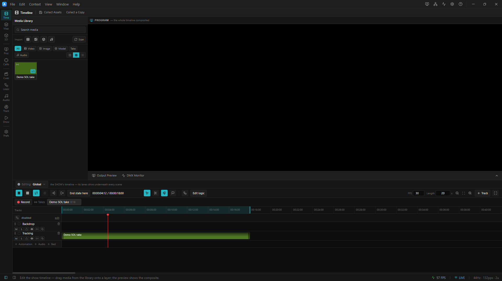
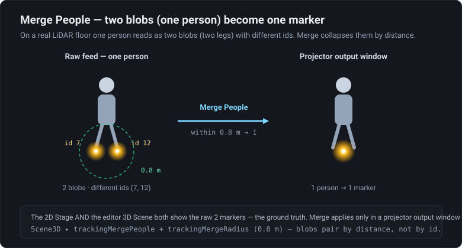

# 03 · Replayed Take

> Project: [`../03-replayed-take.artlux`](../03-replayed-take.artlux)
> You'll learn: how a **recorded LiDAR take** (`.lblob`) replays from a **tracking lane** with **no
> tracker and no emitter**, how to **record your own** from the synthetic emitter, and the three moves
> that take this **from the bench to a real venue** — the OSC **bind address**, the **1‑person‑2‑blobs**
> field test, and **Merge People** in the 3D Scene.

Chapters [01](01-blob-viewer.md) and [02](02-calibrated-projection.md) needed the emitter running to put
blobs on the floor. This one doesn't: the project **carries its own recording**. A **take** is a capture
of the live blob feed saved as a compact JSON sidecar (`.lblob`); dropped on the timeline's **tracking
lane**, it drives the exact same store the live feed does — so a show can be authored and rehearsed with
nothing plugged in. Full architecture: [`docs/TRACKING_TAKES.md`](../../../docs/TRACKING_TAKES.md).

```
  live:    OSC :10000 ─► trackingStore ─► Floor (SOL) surface / 3D Scene
  replay:  playhead ──► tracking clip (demo.lblob) ──► applySnapshot ──► same surface / Scene
           (while a take plays, the live feed is suppressed — replay wins)
```

## 1. Open it — the floor moves with nothing connected

**File ▸ Open…** → `03-replayed-take.artlux`. The 2D **Stage** shows one surface, **Floor (SOL)**
(`srf_sol`, a **TRACKING** content surface, `trackingSource: "SOL"`), and on it **three blobs already
drifting** — trailing softly (`trail: true`, `trailSeconds: 0.6`) with their **ids** (`1`, `2`, `3`)
shown. No emitter, no tracker — and even with **OSC receive** enabled in **Preferences ▸ OSC / Tracking**
(a *machine* setting, not carried in the `.artlux`), **nothing is sending**, so every bit of motion is
coming from the timeline.

Open the **Timeline** dock. You'll see two layers:

- **Tracking** (`lay_track`, `kind: "tracking"`) — carrying one clip, **Demo SOL take**
  (`clip_sol_take`), with a green **blob‑density sparkline** instead of a filmstrip.
- **Backdrop** (`lay_bg`) — empty here; it's the layer `srf_sol` names as its `bgLayerId`, ready for you
  to drop an effect or video *under* the blobs (that's Chapter 02's move).


<!-- TODO screenshot: Timeline dock. The Tracking lane (lay_track) with the "Demo SOL take" clip drawn as a green blob-density sparkline (not a filmstrip); the Backdrop lane empty below; the Takes strip in the toolbar with the ● Record button. -->

Press **Play**. The playhead sweeps the clip and the three blobs trace their recorded path. Now **stop and
drag the playhead by hand** — scrubbing works too, because replay is driven by the playhead every frame,
not by the transport running. Let it play to the end: `timeline.loop` is **true** with the loop range
`inPoint 0 → outPoint 18`, so the 18‑second take **re‑plays forever**. (Without the loop, playback clears
the blobs past the clip and the floor would go empty after one pass.)

## 2. Take it apart

Three pieces make this portable — open [`../03-replayed-take.artlux`](../03-replayed-take.artlux) in a
text editor alongside the app and find them:

| Piece | In the file | What it does |
|---|---|---|
| **The take file** | `assets/tracking/demo.lblob` | the recorded frames (see shape below) |
| **The library ref** | `timeline.trackingTakes[]` → `take_demo` | registers the take, `path` = `assets/tracking/demo.lblob` |
| **The placed clip** | `timeline.clips[]` → `clip_sol_take` | an ordinary clip with `kind: "tracking"`, `takeId: "take_demo"`, same `path` |

Both the ref **and** the clip point at the **same folder‑relative POSIX path**,
`assets/tracking/demo.lblob`. On open, persistence resolves those against the `.artlux` file's own folder
— which is why the whole set moves to another machine intact, take and all.

Peek inside `assets/tracking/demo.lblob`. It's plain JSON: a `frames[]` array of `{ t, snap }`, each
snapshot holding one `SOL` surface (`scaleX 5.825`, `scaleY 3.125` — the venue's zone size) with a `blobs`
array (three slots in this take). The first blob of the first frame reads:

```json
{ "slot": 0, "id": 1, "tx": 0.397, "ty": 1.2, "u": 0.568, "v": 0.884, "updatedAt": 0 }
```

Two details worth knowing:

- **`updatedAt: 0` is deliberate.** On replay, `applySnapshot()` re‑stamps every blob with the current
  clock, so the store's stale‑ghost filter never drops a replayed blob. Never bake a real timestamp in.
- **`u`/`v` are normalized `0–1` with a bottom‑left origin** (`u = tx/scaleX + 0.5`, `v = ty/scaleY +
  0.5` — for the blob above, `0.397/5.825 + 0.5 ≈ 0.568` and `1.2/3.125 + 0.5 ≈ 0.884`). The `id` is the
  blob's tracking id; on a real feed **`id = 0` marks an empty slot** and is filtered out — remember
  that, we come back to it in §4.

Frame timing comes from the `t` values (a step lookup — no tweening between frames), so the take's `fps`
field is just nominal metadata. This hand‑authored take runs at about **20 fps** (361 frames over 18 s);
a recording you make yourself captures **up to ~60 fps** (the live feed is coalesced to one snapshot per
animation frame).

## 3. Record your own

Now make a take from the synthetic emitter and place it on the lane.

1. **Confirm OSC receive is on.** OSC is a *machine* setting — set once, shared across projects — so open
   **Preferences** (`Ctrl+,`) **→ OSC / Tracking** and check **OSC receive** is on, **Listen port** is
   **10000**, and **Bind address** is **All**. Leaving **Bind address** on **All** is what lets the
   loopback emitter reach you (see §4).
2. **Start the emitter.** From the repo root:
   ```
   node scripts/lidar-emitter.cjs 127.0.0.1 10000 2
   ```
   It sends two orbiting blobs per zone (SOL + MUR) at 61 fps to `127.0.0.1:10000`
   ([`../../../scripts/lidar-emitter.cjs`](../../../scripts/lidar-emitter.cjs)). Sanity‑check with **View
   ▸ OSC Monitor** (`Ctrl+Shift+M`): a green **SOL** card reading **2 active**. The floor surface should
   now move live.
   > **Move the playhead off the demo clip first** (or the record button stays disabled). Recording is
   > blocked while a take is playing under the playhead, so you never record replayed data.
3. **Record.** In the **Takes** strip under the Timeline toolbar press **Record** (the **●** button); it
   turns into **REC 0:12** while capturing — let it run ~10–20 s, then press it again (now **■**) to stop.
   A new **take chip** appears (and a Tracking lane is created if you'd removed the shipped one).
4. **Where it landed.** The take is written to `userData/tracking-takes/<id>.lblob`, then **copied into
   the project you have open**, at `<this‑project>/assets/tracking/`. That copy‑in is why you open the
   project *before* recording — the take lives inside the set, right next to `demo.lblob`.
5. **Place & trim.** Drag the chip onto the **Tracking** lane; it becomes a `kind:"tracking"` clip with a
   blob‑density sparkline. Move it and **trim its edges** like any clip.
6. **Kill the emitter (`Ctrl+C`) and replay.** Press Play — your recording drives the floor with nothing
   connected. And if you *leave* the emitter running: while your take plays it **suppresses the live
   feed**, so you still see the recording, not the live orbit. (The OSC Monitor keeps showing the raw
   live wire underneath — it taps the stream directly.)

## 4. Going real — from the bench to a venue

Three things change on site. None of them are in the shipped file by accident.

**a) The bind address — All vs a NIC IP.** In **Preferences ▸ OSC / Tracking**, **Bind address** defaults
to **All** — bind to **all interfaces**. Keep it that way on the bench: the loopback emitter
(`127.0.0.1`) only reaches you if you're listening on all interfaces (or `127.0.0.1`). In the venue you
*may* bind one card — **this machine's own IP** (e.g. `192.168.61.32`) — but **never the tracking
server's IP** (`192.168.61.21`) and never a NIC IP that isn't on this box: binding an address that isn't
a local card fails with `EADDRNOTAVAIL` and OSC silently stays off. The server *sends*; ArtLux *binds* to
its own NIC. Details: [`docs/OSC.md`](../../../docs/OSC.md).

**b) The 1‑person‑2‑blobs test.** On a real LiDAR floor **one person produces two blobs** (roughly, two
legs), and — confirmed from venue recordings — **the two blobs carry different ids**, so identity has to
be resolved **spatially**, not by id. The on‑site check is: put **exactly one person** on SOL, open the
OSC Monitor, filter `SOL/blobs`, and confirm **2 active** slots with `id ≠ 0`; then record a `.lblob` of
the one‑person and two‑people cases as a fixture. The full field checklist (including the pairing table to
fill in) is [`docs/TRACKING_SYNC.md`](../../../docs/TRACKING_SYNC.md).

> **You can't rehearse this with the shipped emitter.** It always sends `id = i+1` (1, 2, …) and **never
> `id = 0`**, so the *empty‑slot / person‑left* signal can't appear on the wire — learn that rule from the
> protocol in [`docs/OSC.md`](../../../docs/OSC.md), not from the emitter. (Making the emitter drop a blob
> to `id 0` is a ~3‑line tweak if you want to try it.)

**c) Merge People — and *where* you see it.** To make ArtLux count one person as **one** marker, turn on
**Merge people (2 blobs → 1)** in the **Tracking** inspector section (`SceneTrackingPanel` — open the
**3D** or **Tracking** workspace context); **Merge radius** defaults to **0.8 m** (lower it if distinct
people merge, raise toward 1.0 if one person still shows two markers). This is a **Scene3D per‑project
setting** — `scene3D.trackingMergePeople` / `scene3D.trackingMergeRadius` in the file (Scene3D *is*
persisted, unlike the ignored `settings` block), both shipped here at their defaults (`false` / `0.8`).


*One person on a real floor reads as **two blobs with different ids** (pair by distance, not id). **Merge People** (radius 0.8 m) collapses them to a single marker — but only in the **3D Scene / projector output**; the 2D editor Stage always shows the raw two markers.*

> **Watch it in the 3D Scene or a projector output — not the 2D Stage.** Merge is applied only in the viz
> and the projector channel build; the 2D editor Stage **intentionally shows the raw, un‑merged blobs**
> so you can always see the ground truth. Enable **Tracking zones (LiDAR)** in the **Tracking** inspector
> section (the 3D or Tracking context), replay a two‑people‑close take, and toggle Merge to see two
> markers collapse into one there.

## 5. Trigger zones — make the room drive the show

A replayed take drives the **same store** the live tracker fills — so it also drives **trigger zones**,
the mechanism that lets the room advance the show. You can author and tune the whole interaction right
here, looping `demo.lblob`, with **no venue and no emitter**.

1. **Draw a zone.** Open the **Tracking** workspace context (rail ▸ **Radar**) → **Trigger Zones** dock
   tab. With the take looping (§1), the flat **SOL** map shows the raw blobs drifting. **Drag a
   rectangle** across a part of the floor the blobs cross — it becomes a zone; drag its body to move, a
   corner to resize. It fills in (and shows a live **· headcount**) whenever a blob is inside. Each zone
   carries **People needed** (`minBlobs`, default 1, counted *after* people-merge) and follows the
   **venue-wide dwell** (Zone enter 0.2 s / exit 0.5 s, in the Tracking inspector) unless you tick
   **Override dwell for this zone**.
2. **The eye toggle is per-scene.** Each scene chooses which zones it *listens to* (the eye —
   `Scene3D.activeZoneIds`); the rectangles themselves belong to the **room** and never travel with a
   scene, so a GO never recreates or loses them. A zone switched off for a scene is *unanswerable* there,
   and any rule naming it is inert — the trigger inspector warns you.
3. **Fire a transition on it.** In the **Show Machine** context, add a transition and set its trigger to
   **LiDAR zone**. Its inspector (`ZoneTriggerInspector`) has two modes:
   - **One zone** — *someone enters · everyone leaves · occupied for N s · empty for N s · at least N
     people.*
   - **Combination** — **ALL / ANY** of several zones, each optionally **NOT** (*"someone in the entrance
     **and** nobody on the stage"* is one rule). A combination is about **occupancy**, not events.

   Every rule is **armed once** — it will not re-fire while the visitor who tripped it is still standing
   there — and it **holds**, so paired with **hold at end** + **only after the state has finished** it
   gives the canonical installation state: *play the look, freeze on the last frame, advance when someone
   walks in.*

<!-- TODO screenshot (manual): images/zone-trigger-inspector.png — in the Show Machine, select a transition, set its trigger to "LiDAR zone", and capture the One-zone vs Combination inspector. Needs a drawn zone + a zone-triggered transition, which this demo project doesn't ship. -->
_Screenshot: the LiDAR-zone trigger inspector (One zone vs Combination) — build it in the Show Machine as described above._
<!-- TODO screenshot: the transition inspector with trigger = LiDAR zone. LEFT: One-zone mode (Zone dropdown + When = "someone enters"); RIGHT: Combination mode (Fires when ALL/ANY + two zone terms, one with NOT toggled), with the live occupancy dots. -->

Because it all reads `trackingStore`, drop the **demo take** on the tracking lane (or run the emitter),
watch the zone light in the panel and in 3D, and tune the dwells against the recording. Full wiring:
[`docs/STATE-MACHINE.md`](../../../docs/STATE-MACHINE.md); the zone rules + on-site dwell reference:
[`docs/TRACKING_SYNC.md`](../../../docs/TRACKING_SYNC.md).

## Recap

A **take** is the live blob feed frozen to a `.lblob` and replayed from a `kind:"tracking"` clip on the
**tracking lane** — same store, same look, **no tracker, no emitter**, made portable by a folder‑relative
`assets/tracking/…` path referenced in both the take ref and the clip. You recorded your own from the
emitter (it copies into the open project), then took the three steps to a real venue: bind **All / this
machine's IP, never the server's**; the **1‑person‑2‑blobs / id≠0** field test; and **Merge People**
(0.8 m) demoed in the **Tracking** inspector (3D / Tracking context), not the raw 2D Stage. And because
replay drives the same store as the live tracker, you built **trigger zones** against it — the room‑driven
path into the **Show Machine**.

## Where next

- **Takes reference:** [`docs/TRACKING_TAKES.md`](../../../docs/TRACKING_TAKES.md) — the `.lblob` format,
  record/replay services, and the copy‑in asset policy.
- **On‑site sync + trigger zones:** [`docs/TRACKING_SYNC.md`](../../../docs/TRACKING_SYNC.md) — the full
  field checklist, the predictive tracker behind Merge People, and the zone dwell/rules reference.
- **Wiring a zone to a transition:** [`docs/STATE-MACHINE.md`](../../../docs/STATE-MACHINE.md) — the show
  graph, guards, and hold‑at‑end.
- **OSC & tracking protocol:** [`docs/OSC.md`](../../../docs/OSC.md) — bind rules, the OSC Monitor, and
  the blob address/coordinate spec.

⬅ **[Back to the tutorial home](README.md)** · Previous: **[02 · Calibrated Projection](02-calibrated-projection.md)**
