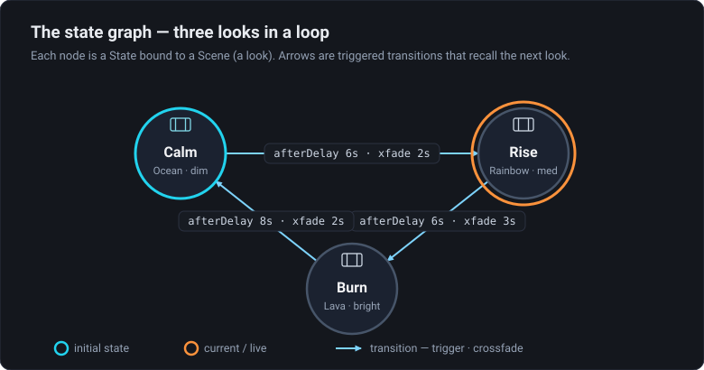

# 01 · Hello State Machine

> Project: [`../01-hello-state-machine.artlux`](../01-hello-state-machine.artlux)
> You'll learn: **states**, **Scene binding**, the **initial** state, the **`afterDelay`** trigger,
> **looping**, and the **transition crossfade**.

The simplest possible show: three looks that cycle forever. It runs on a **wall clock**, so it starts
the instant you open it — **you don't press Play**.

## 1. Open it and watch

**File ▸ Open…** → `01-hello-state-machine.artlux`.

On the 2D **Stage** you'll see one full-screen surface with an animated effect, and a horizontal
**LED strip** (60 pixels) sampling it. Wait a few seconds and the whole look changes — then again, then
it comes back around. That's the state machine cycling:

```
 Calm  ──(after 6s)──▶  Rise  ──(after 6s)──▶  Burn  ──(after 8s)──▶  (back to Calm)
 Wave/Ocean, dim        Rainbow, medium        Fire/Lava, bright
```

Open the **Timeline** panel (bottom dock) and look at the **state lane** (top row): the **⚙ toggle** is
lit (the machine is **enabled**) and the **current state's name** updates — `Calm`, then `Rise`, then
`Burn` — as it advances.

> **Why no Play?** The `afterDelay` trigger uses a standalone **wall clock** that ticks whether or not
> the transport is playing. Chapter 2's triggers use the **playhead** instead, and *do* need Play.

## 2. Look under the hood

On the state lane, click **`edit`** — this opens the **Show Machine** context (the full-window
state-graph editor). You can also reach it any time from the left **rail**: cluster **Show**, the
**Logic** entry (the *Workflow* icon). It used to be a modal boxed over the timeline; it's now a
workspace context with the whole window to itself.


*The three states in a ring, as the graph editor draws them: **Calm** is the initial state (cyan ring), **Rise** is the current/live state (orange ring), and each `afterDelay` arrow carries its wait plus a crossfade time. **Burn → Calm** closes the loop.*

You'll see three circular **state** nodes — **CALM**, **RISE**, **BURN** — joined by **arrows**
(transitions). Note:

- **CALM** is drawn in cyan: it's the **initial state**, entered when the machine turns on.
- One node has an **orange ring** — that's the **current/live** state, updating in real time.
- Each node shows a small **film icon + scene name** (e.g. *Calm*): the **Scene** it recalls on entry.
  *A node is a look.*

Click a node to select it. The **inspector** on the right shows its **Name**, whether it's the
**initial** state (★), and the **Scene (recalled on entry)** it's bound to. This binding is the heart
of the machine: **entering a state recalls its Scene**, which swaps the whole look — here, the surface
effect + the brightness.

> **Every Scene now owns its own timeline.** A state doesn't just swap the *look* — recalling its Scene
> also **warm-swaps** the playback engine to that Scene's own timeline (its own clips, markers and
> playhead). These three states use effects with no clips, so there's nothing on their timelines to
> notice yet — but it's the fact that makes chapter 2 work, so keep it in mind. Reference:
> [`docs/SCENE-TIMELINES.md`](../../../docs/SCENE-TIMELINES.md).

Now click an **arrow**. The inspector shows:

- **Trigger: `afterDelay`** with **Seconds after entering** (6 or 8). This is *when* the arrow fires.
- **Transition time (s)** — `2` or `3`. This is the **crossfade** applied as the new Scene arrives:
  brightness and effect speed/intensity glide over that time; the effect and palette themselves snap.

So the graph reads: *"Enter Calm → wait 6s → cross-fade to Rise over 2s → wait 6s → cross-fade to Burn
→ wait 8s → cross-fade back to Calm."* A loop.

## 3. The pieces, named

| Concept | Here | In the file (`stateMachine`) |
|---|---|---|
| **State** | `Calm`, `Rise`, `Burn` | `states[]` (each has an `id`, `name`, `sceneId`) |
| **Scene binding** | each state recalls a look | `state.sceneId` → an entry in `scenes[]` |
| **Initial state** | `Calm` (cyan) | `initialStateId: "st_calm"` |
| **Transition** | the three arrows | `transitions[]` (`from`, `to`, `trigger`) |
| **`afterDelay` trigger** | "wait N seconds" | `trigger: { kind:"afterDelay", seconds:6 }` |
| **Crossfade** | glide into the next look | `transition.fadeSec` |
| **Loop** | Burn → Calm closes the ring | just a transition back to the start |

There's nothing else — a looping show is *N* states in a ring, each bound to a Scene, joined by
`afterDelay` arrows.

## 4. Try it yourself

1. **Change the pace.** Select the `Calm → Rise` arrow and set **Seconds after entering** to `2`. The
   show now races through Calm. Set it to `20` and it lingers. (Changes apply live.)
2. **Change a look.** Click the **CALM** node → note its Scene is *Calm*. Switch to the **Scenes & Cues**
   context (rail cluster **Show**), click **GO** on *Calm* to make it the edit target, then change the
   surface's effect/palette on the Stage and press **↻ Update** on the scene. Re-open **Show Machine**
   and let it cycle — Calm now shows your new look.
3. **Add a fourth state.** In the editor, **double-click empty canvas** to add a state. Bind it to a
   Scene in the inspector (or leave it blank for a black beat). Then **rewire the ring**: drag the
   little **nub on the node's rim** (it follows your cursor) onto your new node to connect, delete the old closing arrow
   (select it, press **Delete**), and add an `afterDelay` arrow from your new node back to `Calm`.
4. **Break the loop.** Delete the `Burn → Calm` arrow. Now the show runs Calm → Rise → Burn and
   **stops** on Burn (no outgoing trigger). A state with no outgoing arrow is a natural ending.

## Recap

A state machine is **states bound to Scenes**, joined by **triggers**. The `afterDelay` trigger + a
closing arrow gives you a hands-free **looping show**, and each arrow's **transition time** crossfades
between looks. Next: the other four triggers and what a state can *do* on entry.

➡ **[02 · Triggers & Actions](02-triggers-and-actions.md)**
