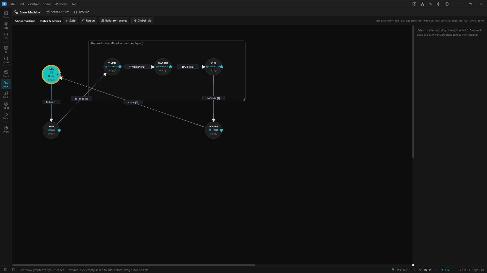

# 02 · Triggers & Actions

> Project: [`../02-triggers-and-actions.artlux`](../02-triggers-and-actions.artlux)
> You'll learn: **five of ArtLux's seven triggers** (`manual`/`afterDelay`/`atTime`/`onMarker`/
> `onClipEnd`), the **two clocks**, **entry actions**, **lock time**, **per-scene timelines**, and
> **regions**. (The other two: `onTimelineEnd` fires once when a non-looping timeline reaches its end;
> `plugin` is the plugin-owned kind — today a **LiDAR trigger zone** — which chapter 3 builds on. Both
> are in [docs/STATE-MACHINE.md](../../../docs/STATE-MACHINE.md).)

Chapter 1 used one trigger (`afterDelay`). This project is a **cookbook**: a single linear path that
walks through **every** trigger kind once, and shows how a state can drive the **transport** on entry.

```
 Idle ─(manual)─▶ Run ─(afterDelay 1.5s)─▶ Timed ─(atTime 3s)─▶ Marker ─(onMarker)─▶ Clip ─(onClipEnd)─▶ Finale ─(afterDelay 4s)─▶ (loop to Idle)
        you        seek 0 + play             playhead≈3s          marker @5s            clip ends @9s        stop
```

## 1. Open it — nothing happens (on purpose)

**File ▸ Open…** → `02-triggers-and-actions.artlux`. The Stage shows a dim, slow look and… **it sits
there.** The current state is **Idle**, and Idle's only way out is a **`manual`** trigger: the show
waits for *you*.

Open the **Timeline** panel. On the **state lane** you'll see the current state `Idle` and a **button**
labelled **Run** — that's the manual trigger out of Idle.

## 2. Kick it off

**Click the `Run` button** on the state lane. Two things happen at once:

1. The look jumps to **Run** (bright rainbow).
2. The **transport starts playing** — the playhead begins moving.

That's because the **Run** state carries **entry actions**: `seek → 0` then `play`. Entering a state
can *do* things, not just change the look. From here the show is on rails:

- **Run → Timed** fires **`afterDelay` 1.5s** (wall clock — 1.5 s after entering Run).
- **Timed → Marker** fires **`atTime` 3s** — when the **playhead** crosses 3 seconds.
- **Marker → Clip** fires **`onMarker`** — when the playhead crosses the ruler **marker "Hit"** at 5 s.
- **Clip → Finale** fires **`onClipEnd`** — when the effect **clip** on *Track A* ends at 9 s.
- **Finale → Idle** fires **`afterDelay` 4s**, but **Finale** first runs a **`stop`** entry action, so
  the transport halts and the show returns to Idle, ready to run again.

Watch the state lane's current-state readout and the Stage change at each step. The **Timeline** panel
always shows the **current state's own** timeline (its scene pill names it), so as the show reaches
each step you'll see that step's ruler content: the **"Hit" marker** at 5 s under **Marker**, the
**clip** on Track A (1–9 s) under **Clip**. On the state lane itself the `atTime` transition is drawn
as a small **diamond** at 3 s. (Why each step has *its own* ruler and not one shared one: §3½ below.)

## 3. The two clocks (important)

Notice **why Idle → Run needed you, but everything after ran on its own**:

| Trigger | Clock | Needs Play? |
|---|---|---|
| `manual` | you | no — you fire it |
| **`afterDelay`** | **wall clock** (time since the state was entered) | **no** — ticks even while stopped |
| **`atTime`** | **playhead** | **yes** |
| **`onMarker`** | **playhead** | **yes** |
| **`onClipEnd`** | **playhead** | **yes** |

The three playhead triggers only advance while the transport plays — which is exactly why **Run**
starts playback on entry. If you removed Run's `play` action, the show would stall at **Timed** forever
(the playhead never reaches 3 s). This wall-clock-vs-playhead split is the single most common source of
"my transition never fires."

## 3½. Which timeline? — the per-scene model (read this)

A playhead trigger (`atTime`/`onMarker`/`onClipEnd`) watches **the active timeline** — and here's the
part that trips people up: **every Scene now owns its own timeline.** When a state recalls its Scene,
the engine **warm-swaps** to that Scene's timeline, and the playhead **restarts at that timeline's
in-point**. So the `atTime 3s`, the marker **"Hit"**, and the **clip on Track A** don't live on one
shared ruler — each lives on **the bound Scene's own timeline** of the state that watches for it, and
each state's clock starts from 0 when you enter it.

That is why this project's ruler content is authored **per state**, not on the Global timeline:

- an early build put the marker + clip on the **Global** timeline, but recall swaps *away* from Global
  the instant a scene is entered, so `onMarker`/`onClipEnd` never saw them and the show stalled;
- the fix is to place each trigger's content on **the timeline of the scene the watching state binds**.

**To author it yourself:** make the state current first — **GO** its Scene (Scenes & Cues), or let the
show land on it — so the **Timeline** panel's scene pill (`◆ Editing: <scene>`) shows that scene and
you're editing *its* timeline. Drop the clip / drag the marker there. Author each state's timeline while
that state is the one you're looking at, and every playhead trigger reads exactly the ruler you drew.
Full model + the two-clocks-inside-one-transport detail:
[`docs/SCENE-TIMELINES.md`](../../../docs/SCENE-TIMELINES.md).

## 4. Read it in the editor

Click **`edit`** on the state lane (or pick **Show Machine** from the rail — cluster **Show**, the
**Logic** entry). Click each **arrow** and read its **Trigger** in the inspector:

- `manual` — *"Fires from the state-lane button, Ctrl+click on the edge, or OSC."*
- `afterDelay` — a **Seconds after entering** field.
- `atTime` — a **Timeline time (s)** field (`3`).
- `onMarker` — a **Marker** picker (→ "Hit").
- `onClipEnd` — a **Track** picker (→ *Track A*). Fires when that track's clip ends under the playhead.


<!-- TODO screenshot: the Show Machine transition inspector — the Trigger dropdown open showing manual/afterDelay/atTime/onMarker/onClipEnd/onTimelineEnd + the LiDAR zone plugin option, plus the "Only after the state has finished" guard checkbox and Transition time field -->

The **Trigger** dropdown lists all the kinds, not just these five. Two more sit below `onClipEnd`:
**`onTimelineEnd`** (fires once when the timeline ends with Loop off — a loop wrap is *not* an end) and
any **plugin-owned** source, which today reads **LiDAR zone** (chapter 3). Below the dropdown you'll
also see two controls we don't use here but chapter 3 leans on: an **Only after the state has finished**
checkbox (the `requireEnd` guard) and the **Transition time (s)** crossfade.

Click the **Run** and **Finale** nodes and look at **Entry actions** in the inspector — `seek`+`play`
on Run, `stop` on Finale. The **`+ add`** button lets a state run more: `pause`, `setLoop`,
`jumpMarker`, **`recallScene`** (recall a *different* scene on top of the bound one) and **`fireCue`**.

Also note two more things in this graph:

- **Idle has a "Lock time" of 1 s** (see the inspector, and the `[1]` under the node). **Lock time** is
  a **minimum dwell**: it holds the state's `afterDelay` transitions for that long before they can fire.
  It only affects `afterDelay` (manual and playhead triggers ignore it) — a debounce so a look is
  guaranteed to show for at least N seconds.
- The three playhead-driven states sit inside a **region** box labelled *"Playhead-driven (timeline
  must be playing)"*. A **region** is just a visual group — drag it and its members move together. It
  has **no** effect on the logic; it keeps big graphs readable.

## 5. Try it yourself

1. **Prove the two-clock rule.** Select the **Run** node, delete its **`play`** entry action, and run
   the show. It now stalls at **Timed** (the playhead never moves). Add `play` back to fix it.
2. **Retime the ruler triggers.** With the relevant state current (so its scene's timeline is the one
   you're editing), drag the **marker** to 7 s, or move the **clip** on Track A. The
   `onMarker`/`onClipEnd` steps now fire at the new times — the graph didn't change, the *timeline* did.
3. **Add a look change without a state.** Select **Timed**, add a **`recallScene`** entry action, and
   point it at the *Finale* scene. Now entering Timed briefly flashes the Finale look on top of its
   bound one — handy for accents.
4. **Loop a section.** Give **Run** a `setLoop` (on) entry action and set an in/out range on the
   timeline (`I`/`O` keys). The transport now loops that region while the FSM walks the states.

## Recap

Five triggers, two clocks: `manual` (you), `afterDelay` (wall clock, runs while stopped), and
`atTime`/`onMarker`/`onClipEnd` (playhead, need Play). Playhead triggers read **the current state's
own scene timeline** — every Scene owns one — so ruler content is authored per state, not on the
Global timeline. ArtLux has **two** triggers this walkthrough skips: `onTimelineEnd` (fires once when a
non-looping timeline reaches its end — a loop wrap doesn't count; the trigger for "the show finished
→ advance") and the plugin-owned `plugin` kind (a **LiDAR zone**), both in
[docs/STATE-MACHINE.md](../../../docs/STATE-MACHINE.md) and chapter 3. **Entry actions** let a state
drive the transport; **lock time** guarantees a dwell; **regions** keep the graph tidy. Next: wire
these into a real, deployable **interactive installation** that reacts to the room.

➡ **[03 · Interactive Installation](03-interactive-installation.md)**
