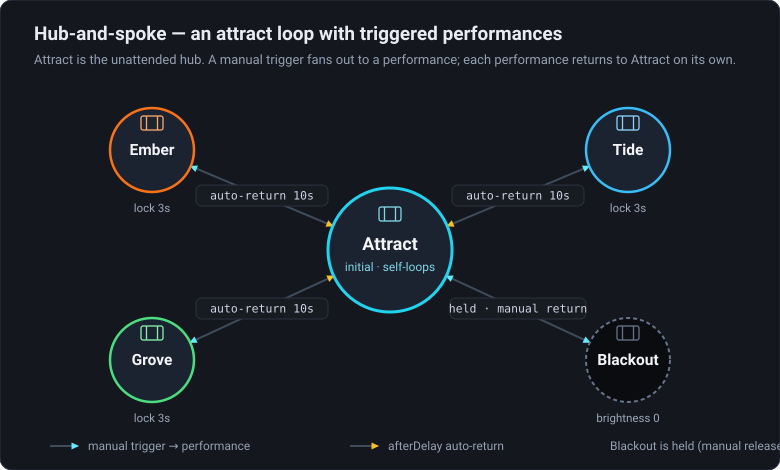

# 03 · Interactive Installation

> Project: [`../03-interactive-installation.artlux`](../03-interactive-installation.artlux)
> You'll learn: the **hub-and-spoke** pattern, live **manual triggers**, **OSC** remote control,
> **auto-return** dwell, a **blackout**, and how a show is **deployed**.

This is the shape most real ArtLux installations take: an **attract loop** that runs unattended, plus
**performance looks** you trigger on demand (by hand, a button, or a show controller over **OSC**) that
**return to attract on their own**. Two surfaces (a **wall** and a **floor**), one LED strip each.

*The hub-and-spoke shape: **Attract** is the unattended hub; a **manual** trigger fans out to each performance, and each returns to Attract on its own via **`afterDelay` 10s** (with a 3 s lock as a debounce). **Blackout** is held — released only by a manual trigger.*

## 1. Open it

**File ▸ Open…** → `03-interactive-installation.artlux`. The Stage shows the **Attract** look — an
animated rainbow across wall + floor that's designed to look alive with nobody touching it. This is the
**hub**: the machine sits here until triggered.

Open the **Timeline** panel. The **state lane** shows current state **Attract** and **four buttons** —
**Ember**, **Tide**, **Grove**, **Blackout** — the manual transitions available *from Attract*.

## 2. Drive it by hand

Click **Ember**. The look crossfades to a fiery wall over a warm floor. Now **watch the clock**: after
~10 seconds the machine **returns to Attract by itself**. Try **Tide** and **Grove** — same deal, each
is a spoke that auto-returns.

Two design details make this robust:

- **Auto-return** is just an **`afterDelay` 10s** transition from each performance back to Attract — the
  installation always recovers to its idle look, even if no one is around.
- Each performance state has a **Lock time of 3 s** (`[3]` under the node). Because lock time gates
  `afterDelay`, the look is guaranteed to hold for at least 3 s — a **debounce** so rapid triggering
  can't make it flicker.

Now click **Blackout**. Everything goes dark (the *Blackout* scene sets **global brightness to 0**).
Unlike the others, blackout **does not** auto-return — its only exit is a **`manual`** trigger. Look at
the state lane: the one button now offered is **Attract** (the `black_return` transition). Blackout is a
**held** state you release deliberately — exactly what you want for a panic/hold cue.

Click **`edit`** to see the topology: **Attract** in its own *Attract loop* region on the left; the four
performance states in a *Performances* region on the right; manual arrows out of Attract, `afterDelay`
arrows back. A classic **hub-and-spoke**.

## 3. Drive it over OSC (the deployment move)

In a real venue you don't stand at the keyboard — a button, sensor, or show controller fires the looks
over **OSC**. This project ships with **OSC receive already enabled** (port **10000**, prefix
**`/artlux`**). Each transition has a **readable id**, and you trigger it by that id:

| Send this OSC message | Effect (from Attract) |
|---|---|
| `/artlux/state/to_ember` | → Ember |
| `/artlux/state/to_tide` | → Tide |
| `/artlux/state/to_grove` | → Grove |
| `/artlux/state/to_black` | → Blackout |
| `/artlux/state/black_return` | Blackout → Attract |

(There's also `/artlux/state/trigger` with the id as a string argument — same effect.) You can drive
scenes and cues directly too: `/artlux/scene/Ember/go`, `/artlux/cue/<name>/go`. Full surface:
[`docs/OSC.md`](../../../docs/OSC.md).

> **The one rule:** a transition only fires if it **leaves the current state**. `/artlux/state/to_ember`
> does nothing unless the machine is currently in **Attract** (that's where the `to_ember` arrow starts).
> This is deliberate — the graph defines what's reachable from where, so a stray message can't jump the
> show somewhere illegal.

**Try it** with any OSC sender (TouchOSC, a Max/PD patch, `oscsend`, a Python one-liner). Point it at
this machine's IP, port **10000**, and send `/artlux/state/to_tide`. Watch the show change from across
the room. That's your installation, remote-controlled.

## 4. Make it yours

1. **Add a performance look.** Capture a new **Scene** (Scenes & Cues tab → **Capture scene**), then in
   the graph add a state bound to it, drag a **manual** arrow from **Attract** to it, and an
   **`afterDelay`** arrow back. Give the return arrow a `fadeSec` and the state a `lockSec`. It's now
   reachable at `/artlux/state/<your-transition-id>` (rename the transition's id for a clean address).
2. **"Blackout from anywhere."** The FSM has no wildcard edge — blackout is only reachable from Attract
   here. To make it reachable during *any* performance, add a **manual** arrow from **each** performance
   state to **Blackout**. (Regions group them visually but don't wire them — you draw the edges.)
3. **Longer attract.** Want the attract loop itself to evolve? Split it into two states
   (`Attract A` / `Attract B`) inside the region, ping-ponging on `afterDelay`, each with manual arrows
   to the performances — the hub becomes a mini timed loop (Chapter 1) that's still interruptible.
4. **Unattended deployment.** Save your project, then launch it headless/broadcast so it runs on boot
   with no editor — see the app's **headless** mode in [`FEATURES.md`](../../../docs/FEATURES.md) and the
   [show-control tablet + scheduler](../../../docs/SHOW-CONTROL.md) for touch control and time-of-day
   automation.

## Recap

The installation pattern is a **hub** (unattended attract) with **spokes** (triggered performances)
that **auto-return** via `afterDelay`, a **held blackout** released manually, **lock time** as a
debounce, and **OSC** so external hardware drives the show. With Chapters 1–3 you have the whole state
machine: **states bound to scenes**, **six triggers across two clocks** (Chapter 2 walks five of them;
the sixth, `onTimelineEnd`, is in the reference doc), **entry actions**, **lock time**, **regions**, and
**remote control**.

## Where next

- **Reference:** [`docs/STATE-MACHINE.md`](../../../docs/STATE-MACHINE.md) — every field and runtime
  detail.
- **Per-state timelines:** bind each state to a Scene that owns **its own timeline**, and author your
  show one state at a time — [`docs/SCENE-TIMELINES.md`](../../../docs/SCENE-TIMELINES.md).
- **Scenes & cues:** compose looks from independent parts —
  [`docs/SCENES.md`](../../../docs/SCENES.md).

⬅ **[Back to the tutorial home](README.md)**
