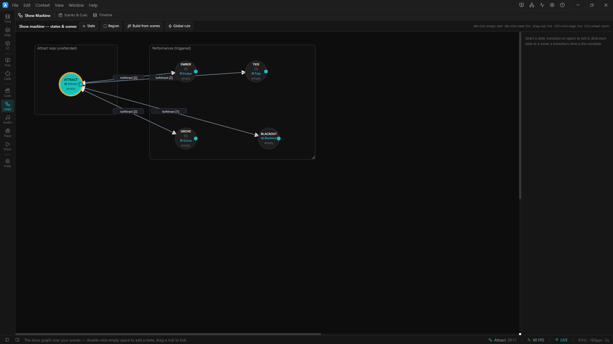

# 03 · Interactive Installation

> Project: [`../03-interactive-installation.artlux`](../03-interactive-installation.artlux)
> You'll learn: **LiDAR trigger zones**, **hold at end** + the **`requireEnd`** guard, `fromAny`
> **global rules**, the **hub-and-spoke** pattern, live **manual** + **OSC** triggers, the
> **cold-start** boot gate, and how a show is **deployed**.

This is the shape most real ArtLux installations take: an **attract loop** that runs unattended, plus
**performance looks** that fire on their own **when the room changes** — a person walks into a zone —
and **return to attract** when the room empties. You can still drive every look by hand or over OSC, but
the headline of a modern installation is that **the room drives the show**. Two surfaces (a **wall** and
a **floor**), one LED strip each.


*The hub-and-spoke shape: **Attract** is the unattended hub; a trigger fans out to each performance, and each returns to Attract on its own. **Blackout** is held — released only by a manual trigger. The chapter builds the interactive version of this: the fan-out becomes a **LiDAR zone**, and the hub **holds on its last frame** until someone walks in.*

## 1. Open it

**File ▸ Open…** → `03-interactive-installation.artlux`. The Stage shows the **Attract** look — an
animated rainbow across wall + floor that's designed to look alive with nobody touching it. This is the
**hub**: the machine sits here until triggered.

Open the **Timeline** panel. The **state lane** shows current state **Attract** and **buttons** —
**Ember**, **Tide**, **Grove**, **Blackout** — the manual transitions available *from Attract*. These
are how you drive the show at the keyboard while you build it; the rest of the chapter is how you make it
run itself.

> **Where's the graph?** Click the state lane's **`edit`** link, or pick **Show Machine** from the left
> **rail** (cluster **Show**, the **Logic** entry). The state-graph editor is a full-window **workspace
> context** now, not a modal.

## 2. Drive it by hand (the base)

Click **Ember**. The look crossfades to a fiery wall over a warm floor. Now **watch the clock**: after
~10 seconds the machine **returns to Attract by itself**. Try **Tide** and **Grove** — same deal, each
is a spoke that auto-returns.

Two design details make the manual version robust:

- **Auto-return** is just an **`afterDelay` 10s** transition from each performance back to Attract — the
  installation always recovers to its idle look, even if no one is around.
- Each performance state has a **Lock time of 3 s** (`[3]` under the node). Because lock time gates
  `afterDelay`, the look is guaranteed to hold for at least 3 s — a **debounce** so rapid triggering
  can't make it flicker.

Now click **Blackout**. Everything goes dark (the *Blackout* scene sets **global brightness to 0**).
Unlike the others, blackout **does not** auto-return — its only exit is a **`manual`** trigger. Look at
the state lane: the one button now offered is **Attract** (the `black_return` transition). Blackout is a
**held** state you release deliberately — exactly what you want for a panic/hold cue.

In **Show Machine** you can read the topology: **Attract** in its own *Attract loop* region on the left;
the four performance states in a *Performances* region on the right; arrows out of Attract, `afterDelay`
arrows back. A classic **hub-and-spoke**.

## 3. Make it react to the room — the canonical interactive state

An attract loop that only responds to a keyboard isn't an installation; it's a demo. The real thing
**plays its look to a chosen point, freezes there, and waits for someone to walk in.** Three features,
all built for this, combine into the shape every reactive ArtLux show uses:

```
Attract ──[hold at end]──▶ frozen on its last frame, the bed still playing
        ──[LiDAR zone: someone enters  +  ⏱ only after the state has finished]──▶ Reaction
Reaction ──[LiDAR zone: empty for 30s]──▶ Attract
        ⚡ global: [entrance ∧ ¬stage] ──▶ Welcome     (from wherever the show is)
```


<!-- TODO screenshot: the Show Machine context showing Attract (snowflake hold badge) ──LiDAR zone + ⏱ requireEnd──▶ Reaction, a ⚡ global-rule badge on a Welcome state, and the timeline state lane below with a HOLDING chip -->

### a. Hold at end — the attract loop that waits

Set where Attract should *finish* on its own timeline (drag the ruler out-handle, press **O**, or hit
**End state here** on the timeline toolbar — which sets the out-point at the playhead **and** turns the
hold on in one click). Then turn on **Hold at end** — the **snowflake** button next to Loop. Now when
Attract's timeline reaches that point it **parks on the last frame with the transport still running**:

- the picture holds on the projectors and the LED output;
- the **audio bed and the global automation play straight through** — the whole difference from a plain
  stop, which would pause and go silent. A room waiting for a visitor stays alive;
- the state machine is told the state has **finished** — you'll see a **HOLDING** chip appear in the
  state lane, and a **snowflake badge** on the node in the graph.

**Loop wins.** A looping timeline never reaches an end, so the hold is ignored (and greyed out) while
Loop is on. Use one or the other.

### b. `requireEnd` — "only after the state has finished"

Select the **Attract → Reaction** arrow and tick **Only after the state has finished** (`requireEnd`).
That edge now can't fire *until Attract is holding its last frame*. It's a **guard, not a trigger**: the
trigger still has to fire, this only decides whether it *may*.

Why it matters: without the guard, a visitor entering a zone three seconds into a twenty-second attract
film would **cut it** — the show becomes unwatchable in exactly the venue it was built for. The guard
binds the **automatic** path (a zone, an `afterDelay`) so the picture always plays out first.

It **does not** bind a human. A **manual** button, OSC, and the show-control tablet fire regardless — an
operator reaching for GO has a reason the machine can't see. So an early manual press is **flagged, not
blocked**: the state-lane button shows a **dashed ⏱ border** while the state is still running, and the
choice stays yours.

### c. LiDAR trigger zones — the trigger itself

A **trigger zone** is a named area of a tracking surface the show can transition on. Author them in the
**Tracking** workbench → **Trigger Zones** dock tab: **drag on empty space** to draw a zone, click to
select, drag to move/resize. Zones are **project-scope room geometry** — you draw the entrance / stage
**once**, and they're shared by every scene and state. (Each scene can switch which zones it *listens to*
with the eye toggle, but by default every zone is live everywhere.)

Then select the **Attract → Reaction** arrow, open its **Trigger** dropdown, and pick **LiDAR zone** —
the plugin's own editor appears (zone · when · seconds/people). The one-zone rules:

| Rule | Fires when |
|---|---|
| `someone enters` | a person arrives — *since this state was entered* |
| `everyone leaves` | the last person leaves |
| `occupied for…` | somebody has stayed N seconds |
| `empty for…` | nobody for N seconds — **the attract-return rule** |
| `at least N people` | the headcount reaches N |

Choose **`someone enters`** for Attract → Reaction, and **`empty for 30s`** for Reaction → Attract. A
**Combination** mode lets one rule watch **ALL / ANY** of several zones, each optionally **NOT** — *"someone
in the entrance **and** nobody on the stage"* is one rule. Every zone rule is a **level** that **arms and
holds**: it can't fire until the world actually changes (so a visitor who's *still standing there* after a
hop doesn't re-trigger), and it stays true for as long as the condition lasts — which is exactly what lets
it fire the moment `requireEnd` opens the gate at the end of the hold. Full model, dwell tuning, and the
one-person-two-blobs caveat: [`docs/TRACKING_SYNC.md`](../../../docs/TRACKING_SYNC.md#trigger-zones--making-the-show-react-to-the-room).

> **A trigger is asked even while its guard is closed.** The runtime evaluates a zone rule *every frame*
> and lets `requireEnd` decide whether to act. That's deliberate: a zone rule is **stateful** (it
> remembers whether it armed since entry), so if the guard suppressed the *question*, a visitor who
> arrived *during* the film would be seen merely *standing* — not *arriving* — when the hold finally
> opened, and the show would never advance. The guard suppresses the **action, not the evaluation.**

### d. `fromAny` — a rule that fires from **any** state (global rules)

> **Correction for anyone who read an older version of this tutorial:** it used to say *"the FSM has no
> wildcard edge."* **That is false.** ArtLux has **global rules**: set **`fromAny`** on a transition and
> it's evaluated from **every** state.

An installation always has a few rules that must work *whatever the show is doing* — *someone walks into
the entrance → start the welcome.* Drawing that edge out of every state (and re-drawing it whenever you
add a state) is how a show quietly stops responding in the one state somebody forgot. Instead, in
**Show Machine** click **⚡ Global rule**: the transition appears in a **Global rules** list in the
inspector (not drawn as an edge — it has no source node), and every state it can reach gets a **⚡ badge**.
A global `manual` rule shows up as a button in the **state lane** from wherever the show currently is.

Three rules keep it predictable:

- **Explicit beats global** — the current state's own transitions are evaluated first, so a state can
  always override a house rule.
- **Never re-enters its own target** — a global whose destination *is* the current state is skipped (its
  condition is usually a level that stays true, and re-entering would restart the scene's timeline every
  frame).
- **Still one transition per frame** — globals share the same single-fire budget; no cascades.

`requireEnd` applies to a global exactly as to a normal edge.

## 4. Drive it over OSC (the other deployment move)

You don't always have a tracker — a button, sensor, or show controller can fire the looks over **OSC**.
This project ships with **OSC receive already enabled** (port **10000**, prefix **`/artlux`**). Each
transition has a **readable id**, and you trigger it by that id:

| Send this OSC message | Effect (from Attract) |
|---|---|
| `/artlux/state/to_ember` | → Ember |
| `/artlux/state/to_tide` | → Tide |
| `/artlux/state/to_grove` | → Grove |
| `/artlux/state/to_black` | → Blackout |
| `/artlux/state/black_return` | Blackout → Attract |

(There's also `/artlux/state/trigger` with the id as a string argument — same effect.) You can drive
scenes and cues directly too: `/artlux/scene/Ember/go`, `/artlux/cue/<name>/go`. Full surface:
[`docs/OSC.md`](../../../docs/OSC.md).

> **The one rule:** a *normal* transition only fires if it **leaves the current state** —
> `/artlux/state/to_ember` does nothing unless the machine is in **Attract**. (A **global** `fromAny`
> rule is the exception: it fires from anywhere.) This is deliberate — the graph defines what's reachable
> from where, so a stray message can't jump the show somewhere illegal.

**Try it** with any OSC sender (TouchOSC, a Max/PD patch, `oscsend`, a Python one-liner). Point it at
this machine's IP, port **10000**, and send `/artlux/state/to_tide`. That's your installation,
remote-controlled.

## 5. Test the room without the room

You don't need the venue's LiDAR to build and test a zone-driven show — zones read the tracking store,
and so does take replay:

- Run **`node scripts/lidar-emitter.cjs`** for a synthetic live feed, **or** drop a recorded `.lblob`
  **take** on a tracking lane and play the timeline — either drives the zones exactly like the real
  tracker.
- Watch the zone light up in the **Trigger Zones** panel and in the **3D scene** (labelled with a live
  headcount), and tune the enter/exit **dwell** (venue-wide, in the tracking parameters) against it.
- Entering or leaving a take **re-arms** every zone, so a latch never carries across the boundary.

## 6. The cold start — the show waits for its content

**Opening a project doesn't start the machine — decoding the opening look does.** A **boot gate** holds
the show until the first scene's media is genuinely ready, so a cold boot doesn't push black frames and
silence out to a venue while decoders spin up.

- The status bar shows a **Preloading n/m** chip until the opening look is decoded (these examples use
  built-in effects, so it clears almost instantly; a real HAP/MP4 show takes a few seconds).
- Every open **projector output** draws a dim, centred **PRELOADING SHOW** sign naming its surface
  (`Front wall · 0/1`) while the gate holds, then clears itself — half a look on a wall reads as *broken*
  from the floor, so it shows nothing until the whole look is ready.
- It **fails open**: after *Preferences ▸ Engine ▸ Preload wait* (default **15 s**) the machine arms
  anyway and the log names whatever never loaded.
- The **LED output is not held** — `Stage` keeps sampling and publishing Art-Net throughout (unmounting
  it would stop the show mid-run), so fixtures show the opening frame or black during the wait.

<!-- TODO screenshot (manual): images/03-preloading-show.png — a projector output draws "PRELOADING SHOW" only during the brief cold-start boot gate on project open; capture it from a projector window at launch. -->
_Screenshot: the **PRELOADING SHOW** sign a projector output holds while the cold-start boot gate waits for the opening content to decode._
<!-- TODO screenshot: a projector/broadcast output window showing the dim centred "PRELOADING SHOW · Front wall · 0/1" sign over black -->

Reference: [`docs/STATE-MACHINE.md`](../../../docs/STATE-MACHINE.md#the-cold-start).

## 7. Make it yours

1. **Add a performance look.** Capture a new **Scene** (Scenes & Cues → **Capture scene**), add a state
   bound to it in **Show Machine**, draw a trigger *in* (a **LiDAR zone**, a **manual** button, or OSC)
   and an **`afterDelay`**/`empty for…` arrow back. Give the return a `fadeSec` and the state a `lockSec`.
   Rename the transition's id for a clean OSC address (`/artlux/state/<your-id>`).
2. **"Blackout from anywhere" — the right way.** Instead of drawing a manual edge from *each* performance
   to Blackout (the old advice, and a maintenance trap), make it **one ⚡ global rule** → Blackout with a
   `manual` trigger. It now appears as a state-lane button and an OSC address from **every** state, and
   you never have to remember to re-wire it when you add a look.
3. **Longer attract.** Split Attract into two states ping-ponging on `afterDelay`, each with its own hold
   and its own zone-in edge — the hub becomes a mini timed loop (chapter 1) that's still interruptible.
4. **Unattended deployment.** Save the project, then launch it headless/broadcast so it runs on boot with
   no editor — the **cold-start gate** covers that path too. See the app's **headless** mode in
   [`FEATURES.md`](../../../docs/FEATURES.md) and the
   [show-control tablet + scheduler](../../../docs/SHOW-CONTROL.md) for touch control and time-of-day
   automation.

## Recap

The interactive pattern is a **hub that holds** (attract plays out, then freezes on its last frame with
the bed still running) and **reacts to the room**: a **LiDAR zone** advances it, guarded by
**`requireEnd`** so a visitor never cuts the film, and a `empty for…` zone (or `afterDelay`) returns it.
A **`fromAny` global rule** covers "from anywhere" behaviour without hand-wiring every state. **Manual**
and **OSC** remain for hands-on and controller-driven venues, **lock time** debounces, and the
**cold-start gate** keeps the first seconds from going out black. With chapters 1–3 you have the whole
state machine: **states bound to scenes** (each owning its **own timeline**), **seven triggers across
two clocks and the room**, **entry actions**, **hold at end** + guards, **global rules**, **regions**,
and **remote control**.

## Where next

- **Reference:** [`docs/STATE-MACHINE.md`](../../../docs/STATE-MACHINE.md) — every field and runtime
  detail, including the canonical interactive state and the cold-start gate.
- **Trigger zones:** [`docs/TRACKING_SYNC.md`](../../../docs/TRACKING_SYNC.md) — drawing zones, the
  arm-and-hold rule, dwell tuning, and testing off a recorded take.
- **Per-state timelines:** bind each state to a Scene that owns **its own timeline**, and author your
  show one state at a time — [`docs/SCENE-TIMELINES.md`](../../../docs/SCENE-TIMELINES.md).
- **Scenes & cues:** compose looks from independent parts — [`docs/SCENES.md`](../../../docs/SCENES.md).

⬅ **[Back to the tutorial home](README.md)**
