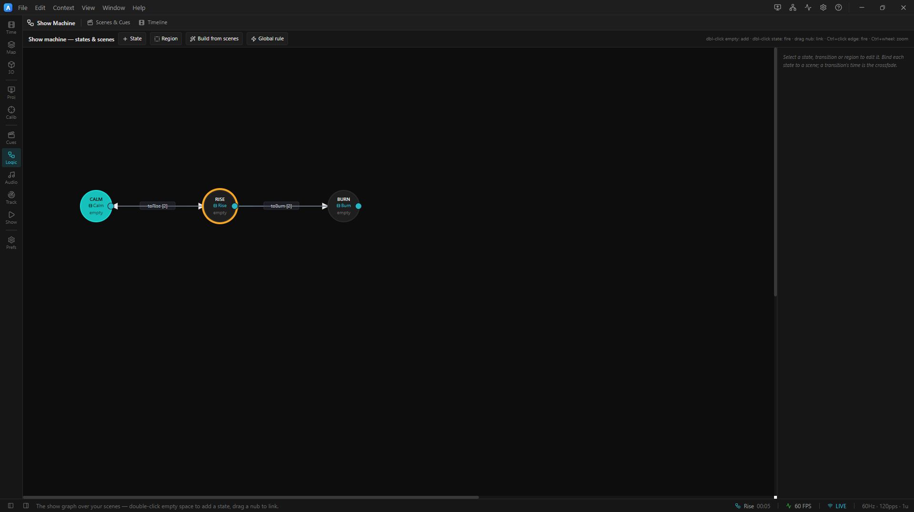

# Tutorial — the ArtLux state machine

A hands-on, three-project course on the **state machine**: ArtLux's tool for turning a set of *looks*
into a **show that runs itself** — a timed sequence, an unattended attract loop, or a live-triggered
installation.

You'll open a ready-made project, watch it run, take it apart in the editor, and change it. No media
files, no LED hardware, and (for the first project) not even the Play button are required — every look
is a built-in GPU **effect**, so the projects animate the moment you open them.

## What is the state machine?

A **finite-state graph over your Scenes**. Each **state** is a circle that *is* a look (it recalls a
bound **Scene** when entered). **Transitions** are arrows between states; each arrow has a **trigger**
that decides *when* it fires — a delay elapses, the timeline reaches a time or marker, a clip ends, the
timeline reaches its end, the **room changes** (a person walks into a **LiDAR zone**), or you fire it
by hand / OSC. While the machine is **enabled**, it sits in one state, watches that state's outgoing
arrows, and moves when a trigger fires — recalling the next look (optionally crossfading).

```
   ( Calm ) ──after 6s──▶ ( Rise ) ──after 6s──▶ ( Burn ) ──after 8s──┐
      ▲                                                                │
      └────────────────────────────────────────────────────────────────┘
```

## Before you start

1. **Open ArtLux** and load a project with **File ▸ Open…** (`Ctrl+O`), then pick one of the
   `.artlux` files in this folder. (These are single-file projects — use *Open…*, not *Open Project
   Folder…*.)
2. Find the **state machine's home** — it now lives in **two** places:
   - The **state lane**: open the **Timeline** panel (bottom dock); its top row shows a **⚙ toggle**
     (the *Workflow* icon) that turns the machine **on/off**, the **current state's name**, a
     **HOLDING** chip when a state has played to its end and is frozen there, and **buttons** for any
     manual triggers available from the current state.
   - The **Show Machine** context: click the state lane's **`edit`** link — or pick **Show Machine**
     from the left **rail** (cluster **Show**, short title **Logic**, the *Workflow* icon). This is
     the **state-graph editor** (the node canvas + inspector), which used to be a modal over the
     timeline and is now a full-window **workspace context** of its own.


<!-- TODO screenshot: the Show Machine workspace context (three-state ring, active node ringed) with the timeline state lane visible below showing the ⚙ toggle, current state and edit link -->

That's the whole surface. Everything below happens in the **Show Machine** context and the state lane.

## The course

| # | Project | You'll learn |
|---|---------|--------------|
| 1 | [01 · Hello State Machine](01-hello-state-machine.md) — [`.artlux`](../01-hello-state-machine.artlux) | states, **Scene binding**, the **initial** state, the `afterDelay` trigger, looping, the **transition crossfade** |
| 2 | [02 · Triggers & Actions](02-triggers-and-actions.md) — [`.artlux`](../02-triggers-and-actions.artlux) | **five of the seven triggers** (`manual`/`afterDelay`/`atTime`/`onMarker`/`onClipEnd`; the other two, `onTimelineEnd` and the plugin-owned `plugin`, are covered in the reference doc and in chapter 3), the **two clocks**, **entry actions**, **lock time**, **per-scene timelines**, **regions** |
| 3 | [03 · Interactive Installation](03-interactive-installation.md) — [`.artlux`](../03-interactive-installation.artlux) | **LiDAR trigger zones**, **hold at end** + the `requireEnd` guard, `fromAny` **global rules**, the **hub-and-spoke** pattern, live **manual**/**OSC** triggers, the **cold-start** gate, deployment |

Work through them in order — each builds on the last.

**The seven triggers, once, for reference** (details in chapters 2–3):
`manual`, `afterDelay`, `atTime`, `onMarker`, `onClipEnd`, `onTimelineEnd`, and `plugin` — the last is
the **plugin-owned** kind, and today it means a **LiDAR trigger zone** (a person entering/leaving an
area of the room). See [`docs/STATE-MACHINE.md`](../../../docs/STATE-MACHINE.md#triggers--when-a-transition-fires).

## Where to go deeper

- **Reference:** [`docs/STATE-MACHINE.md`](../../../docs/STATE-MACHINE.md) — the complete model, every
  trigger/action field, runtime semantics, and OSC.
- **Related:** [`docs/SCENES.md`](../../../docs/SCENES.md) (what a Scene captures),
  [`docs/SCENE-TIMELINES.md`](../../../docs/SCENE-TIMELINES.md) (a state can own its own timeline),
  [`docs/TIMELINE.md`](../../../docs/TIMELINE.md), [`docs/OSC.md`](../../../docs/OSC.md).

> **Tip — keep your edits.** These templates are a sandbox. To keep changes, **File ▸ Save As…** to a
> new file so the originals stay pristine for the next read-through.
